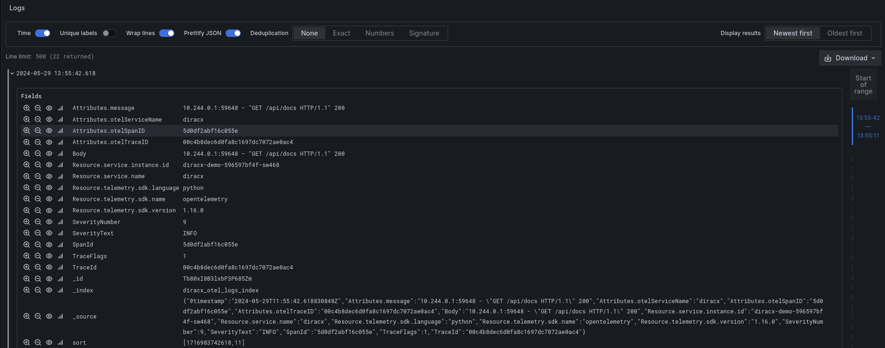
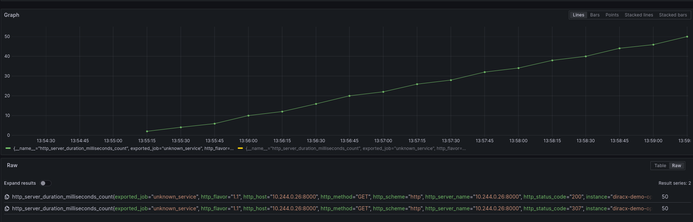
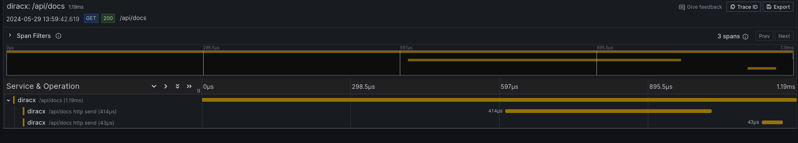

# OpenTelemetry

> :warning: **Experimental**: opentelemetry is an evolving product, and so is our implementation of it.

``diracx`` is capable of sending [OpenTelemetry](https://opentelemetry.io/) data to a collector. The settings are controled by the
``diracx.routers.otel.OTELSettings`` classes

``diracx`` will then export metrics, traces, and logs. For the moment, nothing is really instrumented, but the infrastructure is there

