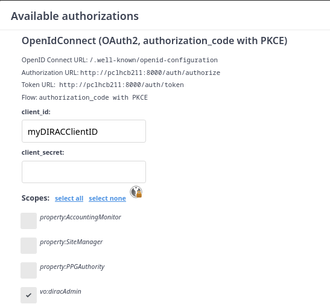
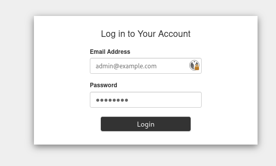

## Run a full diracx demo

This will allow you to run a demo setup.

The code changes will be reflected in the demo.

Requirement: docker, internet

```bash
# Clone the diracx repository
git clone git@github.com:DIRACGrid/diracx.git

# Clone the diracx-chart repository
git clone git@github.com:DIRACGrid/diracx-charts.git

# Run the demo
diracx-charts/run_demo.sh diracx/
```

To login, click the **authorize** button


Connect using the authorization code flow, ticking the "vo:diracAdmin" scope



And enter the credentials prompted by the `run_demo.sh` script in the `Dex` interface



## Create the dev environment

This will help you setup a dev environment to run the unit tests

Requirements: conda, git

```bash
# Clone the diracx repository
git clone git@github.com:DIRACGrid/diracx.git
cd diracx

# Create the mamba environment
mamba env create --file environment.yml
conda activate diracx-dev

# Make an editable installation of diracx

pip install -r requirements-dev.txt

# Install the patched DIRAC version
pip install git+https://github.com/DIRACGrid/DIRAC.git@integration

# Enable pre-commit
mamba install pre-commit
pre-commit install
```

### Run the test

Run the unit tests:

```bash
# In the `diracx` folder
pytest
mypy
pre-commit run --all-files
```

Some tests require the DiracX demo instance to be running (see above) and are skipped by default.
To enable these tests pass `--demo-dir` like so:

```bash
pytest --demo-dir=../diracx-charts/
```

### Run a local instance of diracx

This only runs the diracx server, not any dependency like external IdP.


```bash
# In the `diracx` folder
./run_local.sh
```


## Add a DB

Database classes live in `src/diracx/db/<dbname>`. Have a look at the `src/diracx/db/dummy/` to see how to implement your own DB

* We do not want to use the `ORM` part of `SQLAlchemy` (only the `core`) for performance reasons


## Dependency injection

Dependencies to routes on services are injected as function parameters.
See the FastAPI documentation for details.

In DiracX we have a few additional dependencies which can be injected like so:

```python
@router.get("/dummy")
def my_route(
    config: Annotated[Config, Depends(ConfigSource.create)],
    settings: Annotated[AuthSettings, Depends(AuthSettings.create)],
    job_db: Annotated[JobDB, Depends(JobDB.transaction)],
    user_info: Annotated[UserInfo, Depends(verify_dirac_token)],
) -> MyReturnType:
    ...
```

### Configuration

The `config` object is an instance of the config model schema for the current service (e.g. `diracx.core.config.Config`).
This object is immutable and remains constant for the duration of the function call.
Caching is handled externally to services.

### Settings

Unlike in DIRAC, DiracX separates some information from the "Configuration" (e.g. secrets).
To access this information you depend on the `SettingsClass.create` method which returns a cached instance of the given class.

### Databases

The `job_db` object is an instance of the given db (e.g. `JobDB`).
A single transaction is used for the duration of the request and it is automatically committed when the function returns.
If an exception is raised the transaction is rolled back.
Connections are pooled between requests.

### User information

The `user_info` object contains validation information about the current user, extracted from the authorization header of the request.
See the `UserInfo` class for the available properties.

## Adding a router

To add a router there are two steps:

1. Create a module in `diracx.routers` for the given service.
2. Add an entry to the `diracx.services` entrypoint.
3. Do not forget the Access Policy (see chapter lower down)

We'll now make a `/parking/` router which contains information store in the `DummyDB`.

### Creating the router submodule

TODO: This isn't yet documented here however see `diracx.routers.auth.well_known` for an example.

### Defining the new router in the `diracx.services` entrypoint

Modify the package's `setup.cfg`

```ini
[options.entry_points]
diracx.services =
	parking = diracx.routers.parking:router
```


This will prefix the routes with `/parking/` and mark them with the `"parking"` tag in the OpenAPI spec.

> [!WARNING]
> Any modification in the `setup.cfg` requires to re-install install `diracx`, even if it is a developer installation (`pip install -e`)


## Conventions

### Coding style

Most style are enforced with the pre-commit hooks which automatically reformat the code and sort the imports.
Code should follow PEP-8, particularly for [naming conventions](https://peps.python.org/pep-0008/#prescriptive-naming-conventions) as these aren't modified by the pre-commit hooks.

#### Import style

In addition to the automatic sorting

```python
from datetime import datetime, timedelta, timezone

import pytest
```


## Client generation

[!WARNING]
This is for advanced users only as it is currently an unstable feature


When a new client generation is needed, a CI job called `client-generation` will fail, and one of the repo admin will regenerate the client for you.

If you anyway want to try, the best up to date documentation is to look at the [client-generation CI job](https://github.com/DIRACGrid/diracx/blob/main/.github/workflows/main.yml)


## Access Policy

Permission management in ``diracx`` is managed by ``AccessPolicy``. The idea is that each policy can inject data upon token issuance, and every route will rely on a given policy to check permissions.

The various policies are defined in `diracx-routers/pyproject.toml`:

```toml
[project.entry-points."diracx.access_policies"]
WMSAccessPolicy = "diracx.routers.job_manager.access_policies:WMSAccessPolicy"
SandboxAccessPolicy = "diracx.routers.job_manager.access_policies:SandboxAccessPolicy"
```

Each route must have a policy as argument, and call it


```python
from .access_policies import ActionType, CheckWMSPolicyCallable

@router.post("/")
async def submit_bulk_jobs(
    job_definitions: Annotated[list[str], Body()],
    job_db: JobDB,
    check_permissions: CheckWMSPolicyCallable,
) -> list[InsertedJob]:
    await check_permissions(action=ActionType.CREATE, job_db=job_db)
    ...
```

Failing in doing so will result in a CI error ``test_all_routes_have_policy``

Some routes do not need access permissions, like the authorization ones, in which case they can be marked as such

```python
from .access_policies import open_access

@open_access
@router.get("/")
async def serve_config(
```

Implementing a new ``AccessPolicy`` is done by:
1. Create a module in `diracx.routers.<service>access_policies.py`
2. Create a new class inheriting from ``BaseAccessPolicy``
3. For specific instructions, see ``diracx-routers/src/diracx/routers/access_policies.py``
2. Add an entry to the `diracx.access_policies` entrypoint.


> [!WARNING]
> When running tests, no permission is checked. This is to allow testing the router behavior with respect to the policy behavior. For testing a policy, see for example ``diracx-routers/tests/jobs/test_wms_access_policy.py``
