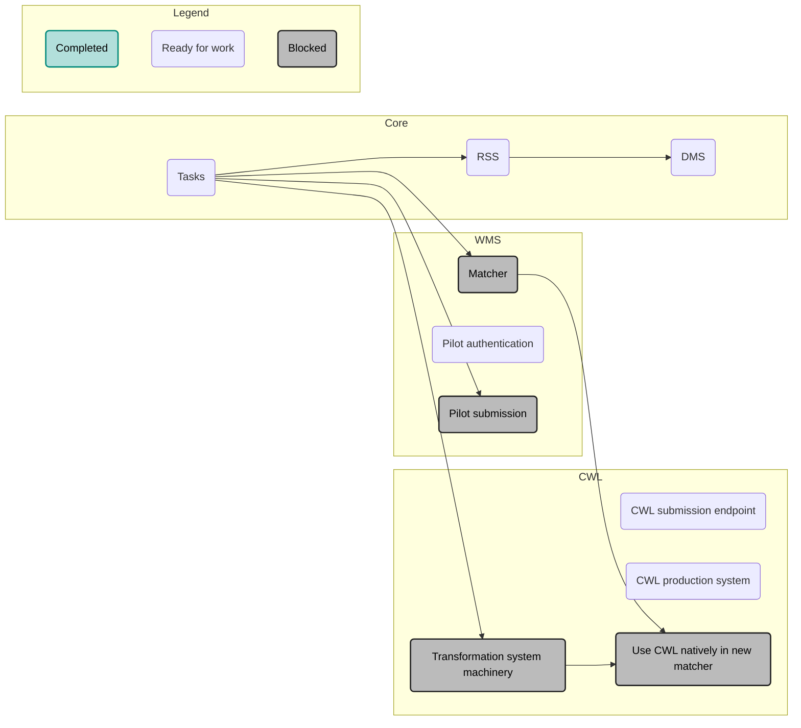

# DiracX Roadmap

## Getting to 0.0.1

* First release contains:
    * All service/client underpinnings
    * Extension support
    * JobStateUpdateHandler can be replaced by DiracX
* Prior to release: Install in LHCbDIRAC production to ensure full functionality.

### What do we need to get there?

* [ ] Finish any DIRAC v9 cleanups
* [ ] Get LHCbDIRAC certification running stably with DIRAC v9
* [ ] Finish legacy adapter for JobStateUpdateClient
* [ ] Admin VO
* [ ] Ensure the helm chart is stable for updates
* [ ] Make sure the docs are complete

## After 0.0.1

For the migration, we want to prioritize deprecating DIRAC over adding new functionality, with the exception of Common Workflow Language (CWL) related features and general UX improvements. Migrating functionality to DiracX and/or removing functionality from legacy DIRAC is considered minor and will happen in incremental releases.

Work towards DiracX 1.0.0 is highly parallelizable and is split into three main work packages:

* **Core:** Tasks in the core work package are worked on by the core DiracX team and provide fundamental underpinnings.
* **WMS:** Work on the Workload Management System (WMS) includes the matcher, pilot authentication, and pilot submission.
* **CWL**: The CWL work package is focused on supporting Common Workflow Language features. These will be the first truly new functionality that is available and will focus on the experience of users.

To avoid bottlenecks in the development process the roadmap segments parts of DiracX to enable the system to run in parallel to the legacy DIRAC installation. For example when migrating the job matching infrastructure:

* The `JobDB` contents is left unmodified.
* DIRAC and DiracX matching infrastructure runs in parallel
* Existing pilots match jobs from both DIRAC and DiracX.
* When submitting a job, the matching process is assigned to either DIRAC or DiracX. Deciding which infrastructure to use can be done either probabilistically and/or based on attributes of the job.

This allows the migration to be independent of other modernizations. A similar strategy is used for migrating the pilot and transformation infrastructure.

### Current status

