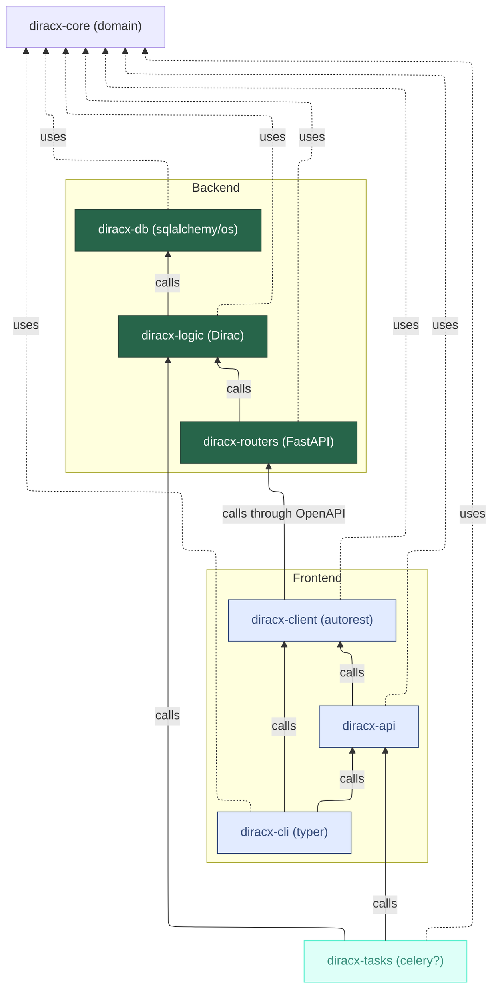

# Packaging and versioning

DiracX is a comprehensive Python package, composed of several interconnected submodules. It's designed to provide robust and versatile functionalities, primarily through these key components:

1. **User-Facing Components**:
   - **`diracx`**: This is the primary interface for users, integrating both the Command Line Interface (CLI) and Python API.
   - **`diracx-routers`**: Serves as the server component, offering HTTPS endpoints.
   - **`diracx-tasks`**: Handles operations executed by DiracX servers, either periodically or upon request.

2. **Containerization**:
   - Each component is available as a container image, packaging DiracX along with all necessary dependencies.

## Python Modules

DiracX is structured into various modules, each serving a distinct purpose:

- **`diracx-core`**: The foundational code base, utilized by all other DiracX modules.
- **`diracx-db`**: Data Access Layer, focuses on database functionalities.
- **`diracx-logic`**: Business Logic Layer, comprises Dirac logic.
- **`diracx-routers`**: Presentation Layer, handles user interactions through HTTP using a FastAPI application.
- **`diracx-client`**: A client auto-generated from the OpenAPI specification in `diracx-routers`.
- **`diracx-api`**: Provides higher-level operations building on `diracx-client`.
- **`diracx-cli`**: The command line interface (`dirac`).
- **`diracx`**: A metapackage offering `diracx-client`, `diracx-api`, and `diracx-cli`.

These modules are each implemented as a [native Python namespace package](https://packaging.python.org/en/latest/guides/packaging-namespace-packages/).

The direct dependencies between the submodules are as follows:




### Versioning Strategy

- Currently, and as long as `DIRAC` and `diracx` coexist, we employ a versioning format of v0.<major>.<patch>.
- We only support using the same version across all `diracx-*` packages.
- The client and server versions can vary, but the client version is always communicated to the server. Incompatibly old client versions may lead to request rejections, prompting a client update. (TODO: https://github.com/DIRACGrid/diracx/issues/258)

## Container Images

DiracX utilizes a structured approach to containerization:

1. **Base Image**:
   - All container images start from `diracx/base`.

2. **Specialized Base Images**:
   - `diracx/services-base`
   - `diracx/tasks-base`
   - `diracx/client-base`

3. **Image Versioning and Building**:
   - Images are built periodically (e.g., every Monday) and tagged as `YYYY.MM.DD.P`.
   - A DiracX release triggers the creation of new `DiracXService`, `diracx/tasks`, and `diracx/client` images, based on specific `diracx/base` tags.
   - This approach ensures stability in production environments.
   - For testing purposes, the `latest` base images are used, with dependencies installed via `pip install`.

See this diagram for an example of how this looks in practice:

```
                       ┌──────────────────────────┐
                 ┌─────┤ diracx/base:YYYY.MM.DD.P ├─────┐
                 │     └──────────────────────────┘     │
                 │                                      │
┌────────────────▼──────────────────┐  ┌────────────────▼───────────────┐
│ diracx/services-base:YYYY.MM.DD.P │  │ diracx/tasks-base:YYYY.MM.DD.P │
└────────────────┬──────────────────┘  └────────────────┬───────────────┘
                 │                                      │
     ┌───────────▼────────────┐              ┌──────────▼──────────┐
     │ diracx/services:v0.X.Y │              │ diracx/tasks:v0.X.Y │
     └────────────────────────┘              └─────────────────────┘

```

### Dependencies

- There is a noted duplication between `setup.cfg` and `environment.yaml`.
- The `diracx/base` image is built from a Dockerfile with `environment.yml`, primarily defining the Python version and `dirac_environment.yaml` containing the DIRAC specific dependencies. The latter is there as a "temporary" thing.
- The `diracx/services-base` and `diracx/tasks-base` images extend `diracx/base` with additional Dockerfiles and `environment.yml`, tailored to their specific needs.
- The `diracx/services` and `diracx/tasks` images are further built upon their respective base images, adding necessary diracx packages through `pip install --no-dependencies`.

### Entrypoint

TODO: document the entry point

- `diracx-routers`:
  - `diracx.diracx_min_client_version` entry-point defines the diracx minimum client version required by the server to prevent issues. This also searches for extension names instead of `diracx`. The minimum version number has to be updated in `diracx-routers/src/__init.py__`

## Extensions

- Extensions will extend one or more of `diracx`, `diracx-routers`, `diracx-tasks` images (e.g. `lhcbdiracx`, `lhcbdiracx-routers`, `lhcbdiracx-tasks`).
- Extensions provide a corresponding container image based on a specific release of the corresponding DiracX image.
