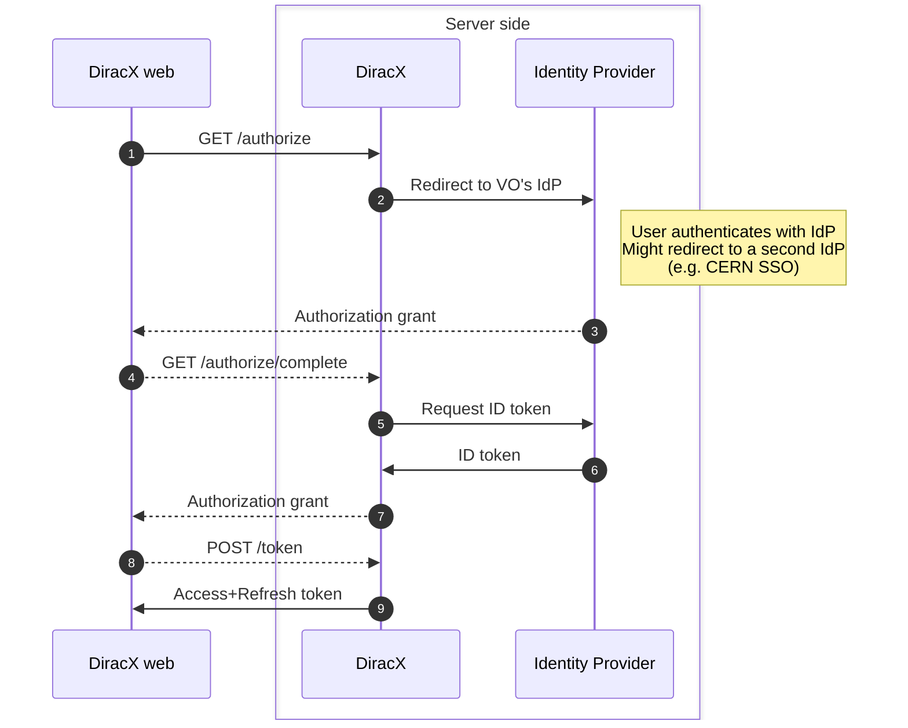
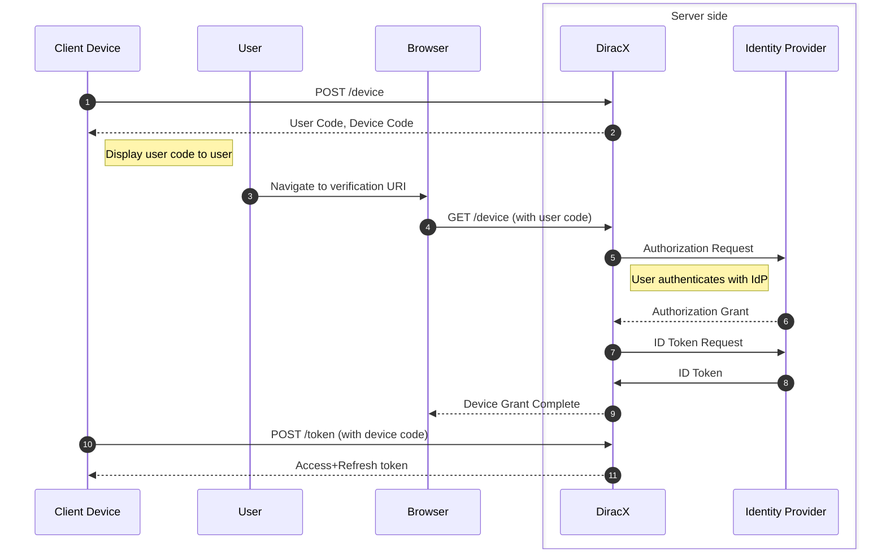
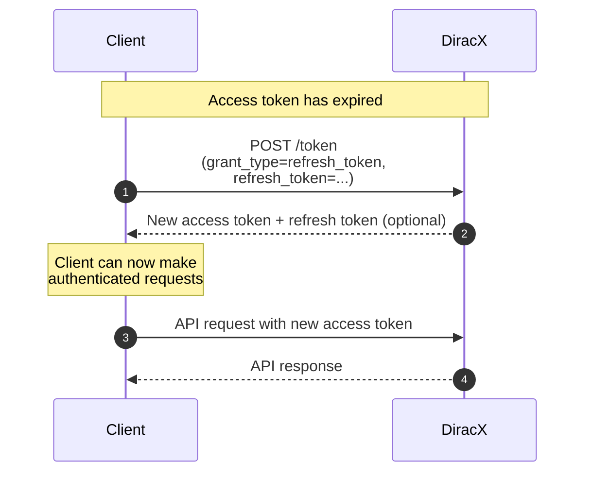
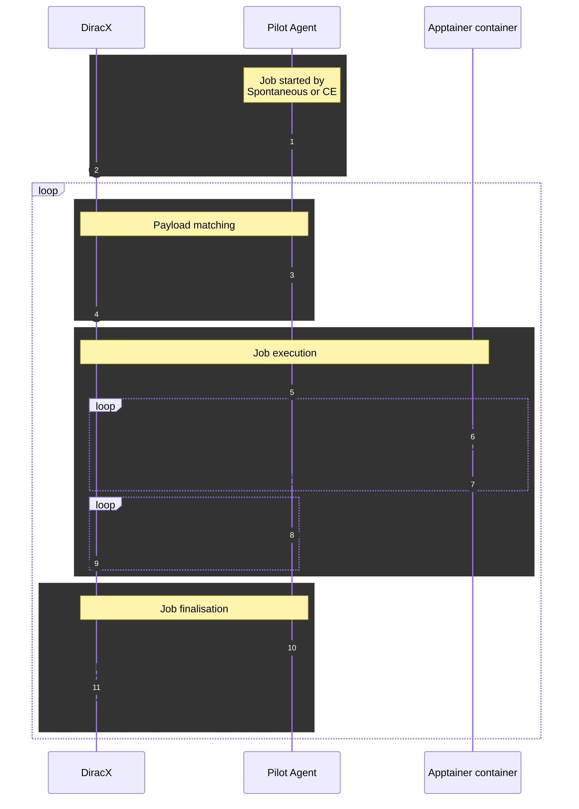

# Authentication with DiracX

This document explains how authentication is handled within DiracX, including the interactions with the legacy DIRAC server.

At a high level, DiracX acts as an IdP for all DIRAC/DiracX-specific activity.
Users are authorised using an external IdP, typically [Indigo IAM](https://indigo-iam.github.io/) for real VOs.
Other OIDC-compliant IdPs can be used for the admin pesudo-VO.

## Overview

Let's start with an overview how authentication works in the legacy DIRAC software.
We'll only cover what DIRAC handles directly, for communication with third party resources see [the dedicated page](./auth-with-external.md).

### What authentication methods do we have in DIRAC?

In the legacy DIRAC software there are 5 modes of authentication:

- **User certificates:** X.509 certificates issued by a trusted Certificate Authority (CA) that identify individual users.
- **Proxies:** Proxies are additional X.509 certificates derived from user certificates. This is used to allow users delegate their credentials to services or other processes without sharing their complete private key. In DIRAC proxies are further restricted by the addition of the dirac group extension.
- **Proxies with VOMS extensions:** Proxies that include Virtual Organization Membership Service (VOMS) extensions, providing additional authorization information such as VO membership and role.
- **Host certificates:** X.509 certificates that identify and authenticate hosts rather than individual users. These are used for service-to-service and agent-to-service authentication.
- **User impersonation via host certificates:** A mechanism where services with host certificates can impersonate users, typically used for administrative operations or when services need to act on behalf of users. This mechanism is used by the legacy DIRAC webapp to "forward" requests to other DIRAC services. This is only available if the host has the `TRUSTED_HOST` property.

In DIRAC there are a series of *properties* which map to functionality which the current X509 credentials are permitted to do (e.g. `JOB_ADMINISTRATOR`, `NORMAL_USER`, ...)
Properties are not added directly in the X509 certificates used by DIRAC and are instead mapped from the central configuration service (CS) by:

- If the identity is a host properties are directly mapped to the host certificate's DN.
- If the identity is a user without a group assigned (e.g. a direct user certificate) a default group is picked from the CS.
- If the identity is a user (or a `TRUSTED_HOST` host imersonating a user) the associated group is mapped to a set of properties.

Additionally, some parts of DIRAC apply custom authourisation logic (e.g. the global job monitoring option in the CS).

### DIRAC/DiracX equivalents

| Purpose                                   | DIRAC                                                  | DiracX                                                         |
| ----------------------------------------- | ------------------------------------------------------ | -------------------------------------------------------------- |
| User authentication                       | X509 certificates from CAs                             | JWTs obtained via DIRAC OAuth2 flows                           |
| Service-to-service                        | X509 host certificates                                 | Not applicable                                                 |
| Agent-to-service                          | X509 host certificates or "shifter" proxies            | Not applicable - Uses direct DB access                         |
| First pilot → DIRAC interaction           | Proxy included in pilot payload                        | Unique secret included in pilot payload                        |
| Pilot → communication (e.g. job matching) | Proxy included in pilot payload                        | Secret obtained from first pilot → DIRAC interaction           |
| Obtaining job specific credentials        | Proxy included in pilot payload                        | Job specific credentials included in matching request response |
| Job payload → DIRAC (e.g. status updates) | Proxy included in pilot payload and job specific proxy | Job specific credentials                                       |

## User authentication

There are two ways in which users can authenticate with DiracX, inside their web browser or their terminal.
In both cases standard OAuth2 authorization flows are used to obtain an access and a refresh token.

### Properties

In DiracX access is handled with access polices which look at the content of an access token and make an authorisation decision.
The primary content inside an access token are managed by OAuth2 scopes which mirror the existing DIRAC properties.
This will likely evolve over time as more DiracX-only functionality appears.
When authenticating with DiracX there are two ways by which these scopes are decided:

- **No property scopes requested:** The default properties are taken to match the corresponding DIRAC group.
- **Some property scopes requested:** Only the specific properties are included in the token. This allows users to create tokens with reduced permissions (e.g. can read data but can't submit jobs).

### DiracX Web

When authenticating against DiracX web we effectively do two [OAuth Authorization code flows](https://datatracker.ietf.org/doc/html/rfc6749#section-4.1), one between the web client and DiracX and a second between DiracX and the VO's IdP. Both authorizations code flows use PKCE.

??? info "What is "PKCE" and why is it used?"

    PKCE (Proof Key for Code Exchange) is an extension to the OAuth 2.0 Authorization Code flow designed to enhance security, especially for public clients such as single-page applications and mobile apps that cannot securely store client secrets.

    PKCE works by having the client generate a random value called a "code verifier" and then deriving a "code challenge" from it (usually by hashing). The code challenge is sent in the initial authorization request. When exchanging the authorization code for tokens, the client must present the original code verifier. The server checks that the code verifier matches the code challenge sent earlier.

    This mechanism prevents authorization code interception attacks, where a malicious actor could otherwise steal the authorization code and exchange it for tokens. By requiring the code verifier, only the legitimate client that initiated the flow can complete the process.

    In DiracX, PKCE is used to ensure that authentication flows—especially those initiated from browsers or other public clients—are protected against such attacks, providing an additional layer of security on top of standard OAuth 2.0.

1. The flow is initiated by the client making a request to the DIRAC auth service with PKCE.
2. The DIRAC auth service stores the request details and redirects the user to the IAM's authorization flow
    by performing an authorization request on behalf of the user.
3. Once done, the IAM redirects the user back to the DIRAC auth service.
4. The user's browser follows the redirect back to the DIRAC auth service.
5. The DIRAC auth service exchanges the code for an ID token by making a token request to the IAM.
6. The IAM responds with an access, a refresh and an ID tokens.
7. The DIRAC auth service only stores the ID token and redirects the user to the client's redirect URI.
8. The client requests an access token from the DIRAC auth service by making a request to
    the token endpoint (POST /token).
9. The DIRAC auth service responds with a DIRAC access/refresh token, based on the IdP's ID token.

The client can:

- [use the access token to access the DIRAC services](#using-a-token)
- [use the refresh token to get a new access token](#refresh-tokens)

### CLI clients

When authenticating CLI clients there are two authorization flows involved:

1. **Device Authorization Grant flow** between the CLI client and DiracX - this is the [OAuth 2.0 Device Authorization Grant](https://datatracker.ietf.org/doc/html/rfc8628) flow, designed for devices with limited input capabilities.
2. **Authorization Code flow** between DiracX and the VO's Identity Provider - this is the standard [OAuth Authorization Code flow](https://datatracker.ietf.org/doc/html/rfc6749#section-4.1) that DiracX uses to authenticate with the external IdP.

The first flow is done between a user's terminal and DiracX. The second flow is done entirely inside the user's web browser [as is done for DiracX web](#diracx-web).

1. The device flow is initiated by the client, which is typically a device with limited input capabilities (POST /device).
2. The DIRAC auth service responds with a user code and a device code.
3. The client then displays the user code to the user and instructs the user to go to a verification URI on another device (e.g. a smartphone or computer) and enter the user code.
4. The user then authenticates on the other device. In the meantime, the client polls the DIRAC authorization server to check if the user has authorized the client.
5. The DIRAC auth service stores the request details and redirects the user to the IAM's authorization flow by performing an authorization request on behalf of the user.
6. Once done, the IAM redirects the user back to the DIRAC auth service.
7. The DIRAC auth service exchanges the code for an ID token by making a token request to the IAM.
8. The IAM responds with an access, a refresh and an ID tokens.
9. The DIRAC auth service stores the ID token and redirects the user to the redirect URI.
10. The client requests an access token from the DIRAC auth service by making a request to the token endpoint.
11. The DIRAC auth service responds with a DIRAC access token, based on the ID token.

The client can then:

- [use the access token to access the DIRAC services](#using-a-token)
- [use the refresh token to get a new access token](#refresh-tokens)

## Using a token

In OAuth2 there are three kinds of token defined, see below for their use within DiracX.

### Access tokens

Access tokens are short-lived credentials that allow clients to authenticate with DiracX services. They contain information about the user's identity and permissions, and are used to authorize API requests.

Key characteristics of access tokens in DiracX:

- **Short-lived**: Typically valid for a limited time (e.g., 1 hour) to minimize security risks
- **Bearer tokens**: Included in the `Authorization` header as `Bearer <token>`
- **JWT format**: JSON Web Tokens that can be decoded to inspect claims
- **User identification**: Contains the user's VO, username, and other identity information
- **Permission scopes**: Include information about what the user is authorized to do

When an access token expires, clients must use a refresh token to obtain a new access token.

### Refresh tokens

Refresh tokens are long-lived credentials used to obtain new access tokens without requiring the user to re-authenticate. They provide a seamless user experience by automatically renewing access when needed.

Key characteristics of refresh tokens in DiracX:

- **Long-lived**: Valid for extended periods (e.g., days) to minimize user re-authentication
- **Rotation**: New refresh tokens are often issued when refreshing access tokens
- **Secure storage**: Should be stored securely on the client side
- **Revocation**: Can be revoked if compromised or when the user logs out

1. The client detects that its access token has expired.
2. The client sends a POST request to the `/token` endpoint with the refresh token.
3. DiracX validates the refresh token and generates a new access token. If token rotation is enabled, DiracX also generates a new refresh token.
4. The client can now make authenticated API requests using the new access token. If a new refresh token was returned it MUST be used for future refreshes as the previous token will have been revoked.

### ID tokens

Currently there is no use of ID tokens within DiracX.
The primary use for ID tokens within DiracX would be to use DiracX as an IdP for an independent service.
However, this independent service could likely be registered as a separate client within the VO's IdP (e.g. IAM).
If you have a distinct use case for this, please [open an issue](https://github.com/DIRACGrid/diracx/issues/new).

## Job authentication

!!! warning "Differs from reality"

    This section represents the expected final workflow for pilots. Currently pilots follow the standard historical DIRAC workflow with the only addition being the inclusion of the DiracX token inside the proxy's PEM file. See [here](#dirac-diracx-communication) for details.

!!! note "This section only explains after pilots start!"

    To learn how a pilot job is submitted see [the external authentication docs](./auth-with-external.md).

!!! danger "Only run jobs on trusted resources"

    While every effort is made to minimise the trust places in remote compute resources, DiracX cannot provide complete security against malicious sites.
    Only submit jobs to compute resources which are being securely managed by admins you trust.

Job authentication in DiracX uses a multi-stage credential system to secure the execution of payloads on external computing resources.
The sequence diagram is as follows:

1. The pilot agent is started by spontaneously or the Computing Element and uses a unique secret to authenticate with DiracX. This secret can typically be used only once, though this is configurable for Spontaneous-style situations.
2. DiracX responds with a JWT which is used for all future operations, such as job matching or sending pilot logs.
3. When ready, the pilot uses it's JWT to request jobs from the DiracX matching service.
4. If a suitable job is available, DiracX responds with the job to be executed and a JWT representing the owner of the job. This "payload JWT" is limited to only the properties it needs for running the job.
5. The pilot starts a container to isolate the job payload from the main pilot process.
6. Inside the container, only the "payload JWT" is available.
7. Application status updates are sent by the payload using the "payload JWT".
8. Heartbeats, logs and status updates are send by the pilot.
9. DiracX responds to heartbeats with job commands if needed (e.g. send a kill signals to the payload).
10. When the job finishes the final status update is sent to DiracX.
11. When receiving the final status update, DiracX revokes the refresh token of the "payload JWT".

## DIRAC → DiracX communication

For the migration from DIRAC to DiracX there are several scenarios in which DIRAC needs to communicate with DiracX:

- To use the legacy adaptor mechanism
- To proxy sandbox upload/downloads from legacy DIRAC clients.

### Legacy exchange

The underpinning of DIRAC → DiracX communication is the legacy exchange mechanism.
A secret string is added to the local `dirac.cfg` file for DIRAC services (`/DiracX/LegacyExchangeApiKey`).
This secret is included as a bearer token in calls to `/api/auth/legacy-exchange` to be able to request a valid DiracX token for a specific user and set of scopes.

!!! warning "Implementation detail"

    The `/api/auth/legacy-exchange` is ONLY for internal use within DIRAC. Implementation details may change at any time and the route is not intended to be secure enough for other purposes.

### DiracX tokens in proxies

When functionality has been migrated from DIRAC to DiracX [the legacy adaptor mechanism](../how-to/install/embracing.md) is used to redirect traffic to DiracX.
To authenticate this requests a DiracX refresh token is stored inside the X509 proxy file in a section with the header `-----BEGIN DIRACX-----`.
The contents of this section is obtained using the `exchangeProxyForToken` RPC call in the `ProxyManager`.
When used, the DiracX token is extracted and placed into a separate file in the current [temporary directory](https://docs.python.org/3/library/tempfile.html#tempfile.gettempdir) with the prefix `dx_`.

### SanboxStoreHandler

The DIRAC SanboxStoreHandler has a special case for the migration where data is transparently proxied to the DiracX sandbox store.
To authenticate the [legacy exchange](#legacy-exchange) mechanism is used to obtain a DiracX token which is then used to impersonate users.

## DiracX → DIRAC communication

There is no direct communication from DiracX to legacy DIRAC services.
Any information in DIRAC which is needed by DiracX is passed indirectly, for example, via the databases and [CS synchronisation from DIRAC](../how-to/install/convert-cs.md).
