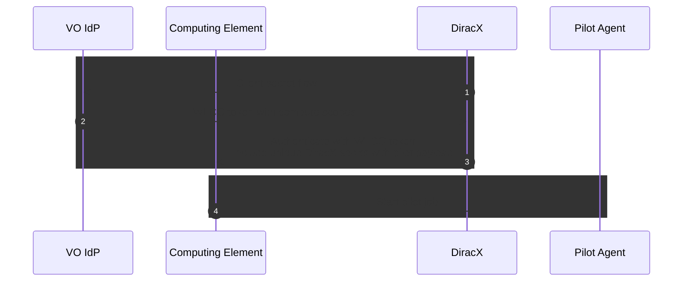

# Authentication with external serivices

This document explains how DIRAC and DiracX communicate with external services like storage and compute elements.

## Job submission

## Data access

### User clients

### Jobs

### File Transfer Service
