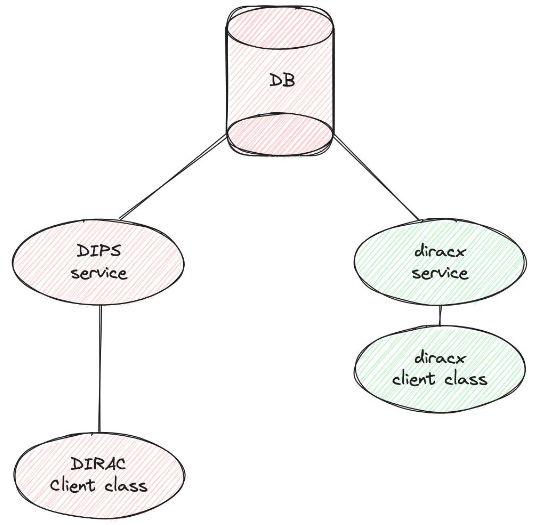
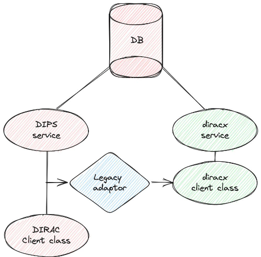

# Use DiracX functionalities

DiracX functionalities can be enabled at your pace. 

## Enable the VO

With "enabling a VO" we mean that a Virtual Organization enjoys DiracX functionalities. 
By default, every VO managed within a DIRAC (v9+) installation is enabled. 
If, for whatever reason (e.g. the IdP for a certain VO is not setup), 
such VO can be disabled by adding it in the following list (which is empty by default).

```
DiracX
{
    DisabledVOs = 
}
```

-> gives you token

ToDO


## Enable the S3 sandbox store

With DiracX the Sandboxes can be stored in an S3-compatible sandbox store.
This functionality will be activated for all the enabled VOs by adding the following option in the CS:

```
Systems
{
    Services
    {
        SandboxStore
        {
            UseDiracXBackend = True
        }
    }
}
```

When this option is activated, DIRAC will forward to DiracX the upload/download of sandboxes.
DiracX will find the correct settings in the `DIRACX_SANDBOX_STORE_*` [environment variables](../../reference/env_variables.md).


!!! warning 

    The `DIRAC` clients still interact with the DIRAC services to proxy the sandbox files to S3. New writes only go to S3, and read can be done from both. Eventually, given the periodic cleanup of sandboxes, all the files will be on S3 only.


## Enable a DiracX service

Once all VOs have been enabled, DiracX can start replacing DIRAC services. In order to do so, "legacy adaptors" have been developed. Activating them is a manual operation in the CS. 

The following sequence of images explain the process:

|  |  |  |
|-----------------------|-----------------------|-----------------------|
| 1: DBs are shared     | 2. Activate a legacy adaptor | 3. DIRAC service can be removed | 

Legacy adaptors will eventually be created for each of the DIRAC services.
In order to activate one, it is enough to add the following CS option: 

```
DiracX
{
    LegacyClientEnabled
    {
        DIRAC_System
        {
            DIRAC_ServiceName = True
        }
    }
}
```

The following table summarizes the DIRAC services for which a Legacy Adaptor is available (tested and certified), per DiracX release:

| DiracX release | DIRAC_System       | DIRAC_ServiceName |
| -------------- | ------------------ | ----------------- |
| v0.1.0         | WorkloadManagement | JobStateUpdate    |
