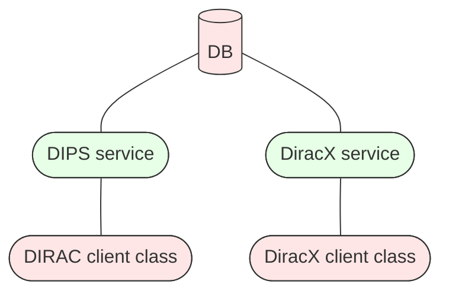

# Embracing DiracX

Once DiracX is installed and all the VOs are enabled, you can start embracing DiracX.

!!! danger "Configure all VOs before using DiracX"

    You cannot enable any diracx service before all of your DIRAC VOs are configured in diracx. Failure to do this will result in non configured VOs being broken in DIRAC in non obvious ways which are difficult to recover from.

## Enable the S3 sandbox store

With DiracX sandboxes are stored on S3-compatible storage.
This functionality is activated for all VOs by adding the following option in the CS:

```
Systems
{
    Services
    {
        SandboxStore
        {
            UseDiracXBackend = True
        }
    }
}
```

When this option is activated, DIRAC will forward uploads to DiracX.
Downloading sandboxes which are in DiracX is always possible regardless of this setting.
The DiracX sandbox store is configured via the environment variables in the helm chart. See the [environment variable docs](../../reference/env-variables.md) for details.

??? note "DIRAC sandbox compatibility in DiracX"

    The `DIRAC` clients still interact with the DIRAC services to proxy the sandbox files to S3. New writes only go to S3, and read can be done from both. Eventually, given the periodic cleanup of sandboxes, all the files will be on S3 only. It is not possible to download sandboxes from the DIRAC sandbox store using a DiracX client.

## Enable a DiracX service

Once all VOs have been enabled, DiracX can start replacing DIRAC services. In order to do so, "legacy adaptors" have been developed. Activating them is a manual per-service operation in the CS.

The following sequence of images explain the process:

DBs are shared, so DIRAC DIPS services and DiracX HTTP services are looking into the same database



*Legacy Adaptors* intercept requests in the DIRAC client and redirect the traffic to DiracX services. If necessary, they also transmute the response to match the format that would have been returned by a DIRAC service.


At this point, DIRAC services can be removed:


Over time as more Legacy Adaptors are developed, you can enable them with the following CS option:

```
DiracX
{
    LegacyClientEnabled
    {
        <System>
        {
            <ServiceName> = True
        }
    }
}
```

The following table summarizes the DIRAC services for which a Legacy Adaptor is available (tested and certified), per DiracX release:

| DiracX release | System             | ServiceName    |
| -------------- | ------------------ | -------------- |
| v0.0.1         | WorkloadManagement | JobStateUpdate |
