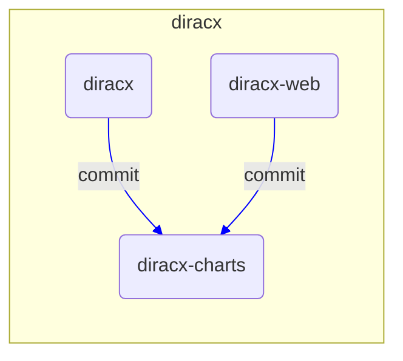

# Making and deploying releases

!!! warning "Version compatibility"

    DiracX should be upgraded before upgrading legacy DIRAC installations.

The versioning of `DIRAC`, `DIRACCommon`, `diracx`, `diracx-charts` and all the extensions are linked to one another.

## Dependencies between diracx, DIRAC and DIRACCommon

Both `DIRAC` and `diracx` depend on `DIRACCommon`. However, `DIRACCommon` is in the same repository as `DIRAC`, and versioned together. This means that if we need to move code from `DIRAC` to `DIRACCommon` such that it is usable by `diracx`, we need first a new release of `DIRAC` and `DIRACCommon` just moving the code, before being able to use it in `diracx`.

The releases of `DIRAC` and `DIRACCommon` are managed as they have always been, and are described in the `DIRAC` documentation

## Dependencies between diracx and diracx-charts

`diracx-charts` has a version number, as well as an `appversion`, which corresponds to the `diracx` version. This means that a new release of `diracx` requires a new `diracx-charts` release, which will update:

- the diracx-charts version
- the AppVersion
- the container versions

The `update-charts` [CI job](https://github.com/DIRACGrid/diracx/blob/e552651ac682e7461bc338856d295b0651ec2a26/.github/workflows/deployment.yml#L168) in `diracx` pushes a new commit in `diracx-charts`, which results in a new `diracx-charts` release.

## Dependencies between diracx, diracx-web and diracx-charts

The `diracx-web` version is only very loosely coupled with the `diracx` version.
A new `diracx-web` release will trigger a new `diracx-charts` updating:

- the chart version
- the container versions
- NOT the AppVersion

It does not bump the AppVersion because it refers to the `diracx` version, which is more relevant.



## diracx release

Releases are managed by `ReleasePlease`. The token used to perform it belongs to `DIRACGridBot` github user.

!!! info "Why a bot token?"

    `GITHUB_TOKEN` cannot trigger downstream workflows (GitHub's anti-loop protection). Using a bot PAT ensures that the tag created by `release-please` triggers the deployment and chart update jobs.

A new release creates:

- a [github release](https://github.com/DIRACGrid/diracx/releases)
- a [pypi release](https://pypi.org/project/diracx/)
- new [docker images](https://github.com/DIRACGrid/diracx/)

### Force version number

You can force a specific version number following the [doc](https://github.com/googleapis/release-please?tab=readme-ov-file#how-do-i-change-the-version-number)

```bash
git commit --allow-empty -m "chore: release 0.0.3" -m "Release-As: v0.0.3"
git push upstream HEAD:main
```

## diracx-web release

Releases are managed by `ReleasePlease`. The token used to perform it belongs to `DIRACGridBot` github user, same as `diracx`.

!!! info "Why a bot token?"

    `GITHUB_TOKEN` cannot trigger downstream workflows (GitHub's anti-loop protection). Using a bot PAT ensures that the tag created by `release-please` triggers the deployment and chart update jobs.

A new release creates:

- a [github release](https://github.com/DIRACGrid/diracx-web/releases)
- an [npm release](https://www.npmjs.com/package/@dirac-grid/diracx-web-components) for `diracx-web-components`
- new [docker images](https://github.com/DIRACGrid/diracx-web/)
- updated [Storybook documentation](https://diracgrid.github.io/diracx-web/) on GitHub Pages

## diracx-charts releases

Every commit in master triggers a new release. The releases are published on a [helm repo](https://charts.diracgrid.org/index.yaml)
