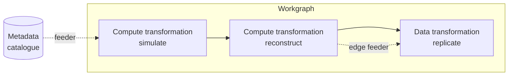

# DX-ADR-002: Transformation System overview

## Metadata

- **Created By:** Chris Burr, Christophe Haen
- **Date:** 2026-07-10
- **Status:** Draft
- **Decision Maker(s):** TBD

## Abstract

The DiracX Transformation System covers the ground of two DIRAC systems (the Transformation System and the Production System) as well as "job" part of the workload management system. This ADR describes the overall model and fixes the vocabulary used by the five companion ADRs.

A **workgraph** is a directed acyclic graph of **transformations**. It is what DIRAC called a production. Each transformation maintains a pool of **inputs**: a **feeder** tops up the pool from the experiment's metadata catalogue, a **packer** groups pooled inputs into **parcels**, and a **dispatcher** hands each parcel to a **compute** or **data backend**, which executes it as a **job** or a **request**. A workgraph is written as a CWL document ([DX-ADR-007](DX-ADR-007_cwl.md)): its dataflow declares how transformations chain, and inputs arriving from outside the workgraph carry the metadata queries that tell the feeder what to fetch.

The specifics live in five companion ADRs: compute backends ([DX-ADR-003](DX-ADR-003_compute_backends.md)), the database schema ([DX-ADR-004](DX-ADR-004_schema.md)), the state machines ([DX-ADR-005](DX-ADR-005_state_machines.md)), the extension points ([DX-ADR-006](DX-ADR-006_extensions.md)), and the CWL specification ([DX-ADR-007](DX-ADR-007_cwl.md)).

## Motivation

DiracX replaces two DIRAC systems, the Transformation System and the Production System, with one. The grouping that the Production System provided becomes the workgraph, a small part of the Transformation System; in DiracX it amounts to one table, a state roll-up and a hook mechanism, which is too little to justify a separate API and lifecycle. Some of the vocabulary changes as well, most notably "production" and "task"; the naming is argued in the Rationale.

A note on the name. DIRAC organises its code into *Systems* (the WMS, the DMS, the Transformation System itself). DiracX has no such concept, so "Transformation System" here names a functional area rather than a code unit, and the name is kept because it is well established.

## Specification

### Vocabulary

| Concept                                         | Term                       | One-line definition                                                                                                                             |
| ----------------------------------------------- | -------------------------- | ----------------------------------------------------------------------------------------------------------------------------------------------- |
| The whole system                                | **Transformation System**  | Covers what DIRAC's Transformation and Production systems did                                                                                   |
| Campaign / deliverable                          | **Workgraph**              | A DAG of transformations that produces what a user requested (the former *production*)                                                          |
| Stage of a campaign                             | **Transformation**         | Applies one operation to a pool of inputs, in units of parcels                                                                                  |
| …running compute jobs                           | **Compute transformation** | Its parcels become jobs                                                                                                                         |
| …moving/removing data                           | **Data transformation**    | Its parcels become requests                                                                                                                     |
| Unit of processable input                       | **Input**                  | Usually a file (LFN), possibly a fraction of one, possibly not a file at all (a seed, a parameter set)                                          |
| Dispatched unit of work                         | **Parcel**                 | An immutable, non-retryable unit of dispatched work: a user job, or a bundle of transformation inputs                                           |
| Compute execution                               | **Job**                    | A CWL process run through the DiracX job wrapper                                                                                                |
| Data-movement execution                         | **Request**                | A sequence of copy/delete operations                                                                                                            |
| Recipe for one job                              | **Process**                | A content-addressed CWL `Process`: a `CommandLineTool` or a `Workflow` (see DX-ADR-007)                                                         |
| Feeds the input pool                            | **Feeder**                 | Evaluates the input source (a metadata query, upstream outputs, a generator), injects new inputs                                                |
| Groups inputs into parcels                      | **Packer**                 | Decides when and how to make parcels                                                                                                            |
| Runs parcels                                    | **Compute / Data backend** | Submits, monitors, retrieves (see DX-ADR-003)                                                                                                   |
| Connects a parcel to its backend                | **Dispatcher**             | Routes an `Unassigned` parcel to its backend and drives submission, materialising its payload on the way (see DX-ADR-003)                       |
| Turns references and defaults into runnable CWL | **Resolution layer**       | Resolves stored-process references and configuration defaults at dispatch, and `lfn:`/`sandbox:` references in the job wrapper (see DX-ADR-007) |

### The model

- A transformation represents an [embarrassingly parallel](https://en.wikipedia.org/wiki/Embarrassingly_parallel) problem that can be solved using DiracX. The common core holds identity, state, what its inputs and outputs are, with their queries where there are any, and the choice of feeder and packer plugins. Additional fields are defined depending on whether the transformation's parcels run as jobs or as requests.
- The loop inside a transformation: the feeder evaluates the input query and inserts new inputs as `Unassigned`. Periodically the packer claims `Unassigned` inputs and proposes parcels. The dispatcher hands each parcel to the transformation's backend. When the backend reports outcomes, inputs move to `Processed`; on failure they return to the pool, and hooks decide per input between retry, giving up for an operator to look at, and split. The packer is told whether its feeder is still running, so it can pack the remainder and let the transformation finish. An input is processed once or not at all.
- A workgraph groups transformations and is defined by a CWL document (DX-ADR-007). The document's dataflow declares the edges; there is no edge table, and each internal edge is served at run time by a feeder over the files the upstream transformation has produced (DX-ADR-004, DX-ADR-006). Behaviour that spans transformations ("when these two finish, merge their histograms") is expressed through hooks rather than schema structure. Data transformations are nodes of the graph that runs without being steps of the document: they are declared in the `dirac:Workgraph` hint against the files they act on, a step output or a workgraph input, since CWL dataflow has no notion of copying or removal (DX-ADR-007).
- The workgraph status rolls up its members and doubles as the control surface. Cancelling a workgraph fans out to its transformations, and an operator brings one to a close by draining or halting it; pausing is per transformation. Forward transitions wait on member states. A workgraph can start with a scouting phase, in which its transformations run on a reduced input sample and the workgraph is approved before running in full (DX-ADR-005).

### What each companion ADR defines

- **[DX-ADR-003: Compute backends](DX-ADR-003_compute_backends.md):** the backend contract, the reference backend set, and the boundary with interCEde.
- **[DX-ADR-004: Database schema](DX-ADR-004_schema.md):** the tables, counters, and identifiers.
- **[DX-ADR-005: State machines](DX-ADR-005_state_machines.md):** the workgraph, transformation, input and parcel lifecycles, and the rules that connect them.
- **[DX-ADR-006: Extensions](DX-ADR-006_extensions.md):** the pluggable roles (feeder, packer, hooks and actions) and their contracts.
- **[DX-ADR-007: CWL specification](DX-ADR-007_cwl.md):** how user jobs, workgraphs and transformations are written in CWL, the `dirac:` hint vocabulary, the resolution layer, and the conventions for grid data, sandboxes and references to stored processes.

## Rationale

The naming choices below have been made to favour clarity over DIRAC continuity because we hope the pool of users and developers will grow well beyond the communities that know the existing terms: the new names would then be learned by many more people than the old ones ever were.

### Keeping "Transformation"

The underlying concept is unchanged in DiracX and the name is well established amongst DIRAC users and the wider community.

### "Workgraph" to describe connected transformations

"Workgraph" says what the thing is, a graph of work, and nothing else. Established words (production, campaign, pipeline) come with meanings from other contexts, and readers bring those meanings with them.

It is "graph" rather than "chain" because real workgraphs fork and merge: a simulation transformation can feed a reconstruction and a data-removal transformation at once, and a filter can fan out to several merges.

### "Parcel" for the unit of dispatched work

"Task" already names the execution framework of [DX-ADR-001](DX-ADR-001_tasks.md), and the feeders, packers and backends of this system themselves run as DX-ADR-001 tasks. Reusing the word for the dispatched unit would give it two unrelated meanings in one codebase. A parcel is a packed bundle handed over for delivery, which is also a fair description of the object.

### A stored recipe is a CWL Process

What DiracX stores content-addressed and a parcel executes is a CWL `Process`, which is CWL's own abstract base type: `CommandLineTool`, `ExpressionTool`, `Workflow` and `Operation` all extend it, and a workflow step's `run` field is typed `[string, Process]`. Most stored rows are `CommandLineTool` documents rather than `Workflow` ones, so calling the concept a workflow would have named it after the case it usually is not, and would have collided with `class: Workflow` in every document.

### Edges declared in CWL, served by feeders

The workgraph's CWL document declares the DAG, so tooling reads the structure from the definition instead of reconstructing it. Execution still runs through feeders: the files each parcel produces are recorded as it finishes and a feeder hands them to the downstream transformation, and storing the edges themselves as rows as well would record the same fact twice and let the two copies drift apart.

The feeders also matter for scaling. A downstream transformation picks up upstream outputs as they are produced, so inputs can be considered in subgroups and there is no need to worry about correlations between the processing statuses of neighbouring transformations. The only synchronisation is deferred to the packer code, which can be installation- or transformation-specific.

## Rejected Ideas

- **A separate system, as in DIRAC.** The workgraph needs a table, a roll-up state machine and hooks. Wrapping that in its own system would add a second API, lifecycle and monitoring surface around a small amount of behaviour and make it considerably harder to ensure correctness.
- **Keeping "production" for the grouping.** The lowest-friction option, but the word means different things to different readers, and removing that baggage was the reason to rename at all.
