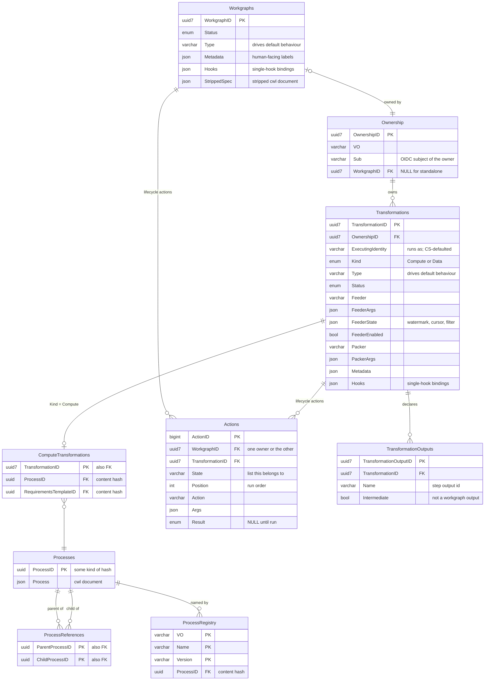
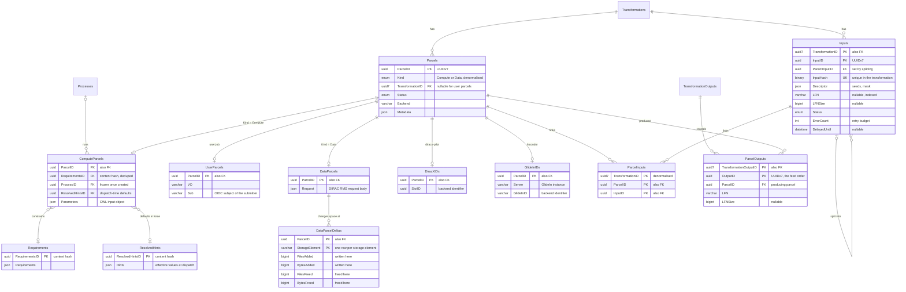
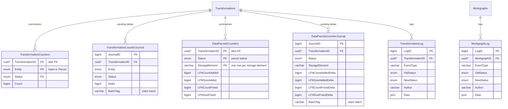

# DX-ADR-004: Transformation System database schema

## Metadata

- **Created By:** Chris Burr, Christophe Haen
- **Date:** 2026-07-10
- **Status:** Draft
- **Decision Maker(s):** TBD

## Abstract

This ADR defines the database schema for the DiracX Transformation System, approximately replacing DIRAC's `TransformationDB`, `JobDB` and `ProductionDB`. The conceptual model (DX-ADR-002) is unchanged: transformations consume *inputs*, a *packer* assembles inputs into *parcels*, and parcels are executed by a *backend*. The schema is restructured:

- `TransformationFiles`/`DataFiles` become a generalised **`Inputs`** table: an indexed nullable `LFN`, a JSON `Descriptor` for everything else, a hash over the two that is **unique per transformation**, and an explicit **parent link** so an input can be *split* into finer-grained children.
- Inputs ↔ parcels is **many-to-many**, and parcels are **not retryable**: a failed parcel returns its inputs to the pool and a new parcel may later be created.
- The bulk tables are **keyed on the transformation first**, so a transformation's rows are contiguous and cleaning is a range delete.
- The files a compute parcel produces are recorded in **`ParcelOutputs`** as it finishes, under the declared output they belong to (**`TransformationOutputs`**), so DiracX can feed internal edges with a default feeder that needs no experiment catalogue and no knowledge of who consumes an output.
- `Transformations` holds the common definition; a **`ComputeTransformations`** row adds the process and the requirements template. Data transformations have no subtype row, because what a data parcel does is written by the packer onto the parcel itself.
- The definition side is **compiled from the workgraph's CWL document** (DX-ADR-007): hints become columns, run bodies become `Processes` rows, and the remaining skeleton is kept as the workgraph's `StrippedSpec`. Stored processes reference each other rather than being flattened, so a shared tool deduplicates on its own, and a **`ProcessRegistry`** gives library processes a name and a version over the content store.
- Parcels are **polymorphic**: one base table of dispatch bookkeeping, a `ComputeParcels` or `DataParcels` facet for the payload, a `UserParcels` row for a submitted user job, and one small table per backend for the backend's own identifier. **User jobs are parcels** and share the dispatcher and the backends (DX-ADR-003), including a **recovery** backend for partial-output registration.
- The ordered lists of lifecycle actions and their results are rows in **`Actions`**, not a JSON column, so running one is a single update.
- Per-status counts are **journalled counters** (DX-ADR-009), which give exact numbers without hot-row contention. Data transformations declare a second counter, keyed by storage element and by what is being done to it, carrying file counts and bytes.
- **UUIDv7** primary keys wherever an entity is minted, definition entities included; process documents, requirement sets and resolved-hint sidecars are **content-addressed**, keyed by hashes instead. Status columns are `ENUM`s over the states of DX-ADR-005.

The illustrative DDL is MySQL; the SQLAlchemy Core table definitions in `diracx-db` are the source of truth.

## Motivation

`TransformationDB` has accumulated structural limits that cannot be fixed incrementally:

- **Whole-file granularity.** `TransformationFiles` is keyed on `(TransformationID, FileID)`, so a file is processed as an indivisible unit: there is no way to say "this part is done, this part needs redoing" (the common CMS luminosity-section case).
- **No partial-output recovery.** A job that partially fails may have produced valid output; the current schema has nowhere to record it.
- **LFN-only inputs.** Simulation transformations have no input files; some inputs are not files at all (seeds, event counts). `DataFiles.LFN NOT NULL UNIQUE` forces workarounds.
- **Awkward identifiers.** `TaskID` is a per-transformation counter maintained by a `BEFORE INSERT` trigger, a long-standing source of contention and fragility.
- **Expensive monitoring.** Status summaries scan hundred-million-row tables or serialise writers on hot counter rows.
- **EAV sprawl.** `AdditionalParameters`, `TransformationMetaQueries`, `TaskInputs.InputVector` predate native JSON.

## Specification

### Conventions

- **UUIDv7** identifiers (`BINARY(16)`) wherever an id is minted rather than derived: `Workgraphs`, `Ownership`, `Transformations` and `TransformationOutputs` on the definition side, `Inputs`, `Parcels` and `ParcelOutputs` on the execution side. They are time-ordered, so bulk inserts stay index-local, any worker can mint an id without a round-trip, and a row's creation time is in its key rather than in a column, which is why none of these tables carries `CreatedAt`. `Processes`, `Requirements` and `ResolvedHints` are keyed by content hashes instead (see their sections); `Actions`, the journals and the logs keep `AUTO_INCREMENT` ids, which nothing outside them references.
- **The bulk tables are clustered on the transformation.** `Inputs` and `ParcelInputs` take `TransformationID` as the first column of the primary key, and `ParcelOutputs` the id of the declared output it belongs to, so each transformation's rows are contiguous, inserts still append within it, and cleaning is a range delete rather than a scatter over the whole table. Their foreign keys are composite for the same reason (see the Rationale). `Parcels` is the exception, keyed on `ParcelID` alone, because a user parcel has no transformation.
- Everything lives in the **single unified DiracX database** with the WMS/job-submission tables, so every reference shown is an enforced foreign key.
- **Status columns are `ENUM`s** whose values are exactly the states of [DX-ADR-005](DX-ADR-005_state_machines.md), so the database refuses a status no state machine defines and the two documents cannot drift apart unnoticed. The *transitions* are still enforced in `diracx-logic` rather than by triggers. Adding a state is then a migration, but appending a value to an `ENUM` rewrites no rows in either MySQL 8.0 or MariaDB while the list stays under 256 entries, so the lists are written in state-machine order and extended at the end. Columns whose value set comes from configuration and extensions rather than from this ADR (`Type`, `Feeder`, `Packer`, `Backend`, `EventType`) stay `VARCHAR`.
- Both **MySQL 8.0 and MariaDB** are supported targets, so the schema stays within their common dialect. The consequential differences: MariaDB stores `JSON` as validated text rather than a binary format, and `FOR UPDATE SKIP LOCKED` (DX-ADR-006) requires MariaDB 10.6, which sets the version floor.

### Entity overview

The schema has a definition side (few rows, written by operators and tooling), an execution side (bulk rows, written constantly by the system), and an accounting side (append-only rows serving monitoring). One diagram each; the column lists are abbreviated, and the DDL in the following sections is the full detail, except for the counter tables, whose shape is DX-ADR-009's.

#### Definition



#### Execution



#### Accounting



### `Workgraphs`

Groups one or more transformations into the deliverable users request, and holds the workgraph's definition: `StrippedSpec` is the submitted CWL document with redundant information removed.

```sql
CREATE TABLE Workgraphs (
    WorkgraphID  BINARY(16)   NOT NULL,      -- UUIDv7
    Type         VARCHAR(32)  NOT NULL,      -- VO label driving default behaviour
    Status       ENUM('New', 'Scouting', 'Approving', 'ApprovingBlocked',
                      'Active', 'Finalizing', 'Completed', 'Archiving',
                      'Archived', 'Cancelling', 'Cleaned')
                              NOT NULL DEFAULT 'New',
    StrippedSpec JSON         NOT NULL,
    Metadata     JSON         NULL,
    Hooks        JSON         NULL,          -- single-hook bindings (DX-ADR-006); ordered lists live in Actions
    UpdatedAt    DATETIME     NOT NULL,
    PRIMARY KEY (WorkgraphID),
    INDEX (Status)
);
```

- **The DAG is declared, and there is still no edge table.** A workgraph is submitted as a CWL document (DX-ADR-007) whose dataflow declares the edges; `StrippedSpec` keeps that declaration, with each step's run body replaced by its `Processes` hash. Inputs arriving from outside the workgraph carry feeder queries; internal edges are served by the edge feeder over the `ParcelOutputs` rows recorded as upstream parcels finish (DX-ADR-006), and a consumer's `FeederArgs` names the declared output it feeds from.
- `Type`, here and on `Transformations`, is a VO-defined label that selects default behaviour; anything the document leaves unset is filled from the configuration service (DX-ADR-007).
- There is no name column, here or on `Transformations`. Identity is the `WorkgraphID`; human-facing labels are key-value pairs in `Metadata`, queried by each community's own conventions, and a key that becomes hot can be indexed later with a generated column.
- Cross-transformation behaviour is expressed through **hooks** rather than schema structure. The workgraph status is a roll-up of its transformations and a control surface (DX-ADR-005).
- A workgraph and its member transformations are created in one transaction, and the transitions that fan out to members are applied in one transaction, so there is never a partially created or partially transitioned workgraph (DX-ADR-005).

### `Ownership`

Who owns what, factored into its own table so that sameness is structural rather than promised: a workgraph and its member transformations reference the same row, so their `VO` and `Sub` cannot diverge. A standalone transformation gets a row of its own (`WorkgraphID NULL`). Rows are not shared between standalone transformations for now, and user parcels do not use this table at all: they carry their own `VO` and `Sub`, so that submitting a job needs no lookup.

```sql
CREATE TABLE Ownership (
    OwnershipID BINARY(16)   NOT NULL,         -- UUIDv7
    VO          VARCHAR(32)  NOT NULL,
    Sub         VARCHAR(256) NOT NULL,         -- OIDC subject of the owner
    WorkgraphID BINARY(16)   NULL,             -- NULL for standalone transformations
    PRIMARY KEY (OwnershipID),
    FOREIGN KEY (WorkgraphID) REFERENCES Workgraphs (WorkgraphID),
    UNIQUE  KEY (WorkgraphID),                 -- at most one ownership row per workgraph
    INDEX (VO, Sub)
);
```

`Sub` is the OIDC subject of whoever controls the workgraph or transformation, the same identifier the DiracX authentication tables key on, which is what fixes its width at `VARCHAR(256)`. It is administrative: the identity that work executes under is a separate concern (`Transformations.ExecutingIdentity`, below).

### `Transformations`

A base table holding the definition every transformation has, plus a `ComputeTransformations` row for the compute kind.

```sql
CREATE TABLE Transformations (
    TransformationID  BINARY(16)   NOT NULL,   -- UUIDv7
    OwnershipID       BINARY(16)   NOT NULL,
    ExecutingIdentity VARCHAR(64)  NULL,       -- identity the parcels run as; CS-defaulted (DX-ADR-007)
    Type              VARCHAR(32)  NOT NULL,   -- VO label driving default behaviour: MCSimulation, Merge, ...
    Kind              ENUM('Compute', 'Data') NOT NULL,
    Status            ENUM('New', 'Active', 'Paused', 'Finalizing',
                           'FinalizingBlocked', 'Finalized', 'Completed',
                           'Archiving', 'ArchivingBlocked', 'Archived',
                           'Cancelling', 'CancellingBlocked', 'Cleaned')
                                   NOT NULL DEFAULT 'New',
    Feeder            VARCHAR(64)  NULL,       -- input plugin (DX-ADR-006); NULL when inputs arrive by other means
    FeederArgs        JSON         NULL,       -- from the input's dirac:Feeder hint; changed by the active hook
    FeederState       JSON         NULL,       -- the feeder's own bookmark; written by the core, opaque to it
    FeederEnabled     BOOLEAN      NOT NULL DEFAULT TRUE,
    Packer            VARCHAR(64)  NOT NULL,   -- input-packing plugin
    PackerArgs        JSON         NULL,       -- group size, policy; from the step's dirac:Transformation hint
    Metadata          JSON         NULL,
    Hooks             JSON         NULL,       -- single-hook bindings (DX-ADR-006); ordered lists live in Actions
    UpdatedAt         DATETIME     NOT NULL,
    PRIMARY KEY (TransformationID),
    FOREIGN KEY (OwnershipID) REFERENCES Ownership (OwnershipID),
    INDEX (OwnershipID),
    INDEX (Status),
    INDEX (Type)
);

CREATE TABLE ComputeTransformations (
    TransformationID       BINARY(16) NOT NULL,
    ProcessID              BINARY(32) NOT NULL, -- content hash of what the parcels run (DX-ADR-007)
    RequirementsTemplateID BINARY(32) NULL,     -- base matching; the packer merges per-parcel additions
    PRIMARY KEY (TransformationID),
    FOREIGN KEY (TransformationID)       REFERENCES Transformations (TransformationID),
    FOREIGN KEY (ProcessID)              REFERENCES Processes (ProcessID),
    FOREIGN KEY (RequirementsTemplateID) REFERENCES Requirements (RequirementsID)
);
```

`Kind` says what the transformation's parcels become. A `Compute` transformation has a `ComputeTransformations` row naming the process its parcels run and the requirements template the packer builds on; base and subtype rows are created in one transaction. A `Data` transformation has no subtype row: the request each of its parcels carries out is written by the packer onto the parcel (`DataParcels.Request`, below), so there is nothing per transformation to hold.

**`ProcessID` is frozen once any parcel of the transformation exists**, since each parcel is a record of what ran. Changing what a transformation executes is therefore a new transformation, which is why scouting a bad configuration ends in cancellation rather than an edit (DX-ADR-005).

The definition columns are extracted from the workgraph's CWL document at submission (DX-ADR-007): the feeder and its arguments from the input's `dirac:Feeder` hint, and the packer and its arguments and the lifecycle action lists from the step's `dirac:Transformation` hint. The hook bindings are resolved from the configuration service against the workgraph's `type`, and a hint naming its own overrides that resolution (DX-ADR-007). `Hooks` holds only the bindings that name a single hook and carry no result; the ordered lists of lifecycle actions are rows in `Actions`.

**`FeederState` is the feeder's bookmark**, written by the core in the same transaction as the inputs the feeder yielded alongside it, and never interpreted by the core. It is what stops a feeder re-reading inputs it has already produced: a watermark for a catalogue query, the highest seed issued for a simulation, or a Bloom filter over what has been yielded when nothing cheaper fits. A duplicate *row* is refused by the unique `(TransformationID, InputHash)` key whatever the bookmark does; the bookmark is what stops the feeder paying to re-yield one. Because it commits with the inputs, and because only one feeder runs per transformation at a time (DX-ADR-006), the state can never claim an input was inserted when it was not. It may still be conservative in the other direction, so the reconciliation action at `Finalizing` is what makes an approximate bookmark safe (DX-ADR-006). Clearing `FeederState` reopens a feeder from the beginning, which is how a workgraph returned from `Finalizing` to `Active` picks up what an approximate bookmark missed. A pass with no bookmark needs nothing special: every pass inserts unconditionally and the unique hash key drops what the transformation already has (`Inputs`, below). A feeder whose bookmark is a cursor rather than a watermark never needs any of this anyway, since the cursor is exact and has skipped nothing.

`FeederEnabled` gates the feeder. It is cleared by an operator, by an active hook, or when the feeder reports that no further input will come. An operator or an active hook can set it again: an operator recovering a workgraph that returned from `Finalizing` to `Active` re-enables the feeders that had been disabled. A disabled feeder is one of the conditions for a transformation to leave `Active` (DX-ADR-005).

Ownership (the VO, the owner, and the optional workgraph membership) is factored into the `Ownership` table above, so a workgraph and its members cannot disagree. `ExecutingIdentity` is separate: the identity the transformation's parcels run as, defaulted from the configuration service (DX-ADR-007).

### `Actions`

The ordered lists of lifecycle actions bound to a workgraph or transformation, and their results. One row is one bound action: what to run, with what arguments, in which position of which state's list, and what happened when it last ran.

```sql
CREATE TABLE Actions (
    ActionID         BIGINT       NOT NULL AUTO_INCREMENT,
    WorkgraphID      BINARY(16)   NULL,             -- exactly one of the two owners is set
    TransformationID BINARY(16)   NULL,
    State            VARCHAR(32)  NOT NULL,         -- the state whose list this belongs to
    Position         INT          NOT NULL,         -- run order within that list
    Action           VARCHAR(64)  NOT NULL,
    Args             JSON         NULL,
    Result           ENUM('Pending', 'Passed', 'Failed', 'Done') NULL, -- NULL until run
    Message          VARCHAR(512) NULL,
    Author           VARCHAR(64)  NULL,             -- set when an operator forces or resets the result
    UpdatedAt        DATETIME     NULL,
    PRIMARY KEY (ActionID),
    FOREIGN KEY (WorkgraphID)      REFERENCES Workgraphs (WorkgraphID),
    FOREIGN KEY (TransformationID) REFERENCES Transformations (TransformationID),
    UNIQUE KEY (WorkgraphID, State, Position),
    UNIQUE KEY (TransformationID, State, Position)
);
```

- **`Position` makes the list an order, not an accident.** The runner takes the lowest position in the current state whose `Result` is null, so a list resumes exactly where it stopped and inserting an action later is a renumbering rather than a rewrite.
- **Recording a result is one `UPDATE` of one row.** In the JSON alternative every action, every operator edit and every reset rewrote the same column, which races and loses the previous message.
- **Entering a state resets that state's list** (`SET Result = NULL WHERE <owner> AND State = ?`) in the same transaction as the transition (DX-ADR-005).
- `Result` covers both kinds of list: checks record `Passed` or `Failed`, housekeeping records `Done` or `Failed`, and either records `Pending` when the answer is not yet knowable, such as in-flight parcels that are still cancelling. `Pending` leaves the entity where it is and the action is tried again; only `Failed` moves it to the state's blocked counterpart. A sign-off nobody has given is `Failed`, not `Pending`, so that it is visible as a blocked entity rather than as work in progress (DX-ADR-005, DX-ADR-006).
- The rows are created with the entity, from the CWL hints and the configuration-service defaults (DX-ADR-007). Every run is also written to the owner's log table.

### `Inputs`

One row is one *unit of processable input*: usually a file, possibly a fraction of one (via a mask in `Descriptor`), possibly not a file at all.

```sql
CREATE TABLE Inputs (
    TransformationID BINARY(16)   NOT NULL,
    InputID          BINARY(16)   NOT NULL,        -- UUIDv7
    ParentInputID    BINARY(16)   NULL,            -- set when created by splitting; same transformation
    InputHash        BINARY(16)   NOT NULL,        -- XXH3-128 over the canonical (LFN, Descriptor)
    LFN              VARCHAR(255) NULL,            -- promoted out of JSON: indexed, joinable
    LFNSize          BIGINT       NULL,            -- size of the whole file, whatever the mask selects
    Descriptor       JSON         NULL,            -- {"Mask": "11-20", "Run": 1234, "Seed": 42}
    Status           ENUM('Unassigned', 'Assigned', 'Processed', 'Split',
                          'Failed', 'Problematic', 'NotProcessed')
                                  NOT NULL DEFAULT 'Unassigned',
    ErrorCount       INT          NOT NULL DEFAULT 0, -- failed parcels since the last reset
    DelayedUntil     DATETIME     NULL,            -- withheld from the packer until then
    LastParcelID     BINARY(16)   NULL,            -- full history via ParcelInputs
    UpdatedAt        DATETIME     NOT NULL,
    PRIMARY KEY (TransformationID, InputID),
    FOREIGN KEY (TransformationID) REFERENCES Transformations (TransformationID),
    FOREIGN KEY (TransformationID, ParentInputID) REFERENCES Inputs (TransformationID, InputID),
    UNIQUE  KEY (TransformationID, InputHash),
    INDEX (TransformationID, Status),
    INDEX (TransformationID, LFN),
    INDEX (TransformationID, ParentInputID)
);
```

- **The mask is opaque to the core.** Only packers and backends interpret it; the core state machine treats every row identically (CMS luminosity sections, LHCb event ranges, and future schemes all fit). What the core does with `Descriptor` is hash it, which needs no understanding of what is inside.
- **`LFNSize` is the size of the whole file**, whatever the mask selects. A feeder that wants the size of the selected fraction puts it under its own key in `Descriptor`. A size-based packer that puts several masks of one LFN into a parcel can still account for the transfer by summing over distinct LFNs (DX-ADR-006).
- **Splitting** sets the parent row to `Split` (terminal) and inserts children pointing at it, in one transaction. Lineage is explicit and queryable without parsing masks, and a child is always in the same transformation as its parent, which is what lets the reference be composite.
- **`InputHash` is what an input is deduplicated on.** It is an `XXH3-128` digest over the canonical form of the pair `(LFN, Descriptor)`, computed by the core rather than by the feeder so that two feeders describing the same thing agree, and unique within the transformation. Hashing the descriptor as well as the LFN is what makes the key survive splitting, which a unique key on `(TransformationID, LFN)` could not: a parent `{"Run": 1234}` and its children `{"Run": 1234, "Mask": "1-10"}` hash differently, while a feeder yielding the same bare LFN twice does not. A feeder pass is therefore an unconditional insert that the database itself resolves, with no per-input lookup, and the bookmark becomes an optimisation rather than the guarantee. The cost is sixteen bytes and a second unique index on the hottest insert path in the system, which an earlier draft of this ADR refused to pay; it is paid because deduplication then holds for every feeder, including one whose bookmark is wrong.
- **A file may legitimately come round again.** Because the hash covers the descriptor and not the LFN alone, a feeder that has to yield the same file more than once distinguishes the occurrences with a field of its own in `Descriptor`, and each becomes a row. A standalone data transformation is where this arises: files staged to disk at users' requests are removed, staged again later, and have to be removed again, and each round is a unit of work in its own right rather than a repeat of one that is already `Processed`. The field is the feeder's and opaque to the core, like the mask, and no schema change is needed to allow it. The cost falls inside that transformation, where `(TransformationID, LFN)` stops identifying at most one row, so anything that reads an input by LFN there has to say which occurrence it means, including the reconciliation action at `Finalizing` (DX-ADR-006).
- **The digest is non-cryptographic on purpose.** Nothing here defends against an adversary choosing an input, and the key is scoped to one transformation, so the fast hash is the right one. The width is not free of consequence: a collision silently drops a legitimate input, so at 128 bits it stays negligible over a billion inputs where a 64-bit variant would not. The algorithm and the canonical byte form are the same question as for the content hashes below (see Open Issues), with one difference: this hash never leaves the database, so it can be changed by a migration that rewrites one column, while a content hash cannot.
- **`DelayedUntil`** withholds an input from the packer without changing its status. The packer sets it (DX-ADR-006) and the claim query skips rows whose time has not passed.
- **`ErrorCount`** is the retry budget the failure hook reads (DX-ADR-006), counting the failed parcels the input has been part of since it was last reset. An operator resetting a quarantined input back to `Unassigned` returns the count to zero (DX-ADR-005), so it is not derivable from `ParcelInputs` once that has happened. It is kept on the row so the hook reads it without a join, and the full history is always recoverable from `ParcelInputs`, whose rows are never deleted on failure.

Input statuses and transitions are defined in [DX-ADR-005](DX-ADR-005_state_machines.md). The `(TransformationID, Status)` index serves the packer's claim and the status-driven sweeps.

### `Processes`

Content-addressed storage for the CWL documents that describe one unit of compute work (DX-ADR-007). The key is a hash of the canonicalised document.

```sql
CREATE TABLE Processes (
    ProcessID BINARY(32) NOT NULL,   -- content hash of the canonicalised document; algorithm open
    Process   JSON       NOT NULL,   -- the CWL document
    CreatedAt DATETIME   NOT NULL,   -- when the document was first stored
    PRIMARY KEY (ProcessID)
);
```

- **Immutability is by construction.** Editing a document changes its hash, which is a different row; no service-layer rule is needed.
- **Sharing is automatic.** A merge tool that is byte-identical across thousands of workgraphs is stored once, however many transformations and user parcels reference it.
- **Stored as a tree, not flattened.** A step's `run` may be a reference to another stored process rather than an inline body (DX-ADR-007), and the reference is kept. A shared tool therefore deduplicates independently of everything that composes it, and correcting one does not rewrite the documents above it, which would change their hashes and their provenance.
- Processes are not transformation-specific: every compute parcel references one directly (`ComputeParcels.ProcessID`, below).

### `ProcessReferences` and `ProcessRegistry`

Two small tables sit over the content store. Neither is authoritative: the hash identifies a document, and both tables are derived from or point into `Processes`.

```sql
CREATE TABLE ProcessReferences (
    ParentProcessID BINARY(32) NOT NULL,
    ChildProcessID  BINARY(32) NOT NULL,
    PRIMARY KEY (ParentProcessID, ChildProcessID),
    FOREIGN KEY (ParentProcessID) REFERENCES Processes (ProcessID),
    FOREIGN KEY (ChildProcessID)  REFERENCES Processes (ProcessID),
    INDEX (ChildProcessID)
);

CREATE TABLE ProcessRegistry (
    VO        VARCHAR(32)  NOT NULL,
    Name      VARCHAR(128) NOT NULL,
    Version   VARCHAR(64)  NOT NULL,
    ProcessID BINARY(32)   NOT NULL,
    Author    VARCHAR(64)  NOT NULL,
    CreatedAt DATETIME     NOT NULL,
    PRIMARY KEY (VO, Name, Version),
    FOREIGN KEY (ProcessID) REFERENCES Processes (ProcessID),
    INDEX (ProcessID)
);
```

- **`ProcessReferences` is extracted when a process is stored**, one row per reference its body carries. The graph is acyclic by construction, since a child's hash has to exist before the parent's can be computed. `INDEX (ChildProcessID)` answers "what composes this tool", which is the half of the lineage question the registry cannot answer on its own.
- **`ProcessRegistry` gives library processes a name and a version.** It is a lookup for authoring and for asking questions, never an identity: submission resolves a name to a hash and stores the hash, so nothing that happens in this table afterwards can change what a running transformation executes. With the two tables together, "every transformation running a step older than the fix" is an indexed lookup rather than a crawl over stored documents.
- Names are scoped per VO. Whether a published name may later be repointed, and whether versions are ordered, is open.
- **Both tables pin their targets against collection.** A process named in the registry, or referenced by another stored process, is reachable and cannot be deleted.

### `Requirements`

Matching criteria (sites, tags, memory, priority) recur endlessly: thousands of parcels of one transformation share a site whitelist, and users resubmit with identical requirements. Like `Processes`, the table is content-addressed, so deduplication needs no logic at all.

```sql
CREATE TABLE Requirements (
    RequirementsID BINARY(32) NOT NULL,   -- content hash of the canonicalised requirement set
    Requirements   JSON       NOT NULL,
    CreatedAt      DATETIME   NOT NULL,
    PRIMARY KEY (RequirementsID)
);
```

For transformation parcels the requirement set is minted by the packer, merging per-parcel additions over the transformation's template (DX-ADR-006); for user parcels it comes from the submitted document plus the configuration-service defaults (DX-ADR-007). The templates themselves are rows in this table too: `ComputeTransformations.RequirementsTemplateID` points here, so a template shared by many transformations is stored once.

### `ResolvedHints`

The effective hint values a parcel ran under, after the configuration service has been resolved (DX-ADR-007). The dispatcher writes them as a sidecar rather than baking them into the document, so the process stays byte-identical to its stored hash while the parcel still records exactly which defaults were in force.

```sql
CREATE TABLE ResolvedHints (
    ResolvedHintsID BINARY(32) NOT NULL,   -- content hash of the canonicalised sidecar
    Hints           JSON       NOT NULL,
    CreatedAt       DATETIME   NOT NULL,
    PRIMARY KEY (ResolvedHintsID)
);
```

Content-addressed like the tables above, which matters here: every parcel of a transformation dispatched under the same configuration resolves to the same sidecar, so thousands of parcels share one row and one materialised payload (DX-ADR-003).

### `Parcels`, `UserParcels`, `ComputeParcels`, `DataParcels`

Like `Transformations`, parcels are polymorphic: a base table carries the dispatch bookkeeping the hot paths touch, a kind-specific table carries other information, and a `UserParcels` row carries the identity of a submitted user job. A **user parcel** is a submitted user job; a **transformation parcel** is a unit of work created by a packer, and carries its `TransformationID` on the base row. Both are dispatched the same way (DX-ADR-003), which is what gives user jobs access to every backend.

```sql
CREATE TABLE Parcels (
    ParcelID         BINARY(16)   NOT NULL,       -- UUIDv7
    TransformationID BINARY(16)   NULL,           -- NULL for user parcels
    Kind             ENUM('Compute', 'Data') NOT NULL, -- denormalised from the transformation; user parcels are always Compute
    Status           ENUM('Unassigned', 'Reserved', 'Assigned', 'Completing',
                          'Done', 'PartiallyDone', 'Failed', 'Cancelled')
                                  NOT NULL DEFAULT 'Unassigned',
    Backend          VARCHAR(32)  NULL,           -- DX-ADR-003 reference set; chosen by the dispatcher
    Metadata         JSON         NULL,           -- output manifest, backend extras
    UpdatedAt        DATETIME     NOT NULL,
    CompletedAt      DATETIME     NULL,
    PRIMARY KEY (ParcelID),
    FOREIGN KEY (TransformationID) REFERENCES Transformations (TransformationID),
    INDEX (TransformationID, Status),
    INDEX (Backend, Status),
    INDEX (Kind, Status)
);

CREATE TABLE UserParcels (
    ParcelID BINARY(16)   NOT NULL,
    VO       VARCHAR(32)  NOT NULL,
    Sub      VARCHAR(256) NOT NULL,             -- OIDC subject of the submitter
    PRIMARY KEY (ParcelID),
    FOREIGN KEY (ParcelID) REFERENCES Parcels (ParcelID),
    INDEX (VO, Sub)
);

CREATE TABLE ComputeParcels (
    ParcelID        BINARY(16) NOT NULL,
    ProcessID       BINARY(32) NOT NULL,         -- content hash (DX-ADR-007); copied from the transformation
    RequirementsID  BINARY(32) NULL,             -- deduped matching criteria
    ResolvedHintsID BINARY(32) NULL,             -- the defaults in force at dispatch
    Parameters      JSON       NULL,             -- the CWL input object for this run
    PRIMARY KEY (ParcelID),
    FOREIGN KEY (ParcelID)        REFERENCES Parcels (ParcelID),
    FOREIGN KEY (ProcessID)       REFERENCES Processes (ProcessID),
    FOREIGN KEY (RequirementsID)  REFERENCES Requirements (RequirementsID),
    FOREIGN KEY (ResolvedHintsID) REFERENCES ResolvedHints (ResolvedHintsID)
);

CREATE TABLE DataParcels (
    ParcelID BINARY(16) NOT NULL,
    Request  JSON       NOT NULL,                -- DIRAC RMS request body, written by the packer
    PRIMARY KEY (ParcelID),
    FOREIGN KEY (ParcelID) REFERENCES Parcels (ParcelID)
);

CREATE TABLE DataParcelDeltas (
    ParcelID       BINARY(16)  NOT NULL,
    StorageElement VARCHAR(64) NOT NULL,         -- one row per storage element
    FilesAdded     BIGINT      NOT NULL,         -- written here; never negative
    BytesAdded     BIGINT      NOT NULL,
    FilesFreed     BIGINT      NOT NULL,         -- freed here; never negative
    BytesFreed     BIGINT      NOT NULL,
    PRIMARY KEY (ParcelID, StorageElement),
    FOREIGN KEY (ParcelID) REFERENCES DataParcels (ParcelID),
    INDEX (StorageElement)
);
```

- **Compute parcels** run the process named by their `ComputeParcels` row with its `Parameters` and `Requirements`, written at creation and read once at submission. `ProcessID` sits on the facet for both origins: copied from `ComputeTransformations` for a transformation parcel, so each parcel records what it ran, and set from the submitted document for a user parcel. `ResolvedHintsID` records the configuration-service values the dispatcher resolved for it, which together with the process hash is what the materialised payload is keyed on (DX-ADR-003).
- **Data parcels** carry a `Request`, the copy and remove operations the packer decided on. Its vocabulary is the DIRAC Request Management System's for now ([DX-ADR-008](DX-ADR-008_data_management.md)), so the data backend hands it over rather than translating it. What the request costs each storage element is declared separately by the packer (DX-ADR-006) and stored as one `DataParcelDeltas` row per storage element, holding what the request writes there and what it frees there as separate file and byte counts, so that the core can drive the counters below and answer "how much is this transformation about to add to CERN-TAPE" without parsing an RMS body it does not otherwise understand.
- **Recovery parcels** are transformation parcels born `Done` (DX-ADR-003).
- **User submission** creates a parcel (base, `UserParcels`, `ComputeParcels`) in `Unassigned`. Resubmission after a failure is a new parcel; parcels are never retried, for users too. The WMS `Jobs` table is internal to the `diracx-pilot` backend, which creates a `Jobs` row per parcel of either origin.
- There is no origin column: a transformation parcel has a `TransformationID`, a user parcel has a `UserParcels` row, and exactly one of the two holds. `Kind` is denormalised from the transformation (user parcels are always `Compute`) so that claiming never joins. That invariant, the origin invariant, and "a `ComputeParcels` row exists exactly when `Kind = Compute`, a `DataParcels` row exactly when `Kind = Data`" are enforced in `diracx-logic`, like VO.
- Every index the sweeps use is on the base table, so none of them joins: `(Backend, Status)` for the per-backend status sync, `(Kind, Status)` for the dispatcher's claim, `(TransformationID, Status)` for per-transformation operations and cleaning.
- The **dispatcher** (DX-ADR-003) hands each `Unassigned` parcel, user or transformation, to a backend, driving `Unassigned → Reserved → Assigned`, and chooses the backend at claim within whatever constraint the packer expressed.

Parcel statuses and transitions are defined in [DX-ADR-005](DX-ADR-005_state_machines.md), including that parcels are not retryable. Recovery parcels are inserted directly in `Done`.

#### Backend identifiers

The identifier a backend uses for a parcel (a slot, a glidein, a legacy job id) lives in a table per backend rather than in a shared column. The identifiers differ in shape, and each needs its own unique index for the reverse lookup when the backend reports back (DX-ADR-003). A parcel has a row in at most one of these tables.

```sql
CREATE TABLE DiracXIDs (                          -- diracx-pilot
    ParcelID BINARY(16) NOT NULL,
    SlotID   BINARY(16) NOT NULL,
    PRIMARY KEY (ParcelID),
    FOREIGN KEY (ParcelID) REFERENCES Parcels (ParcelID),
    UNIQUE KEY (SlotID)
);

CREATE TABLE GlideInIDs (                         -- htcondor
    ParcelID  BINARY(16)   NOT NULL,
    Server    VARCHAR(255) NOT NULL,              -- GlideIn instance
    GlideInID VARCHAR(255) NOT NULL,
    PRIMARY KEY (ParcelID),
    FOREIGN KEY (ParcelID) REFERENCES Parcels (ParcelID),
    UNIQUE KEY (Server, GlideInID)
);
```

### `ParcelInputs`

The many-to-many association, and the complete processing history of every input: rows are never deleted on failure. Only transformation parcels have rows here; that a user parcel has none is enforced in `diracx-logic`. The "current" parcel of an input is the denormalised `Inputs.LastParcelID`.

```sql
CREATE TABLE ParcelInputs (
    TransformationID BINARY(16) NOT NULL,
    ParcelID         BINARY(16) NOT NULL,
    InputID          BINARY(16) NOT NULL,
    PRIMARY KEY (TransformationID, ParcelID, InputID),
    FOREIGN KEY (ParcelID) REFERENCES Parcels (ParcelID),
    FOREIGN KEY (TransformationID, InputID) REFERENCES Inputs (TransformationID, InputID),
    INDEX (TransformationID, InputID)
);
```

### `TransformationOutputs` and `ParcelOutputs`

The files a compute parcel produces, recorded so that internal edges can be fed without an experiment catalogue. `TransformationOutputs` is the definition side: one row per step output of each compute transformation, created at submission from the CWL document (DX-ADR-007), with `Intermediate` set when the output is not declared as a workgraph output. `ParcelOutputs` is the execution side: as a compute parcel transitions to `Done`, the core reads the output manifest the backend reported (DX-ADR-003) and inserts one row per file under the output it belongs to. Nothing in a row says who will read it.

```sql
CREATE TABLE TransformationOutputs (
    TransformationOutputID BINARY(16)  NOT NULL,   -- UUIDv7
    TransformationID       BINARY(16)  NOT NULL,
    Name                   VARCHAR(64) NOT NULL,   -- the step output id in the CWL document
    Intermediate           BOOLEAN     NOT NULL,   -- not declared as a workgraph output (DX-ADR-007)
    PRIMARY KEY (TransformationOutputID),
    FOREIGN KEY (TransformationID) REFERENCES Transformations (TransformationID),
    UNIQUE KEY (TransformationID, Name)
);

CREATE TABLE ParcelOutputs (
    TransformationOutputID BINARY(16)   NOT NULL,
    OutputID               BINARY(16)   NOT NULL,   -- UUIDv7, the feed order
    ParcelID               BINARY(16)   NOT NULL,   -- the parcel that produced the file
    LFN                    VARCHAR(255) NOT NULL,
    LFNSize                BIGINT       NULL,
    PRIMARY KEY (TransformationOutputID, OutputID),
    FOREIGN KEY (TransformationOutputID) REFERENCES TransformationOutputs (TransformationOutputID),
    FOREIGN KEY (ParcelID)               REFERENCES Parcels (ParcelID),
    INDEX (ParcelID),                               -- what a parcel produced
    INDEX (TransformationOutputID, LFN)             -- which parcel produced a file
);
```

- **Consumers feed themselves.** The edge feeder (DX-ADR-006) is an ordinary feeder whose argument is the `TransformationOutputID` it reads from, the compiled form of the step's `in` source. `OutputID` is UUIDv7 and so time-ordered: the feeder's bookmark is the largest id it has fed, and each feed is a primary-key range scan from there. A consumer added to a running workgraph starts from the beginning, and a fan-out to several consumers costs no extra rows. Because an id is minted before its row commits, a row can appear behind the bookmark; the feeder trails the present by a margin, and the reconciliation action at `Finalizing` compares the producer's rows against the consumer's inputs by LFN, as it does for a catalogue feeder.
- **`Intermediate` marks what may be removed.** An output consumed by another step but not declared as a workgraph output is an intermediate (DX-ADR-007), eligible for removal once its consumers are done.
- **Provenance.** `(ParcelID)` answers what a parcel produced; `(TransformationOutputID, LFN)` answers which parcel produced a file. What became of a file in a consumer is a lookup of its LFN in the consumer's `Inputs`, whose `(TransformationID, LFN)` index exists for it: that is what the removal of an intermediate waits on and what the finalizing checks read.
- The rows are the data flowing along the DAG, not the DAG: the edges themselves are declared only in `StrippedSpec`, and the binding of a consumer to an output lives in its `FeederArgs`.
- Only compute parcels produce rows; a data parcel makes replicas of files that already exist.
- The rows belong to the producer and are deleted when it is cleaned (DX-ADR-005).

**Joining two edges.** A step with two inputs sourced from other steps, such as a comparison of two reconstructions of the same files, has one driving edge and one joined edge. The edge feeder feeds the driving edge, and a joining packer (DX-ADR-006) fills the other step input by lookup, entirely within this schema. From the driving input's `LFN`, through the `(TransformationOutputID, LFN)` index, it reads the reconstruction A parcel that produced the file; from `ParcelInputs` that parcel's inputs, whose `LFN` is the source file; from reconstruction B's `Inputs`, through the `(TransformationID, LFN)` index, the row for the same source file and its `LastParcelID`; and from the `(ParcelID)` index here, the files that parcel produced under the joined output, which are the partners. The packer yields a parcel with the driving input and the partner in its parameters. A partner that is not yet `Processed` delays the driving input; one whose reconstruction B input ended `NotProcessed` leaves the driving input without a partner, and the packer marks it `Problematic` for the finalizing checks to review. A reconstruction B input still in `Problematic` is a quarantine an operator may yet resolve, so it keeps the driving input delayed rather than losing it.

### Counters

Monitoring needs "how many inputs and parcels of transformation X are in status Y" constantly, and the drain guard of DX-ADR-005 reads the same numbers to decide that a member has no live work left. Both counters are **journalled counters** ([DX-ADR-009](DX-ADR-009_counters.md)): every transition appends signed deltas to a journal in the same transaction as the status change, a background aggregator folds them into a counter table, and a read sums both halves, so the answer is exact whatever the aggregation lag and no two writers share a row to lock. DX-ADR-009 has the table shapes, the fold and the operational rules; what this schema declares is the key and the measures of each.

| Counter                  | Key                                            | Measures                                                         |
| ------------------------ | ---------------------------------------------- | ---------------------------------------------------------------- |
| `TransformationCounters` | `TransformationID`, `Entity`, `Status`         | `Count`                                                          |
| `DataParcelsCounters`    | `TransformationID`, `Status`, `StorageElement` | `LFNCountAdded`, `LFNSizeAdded`, `LFNCountFreed`, `LFNSizeFreed` |

- **Inputs and parcels share one counter**, discriminated by `Entity`, because the shapes are identical and there is no polymorphic reference to break. `Status` is then the union of the two state machines, so the column admits combinations the logic never writes, such as an `Input` row in `Completing`; what it still rules out is a status belonging to neither machine.
- **The data counters are a second counter** rather than extra measures on the first, because their key carries a storage element a compute transformation has no use for and their measures are quantities moved rather than populations. The task that runs the packer journals the `Unassigned` deltas in the transaction that creates the data parcel, one per `DataParcelDeltas` row, each carrying that row's four columns straight across; every later parcel transition moves the same quantities from the old status to the new.
- **One row per storage element, with the two directions as separate measures.** The packer declares what its request costs each storage element (DX-ADR-006), so a parcel replicating to three destinations counts against each of the three and one that removes counts under the freed measures of what it frees. Keeping the directions apart as measures rather than as a fourth part of the key is what lets one primary-key lookup answer all three questions an operator asks of a storage element: what is about to be written to it, what is about to be freed on it, and the net of the two. A direction in the key would make the net two rows subtracted, and would be single-valued in almost every row, since a parcel rarely writes and frees at the same storage element. The price that remains is that summing the table over storage elements counts a multi-destination parcel once per destination, which is the right answer for transfers and the wrong one for parcels; parcel counts come from `TransformationCounters`.
- **The cleanup does not maintain the counters.** The last archiving or cleaning action deletes a transformation's input and parcel rows together with its counter and journal rows (DX-ADR-006), so it journals no deltas for the statuses it empties.

### `TransformationLog` / `WorkgraphLog`

Append-only event logs for the definition-level entities: the durable audit trail that survives cleaning. Every state transition writes a row in the same transaction as the transition; other events (comments, hook firings, action results) reuse the table with their own `EventType`, which stays a `VARCHAR` because extensions add to it. Input- and parcel-level history is deliberately *not* logged here (at that volume the history *is* the data: `ParcelInputs`, `ErrorCount` and the split lineage, all removed at cleaning).

```sql
CREATE TABLE TransformationLog (
    LogID            BIGINT       NOT NULL AUTO_INCREMENT,
    TransformationID BINARY(16)   NOT NULL,
    EventType        VARCHAR(32)  NOT NULL,            -- 'StateChange', 'Comment', 'HookFired', 'ActionRun', ...
    OldStatus        ENUM('New', 'Active', 'Paused', 'Finalizing',
                           'FinalizingBlocked', 'Finalized', 'Completed',
                           'Archiving', 'ArchivingBlocked', 'Archived',
                           'Cancelling', 'CancellingBlocked', 'Cleaned')
                                  NULL,                -- EventType = 'StateChange'
    NewStatus        ENUM('New', 'Active', 'Paused', 'Finalizing',
                           'FinalizingBlocked', 'Finalized', 'Completed',
                           'Archiving', 'ArchivingBlocked', 'Archived',
                           'Cancelling', 'CancellingBlocked', 'Cleaned')
                                  NULL,
    Author           VARCHAR(64)  NOT NULL,            -- user or component responsible
    Message          VARCHAR(512) NULL,
    Data             JSON         NULL,                -- event detail: hook result, action statistics, ...
    CreatedAt        DATETIME     NOT NULL,
    PRIMARY KEY (LogID),
    FOREIGN KEY (TransformationID) REFERENCES Transformations (TransformationID),
    INDEX (TransformationID, CreatedAt)
);

-- WorkgraphLog: identical shape, keyed on WorkgraphID, with the workgraph statuses.
```

### Transformation lifecycle

The transformation state machine, including scouting, the drain into `Finalizing`, and the archiving and cleaning actions before the terminal states, is defined in [DX-ADR-005](DX-ADR-005_state_machines.md). Two parts of the schema exist for it: the counters make the drain guard cheap (above), and the last archiving or cleaning action deletes the input, parcel, link, output, identifier, journal and counter rows while the transformation row, its actions and its log remain as the permanent record.

## Rationale

- **Opaque masks with an explicit parent link.** Mask semantics are experiment-specific; the core needs only a state machine that treats a split parent as terminal, plus lineage. `ParentInputID` gives lineage as an indexed query; the mask stays in `Descriptor` where only code that understands it looks.
- **Clustering the bulk tables on the transformation.** A bare UUIDv7 key orders every transformation's rows by time together, so a per-transformation scan and the cleaning delete touch pages across the whole table, which is what the abandoned per-transformation-table sketch existed to fix. Leading the key with `TransformationID` makes each transformation a contiguous range while inserts still append within it, since InnoDB records insert direction per page and splits at the insertion point for each ascending stream separately. The costs are one hot page per active transformation and the width of a `TransformationID`, sixteen bytes now that it is a UUIDv7, on every secondary index entry. Making the foreign keys composite avoids the obvious trap: a reference to `InputID` alone would need its own unique index, giving back the space, and nothing needs one, because a split child and a parcel link are always in the same transformation as the input. `Parcels` keeps a bare key because user parcels have no transformation, and parcels are an order of magnitude fewer than inputs, so the scattered delete matters less. The argument rests on InnoDB's split heuristics and is written down to be measured, not assumed.
- **A uniqueness constraint *and* a feeder bookmark.** The obvious defence against a feeder re-yielding an input is a unique key over the transformation and the LFN, but splitting means several rows legitimately share an LFN, so that key would have to exclude split children through a generated column. Hashing the whole of `(LFN, Descriptor)` removes the obstacle rather than working around it, because a split child differs from its parent in the descriptor and so in the hash, and what is left is an ordinary unique index the database enforces on insert. An earlier draft rejected any such index as a second large index on the hottest insert path, and that cost is real; it is accepted because the two mechanisms answer different questions and neither substitutes for the other. `InputHash` guarantees that a duplicate never becomes a row, including when a bookmark is wrong, a feeder is rewritten, or two components insert the same thing; `FeederState` stops the feeder doing the work of re-yielding in the first place, which no constraint can. Neither catches the opposite failure, an input the feeder never yielded at all, so the reconciliation action at `Finalizing` stays.
- **Recovery as a backend.** Retryable parcels or multi-owner inputs both break "an input is successfully processed by exactly one parcel", which output registration and deduplication rely on. Born-`Done` recovery parcels keep the failed parcel immutable, claim the recovered portions as `Processed` children, and leave failed portions as ordinary `Unassigned` inputs.
- **Metadata instead of name columns.** An earlier draft gave workgraphs and transformations unique name columns. The uniqueness scope was ambiguous (per VO? forever, given the rows survive cleaning?) and every community labels its workgraphs differently, so there is no name column at all: the `WorkgraphID` is the identity, and labels are key-value pairs in `Metadata` that each community queries by its own conventions.
- **UUIDv7 wherever an id is minted.** Concurrent workers mint input and parcel ids without coordination, the time prefix keeps each transformation's range append-mostly, and the legacy per-transformation `TaskID` trigger disappears. The definition entities take the same keys, for uniformity rather than for throughput: one convention means a foreign key has the same shape wherever it points, a workgraph and its transformations and their declared outputs can all be built before anything is written and inserted in one round trip, and the creation time is carried in the key, so none of those tables needs a `CreatedAt` column at all. What it costs is the human currency, since a transformation becomes a UUID in a ticket rather than a six-digit number; that is a display problem, and the same one parcels already have.
- **Content-addressed processes and requirements.** A named, versioned store needs uniqueness rules, a latest-version convention and an immutability promise. Keying on a hash removes the machinery: immutability holds by construction, identical bodies are stored once however many workgraphs use them, and provenance is a hash comparison. Requirement sets and the resolved-hints sidecars get the same treatment because they recur across thousands of parcels.
- **Naming as an index, not as identity.** The registry puts names and versions back, but strictly above the hash: submission resolves a name once and stores what it resolved to. That keeps the property the content store was chosen for, since nothing a name is later repointed at can change what a running transformation executes, while making lineage questions about a shared library step answerable without walking every stored document.
- **LFN as a column, everything else JSON.** The LFN is the one field queried *across* transformations (data-management consistency, "what used this file", cleanup) and needs an index and joins; masks and correlated metadata are read only by code that already knows the transformation's conventions. `LFNSize` joins it as a column because the data counters sum it for every parcel.
- **Parcel outputs as rows, owned by the producer.** An earlier draft realised each internal edge as a metadata-catalogue query generated from the declaration, which made every workgraph depend on an experiment catalogue that can express "the outputs of that transformation". The draft after it recorded each file once per consuming edge, with a column the consumer set when it fed the row, so that exactly-once feeding was a property of the schema. That needed the consumers to be known when the producer finished, which a transformation added to a running workgraph breaks, and it multiplied the rows by the fan-out. Recording each file once, under its declared output, and feeding consumers through the ordinary feeder bookmark keeps the producer ignorant of its readers. Exactly-once feeding is then the bookmark's contract, with the reconciliation at `Finalizing` as the backstop, the same as for a catalogue feeder.
- **Actions as rows rather than a JSON column.** An ordered list whose entries each accumulate a result is a table. Keeping it in JSON meant the action runner, the operator editing a binding and the reset on state entry all rewrote one column, so results raced and the previous message was lost; a row per action makes recording one a single update and gives each its own timestamp, message and author. `Hooks` stays JSON because the bindings left in it name one hook and carry no result; whether it stays a mapping or becomes a column per hook is open.
- **Journalled counters.** Why the counts are journalled rather than maintained in place is DX-ADR-009's argument. What belongs here is the choice of keys: input and parcel counts share one counter, discriminated by `Entity`, because the shapes are identical and there is no polymorphic reference to break, while the data counts are a second counter because their key carries a storage element and their measures are quantities added and freed, neither of which a compute transformation has a use for.
- **One dispatch path for users and transformations.** A user job is a parcel, so the dispatcher is the single entry point to execution and users reach every backend; the WMS `Jobs` table becomes internal to the `diracx-pilot` backend. The heavy payload stays off the swept row entirely: the process and requirement set are content-addressed hashes, and the per-run `Parameters` live in the `ComputeParcels` facet, written at creation and read at submission.
- **Polymorphic transformations and parcels.** Joined-table inheritance suits both: kind-specific columns live in facet tables with real `NOT NULL` constraints, while every column the sweeps touch stays on the base, so the hot paths never join. An earlier draft kept parcels uniform with a shared `JobSpecs` payload table; once processes and requirement sets became content-addressed, the spec row held nothing but pointers, and the facets now carry them directly. The transformation reference is a nullable column on the base rather than an origin subtype, so per-transformation sweeps read one table.
- **One identifier table per backend.** A shared `ExternalID` column would have carried a slot UUID, a server plus glidein id and a legacy integer job id in one untyped string with one index. A table per backend gives each identifier its own type and its own unique index, and a backend that needs two columns to name a job has them.
- **User parcels keep their own VO and subject.** Routing them through `Ownership` would save two columns and make "everything owned by X" a single join, at the cost of a lookup-or-create on the hottest insert path in the system. `Ownership` exists to stop a workgraph and its members disagreeing, which is not a problem a user job has.
- **The owner is an OIDC subject, not a username.** `Sub` is what the DiracX authentication tables already key on, so ownership compares by the identifier the token carries rather than by a rendered name that a registry change can alter under a long-running workgraph. Displaying a subject is the interface's problem, and the one place it is not enough, which identity the work should *run* as, is `ExecutingIdentity` and stays separate.

## Rejected Ideas

- **Retryable parcels / one-to-many recovery.** Unrepresentable authoritative-output bookkeeping without effectively inventing the input-split model anyway.
- **Structured mask columns validated by the core.** Forces one mask representation on every community and moves plugin logic into the core.
- **Normalised `DataFiles` with integer `FileID`.** Join tax on every operation and an ambiguous global file status; file health belongs to the DMS.
- **A uniqueness constraint on the transformation and the LFN.** See the Rationale; splitting gives several rows one LFN, so the key would need a generated column to exclude the children. The unique key is over `InputHash`, which covers the descriptor as well and therefore distinguishes them.
- **Dynamically created per-transformation tables.** An earlier draft split `Inputs`, `Parcels` and `ParcelInputs` per transformation, dropped whole at cleaning, with a global ledger of non-terminal parcels for the cross-transformation paths. It multiplied three tables by every uncleaned transformation, needed migration tooling for a schema spread over thousands of tables, and left the shape of a promoted transformation unresolved. Leading the primary keys with `TransformationID` gets the contiguity and the cheap cleaning inside one table.
- **In-place counter rows or on-demand `COUNT(*)`.** Hot-row contention and table scans respectively; both are what the current system does, and both are pain points at scale. See DX-ADR-009.
- **Per-transformation sequential parcel numbering.** The trigger hack for human-guessable ids; UUIDv7 removes it, and a cosmetic display sequence can be added later.
- **Auto-increment integers for the definition entities.** Earlier drafts kept `WorkgraphID` and `TransformationID` as integers because they are the currency of tickets and shifter conversations, and a short integer survives being read aloud at three in the morning. Two id conventions in one schema meant every foreign key and every join had to be checked against which side of the line it fell on, and the definition tables then needed a `CreatedAt` column to record what a UUIDv7 already carries. The short form is a rendering, not a key, and can be added over the UUID later.
- **Parcels as WMS `Jobs` rows.** Several backends have no DiracX job at all; the `Jobs` table is instead internal to the `diracx-pilot` backend, populated per parcel of either origin.
- **A shared `JobSpecs` payload table.** An earlier draft of this ADR froze process, requirements and parameters into a spec row shared by user jobs and parcels. Once processes and requirement sets became content-addressed, the spec was three pointers; the parcel facets carry them directly.
- **A `DataTransformations` subtype with a body template.** An earlier draft rendered each data parcel's request at submission from a per-transformation template. The packer already decides per parcel what is copied where, so the request is written on the parcel and the template has nothing left to hold.
- **A `TransformationParcels` origin subtype.** An earlier draft put the transformation reference in a subtype table, symmetric with `UserParcels`. Per-transformation sweeps then paid a join for every row; the reference is a nullable column on the base instead.
- **A shared `ExternalID` column.** See the Rationale; replaced by one identifier table per backend.
- **Action results in the `Hooks` JSON.** See the Rationale; replaced by the `Actions` table.
- **Reschedule-in-place for user jobs.** DIRAC behaviour; resubmission is a new parcel referencing the same process, so every parcel stays an immutable record of one attempt.
- **Unique name columns on workgraphs and transformations.** See the Rationale; replaced by key-value labels in `Metadata`.
- **Naming and versioning as the store's identity.** An earlier draft of this ADR and DX-ADR-007 keyed the store itself on a name, a version and a parent link, which needs uniqueness rules and a latest-version convention, and lets a document change under a running transformation. The content hash is the identity; `ProcessRegistry` adds the names back as a lookup over it.
- **Edge outputs recorded per consumer.** See the Rationale; replaced by producer-owned `ParcelOutputs` rows and the feeder bookmark.

## Open Issues

- **The clustered-key argument is unmeasured.** It rests on InnoDB's per-page split heuristics holding up under many concurrent ascending streams. The benchmark plan is in `schema-benchmarks.md`; a fill factor collapsing towards half, or throughput falling off with the number of active transformations, brings the per-transformation tables back.
- **Raw backend status.** Whether the backend's own status string needs storing for display, and if so whether it belongs in the per-backend identifier tables, or is fetched on demand through the identifier.
- **Hashing and canonicalisation.** The hash algorithm and the canonical byte form it runs over are shared with DX-ADR-007, where the rules are the real deliverable: deduplication and the provenance chain are only as strong as they are. `Inputs.InputHash` is drawn as `XXH3-128` above, which is a different choice from the content hashes because it is internal to the database and defends against nothing; whether the two should be the same function anyway, for one canonicaliser rather than two, is part of the same question.
- **Garbage collection.** `Processes`, `Requirements` and `ResolvedHints` rows are shared, so when one can be deleted is open. Reachability is at least well defined: a process is pinned by a registry name, by a parent in `ProcessReferences`, or by any parcel or transformation referencing it.
- **`Hooks` as a mapping or as columns.** `Workgraphs.Hooks` and `Transformations.Hooks` are a JSON mapping of hook name to binding, which keeps the set of extension points open and costs a JSON read to reach any one of them. A column per hook (`ActiveHook`, `HandleFailedInputHook`, and so on) would be typed, indexable, and would refuse a hook name that does not exist, at the price of a migration every time DX-ADR-006 gains an extension point. Whether the set of hooks is stable enough for that trade is open, and the answer may differ between the two tables.
- **Naming the repeat discriminator.** A transformation whose feeder yields the same file more than once distinguishes the occurrences with a key in `Descriptor` (above), and the core neither names nor reads it. Whether a conventional key is worth fixing anyway, so that tooling can show which round of a file an input belongs to without knowing the feeder, is open.
- **Registry rules.** Who may publish a name, whether a published name may be repointed, and whether versions carry an ordering that makes "older than" a query rather than a convention.
- **Resubmission lineage.** Whether a resubmitted user parcel records its predecessor (a `ParentParcelID` on `UserParcels`) or attempts stay unlinked.
- **Standalone transformations.** A transformation without a workgraph has no `StrippedSpec` home for its definition document. Where that lives, or whether standalone transformations should instead be single-member workgraphs, is open; the argument against is that workgraph states such as `Scouting` mean nothing for a replication transformation.
- **The edge feeder's lag.** An `OutputID` is minted before its row commits, so the feeder trails the present by a margin. How large the margin is, and whether the reconciliation against the producer's rows should run periodically as well as at `Finalizing`, is open.
- **Identifier tables for the remaining backends.** `diracx-remote` has no identifier table drawn yet; the RMS data backend's is in DX-ADR-008.
