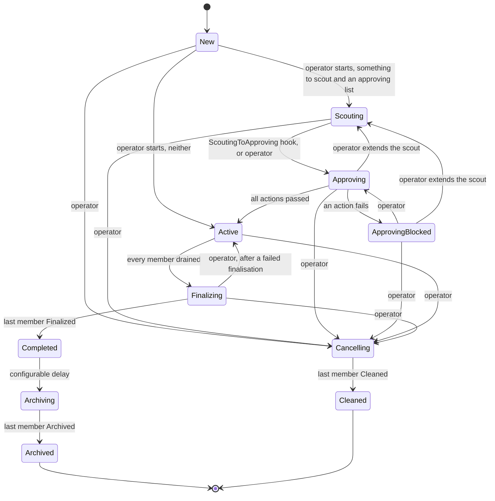
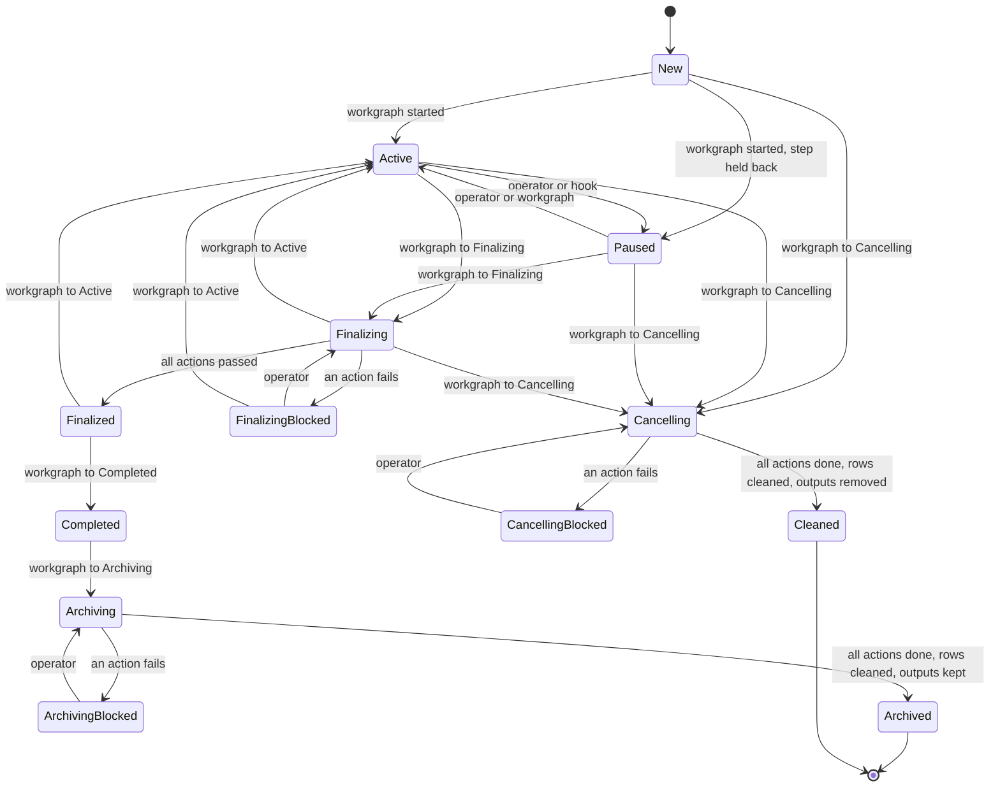
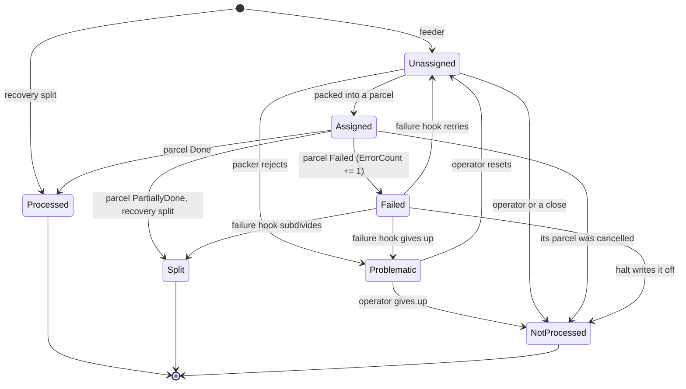
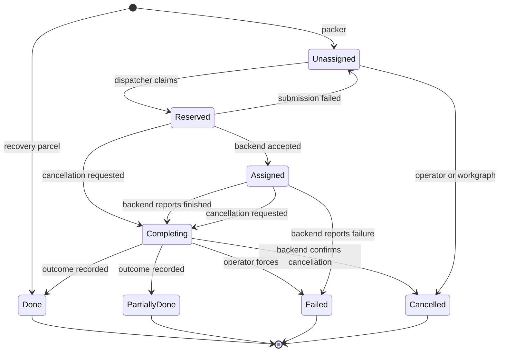

# DX-ADR-005: Transformation System state machines

## Metadata

- **Created By:** Chris Burr, Christophe Haen
- **Date:** 2026-07-13
- **Status:** Draft
- **Decision Maker(s):** TBD

## Abstract

Four entities in the Transformation System carry state: workgraphs, transformations, inputs and parcels. This ADR defines their state machines and the rules that connect them: which transitions the core takes on its own, which are taken by hooks and operators, how a workgraph's transitions fan out to its transformations, how parcel outcomes drive input transitions, and which states must be resettable when a broker restarts. The tables that store the states are in [DX-ADR-004](DX-ADR-004_schema.md); the hooks and actions that run inside the states are in [DX-ADR-006](DX-ADR-006_extensions.md). Only the core applies a transition.

## Motivation

In DIRAC the lifecycle rules live inside the agents that enforce them, spread across code bases and coordinated by convention. Races around transformation state transitions are a known consequence, and were part of the motivation for [DX-ADR-001](DX-ADR-001_tasks.md). Writing the machines down in one document lets the stakeholder communities review them before implementation, and separates that review from the schema review in DX-ADR-004: the tables can settle while the transitions are still being argued.

Statuses are also the operator interface: shifters reason about a workgraph almost entirely through status counts.

## Specification

### Conventions

- Statuses are `VARCHAR(32)` columns (DX-ADR-004), validated in `diracx-logic`. There are no database triggers. Hooks propose transitions; only the core applies them (DX-ADR-006).
- Every input and parcel transition writes its counter-journal rows (DX-ADR-009) in the same transaction as the change itself. Workgraph and transformation transitions have no counters; they write a row in the corresponding log table. The last archiving or cleaning action is the exception to the first rule: it deletes a transformation's counter and journal rows outright rather than journalling the statuses it empties.
- A workgraph and its member transformations are created in one transaction, and every workgraph transition that fans out to members moves the workgraph and the members in one transaction. Everything is in the single DiracX database, so there is never a partially created or partially transitioned workgraph.
- Hooks and actions run while an entity is in a state, never between states. A transition is a plain database transaction, and entering a state resets the results of that state's actions (DX-ADR-004) in the same transaction.
- A state whose actions can fail has a **blocked** counterpart on the entity that runs the actions: `ApprovingBlocked` for the workgraph, and `FinalizingBlocked`, `ArchivingBlocked` and `CancellingBlocked` for a transformation. A workgraph whose member is blocked stays where it is. A blocked state means an action failed and a person is needed, not that the entity is finished. The list a `Cancelling` transformation runs is its cleaning list (DX-ADR-006).
- A check records `Passed`, a housekeeping step `Done`; either records `Pending` while the answer is not yet knowable, and `Failed` is what moves the entity to the state's blocked counterpart (DX-ADR-004).
- The edge labels in the diagrams say who takes the transition: the core on a condition, a hook, an operator, or the workgraph fanning out to its members.
- `Reserved` is a state a crashed worker can strand and is resettable on restart, per DX-ADR-001. `Completing` is re-entrant: the work done there is idempotent and resumes after a restart.

### Workgraph

The workgraph status is a roll-up and a control surface. Operator transitions fan out to the member transformations; forward transitions are guarded by member states. The guards are cheap queries, since a workgraph has few members.

| Workgraph state    | Member transformations may be                  |
| ------------------ | ---------------------------------------------- |
| `New`              | `New`                                          |
| `Scouting`         | `Active`, `Paused`                             |
| `Approving`        | `Active`, `Paused`                             |
| `ApprovingBlocked` | `Active`, `Paused`                             |
| `Active`           | `Active`, `Paused`                             |
| `Finalizing`       | `Finalizing`, `FinalizingBlocked`, `Finalized` |
| `Completed`        | `Completed`                                    |
| `Archiving`        | `Archiving`, `ArchivingBlocked`, `Archived`    |
| `Archived`         | `Archived`                                     |
| `Cancelling`       | `Cancelling`, `CancellingBlocked`, `Cleaned`   |
| `Cleaned`          | `Cleaned`                                      |

**Scouting** is the optional validate-by-doing phase: the transformations run on a reduced input sample to prove the configuration works and to measure resource requirements. It does not test the mechanics of DiracX, only the reliability of the payload at scale and how much it needs.

It reuses the ordinary machinery: the feeder runs in scouting mode (DX-ADR-006), scout parcels are ordinary parcels, and the counters apply unchanged. Which members run during scouting is derived from the workgraph's CWL document rather than declared on each of them (DX-ADR-007): a member runs if it is a compute step or an ancestor of one, and anything that sits only downstream waits for approval. For an LHCb simulation the compute steps run and the output replication is held, being downstream of the merge that produces what it would replicate. A workgraph scouts when it has both — a member that runs during the scout, and an approving list to judge it.

The `ScoutingToApproving` hook decides when enough scouting has been done, and can extend the scout by updating feeder arguments instead: a scout may climb from a handful of parcels to the full sample in stages, with nobody watching. A person is needed only in a blocked state. A scout that fails is therefore accepted rather than held: the hook moves the workgraph to `Approving` knowing the success-rate check will fail, so the trouble shows as `ApprovingBlocked` and a scout still running is plainly `Scouting`. The same holds later in `Active`, where a workgraph whose feeders have all been disabled is draining, a condition the dashboards report rather than a state of its own.

**Scout output is ordinary output, and approval extends rather than restarts.** `Approving` back to `Scouting` therefore means "scout further", never "scout again". A workgraph whose scout shows the configuration is wrong cannot be edited into a good one, because a transformation's process is frozen once it has parcels (DX-ADR-004): it is cancelled and cleaned, and the correction is a new workgraph.

**Approving** runs the workgraph's approving actions in order (DX-ADR-006): a success-rate check, a resource-usage estimate that can feed back into the requirements, a manual sign-off. Each action records its result (DX-ADR-004). An action still at work, such as a resource estimate waiting on accounting, records `Pending` and leaves the workgraph where it is. A sign-off nobody has given is a failure like any other: it moves the workgraph to `ApprovingBlocked`, where an operator forces the action to passed, which is the sign-off, or resets it to run again. When the last action has passed the workgraph moves to `Active`, which starts the members declared to start on approval.

**Finalizing** is entered on a condition the core checks: every member is drained. A member is drained when its feeder is disabled and none of its inputs or parcels is non-terminal. The terminal input states are `Processed`, `Split` and `NotProcessed`; a `Problematic` input is not terminal, so a quarantine holds its member open until an operator has decided each input. `Paused` does not drain a member: pausing is temporary and changes nothing about what is ultimately done, so a paused member whose feeder still has work holds the workgraph in `Active` until it is resumed or its feeder is disabled. The check is the last step of the task that polls an active workgraph, after it has run the workgraph's and the members' `Active` hooks (DX-ADR-006), and the counters of DX-ADR-004 make it cheap.

Operators bring a workgraph to a close at the workgraph level, in one of two ways, and the core takes the transition once the guard is met. A **drain** disables the outermost feeders and lets everything already in flight finish; the packer is what drains the last inputs, since it can see that its feeder is inactive and stop holding back undersized groups (DX-ADR-006). A **halt** disables every feeder, stops the packers and the hooks, cancels the parcels in flight and writes off every input still waiting, `Unassigned`, `Failed` and `Problematic` alike, as `NotProcessed`, so that each member closes as its slots empty. Both end in `Completed` through `Finalizing`; what tells them apart is what became of the work in flight. Neither exists per transformation: a member cannot be drained, halted or cancelled on its own, only paused.

The transition moves the workgraph and every member to `Finalizing` in one transaction. The members are then finalised upstream first: a member's finalizing actions start once every member it depends on is `Finalized`, so members with no dependency between them are finalised at the same time, and a member that blocks holds back everything downstream of it. When the last member reaches `Finalized` the workgraph moves to `Completed`. If a member's finalisation fails, the operator either recovers it in place (see the transformation machine), or returns the workgraph to `Active`, which returns every member to `Active`, or cancels it.

**Completed**, **Archiving** and **Cancelling** are housekeeping. After a configurable delay a completed workgraph moves to `Archiving`, its members run their archiving actions, and it reaches `Archived` when the last member does. A cancelling workgraph's members run their cleaning actions, and it reaches `Cleaned` when the last member does. Both run upstream first, as finalisation does.

### Transformation

A transformation is `Active` while its feeder and packer run and its parcels are dispatched. `Paused` suspends that: an operator pauses a transformation by hand, a hook pauses one whose failure rate has become excessive, and the workgraph holds back members that should not run yet. A standalone transformation takes the transitions marked as the workgraph's on its own, with the same guards.

There is deliberately no `Flush` state. Flushing ("create parcels even for input groups below the normal threshold") is an instruction to the packer, not a fact about the lifecycle, so it is a `flush=True` parameter of an on-demand packer invocation. Nothing is persisted, and the flush is idempotent: inputs returned by parcels that fail after a flush are drained by flushing again. Flushes are triggered by hand, by the transformation's `Active` hook on a cadence that follows what feeds it (DX-ADR-006), and when a workgraph is being brought to a close.

**Finalizing** runs the transformation's finalizing actions in order (DX-ADR-006): the checks that the transformation did what was asked, for example that no input was processed twice across split lineages and that every input the feeder should have produced exists, and the work that completes the deliverable, for example merging the monitoring histograms. Each action records its result (DX-ADR-004). A failed action moves the transformation to `FinalizingBlocked`, where an operator forces the action to passed or resets it to run again. When the last action has passed the transformation moves to `Finalized` and waits for its workgraph.

**Archiving** and **Cancelling** run the archiving and cleaning actions the same way, with `ArchivingBlocked` and `CancellingBlocked` as the blocked states. Archiving keeps the produced data and removes intermediates, such as the outputs of inputs that ended `NotProcessed`; cleaning removes the outputs as well. Both end by deleting the input, parcel, link, output, identifier, journal and counter rows (DX-ADR-004); the transformation row, its actions and its log remain as the permanent record.

### Input

Every input ends in exactly one of `Processed`, `Split` or `NotProcessed`. A `Processed` input was successfully processed by exactly one parcel, a `NotProcessed` input by none, and a `Split` input by none itself, having handed the obligation to its children, so the property holds over the leaves of the split tree. Output registration and deduplication rely on it, which is why parcels are not retryable (below) and why recovery is a backend rather than a second attempt (DX-ADR-003).

The property holds of inputs rather than of files. One file can be the subject of several inputs of one transformation: split children are the common case, and a transformation whose feeder legitimately sees the same file again is the other (DX-ADR-004).

`Unassigned` is the pool the packer claims from. An input can be withheld from the packer for a while without leaving the pool, through the `DelayedUntil` column (DX-ADR-004): the packer asks for the delay, for example because a file is not yet at the storage element the transformation needs. An input the packer cannot use at all, such as an LFN that does not exist, goes to `Problematic`.

A parcel's failure moves each of its inputs to `Failed` and increments its `ErrorCount`. The input failure hook (DX-ADR-006) then decides per input: retry returns it to `Unassigned` for a later packing, giving up quarantines it in `Problematic` for operator attention, and splitting replaces it with finer-grained children. `Split` is terminal for the parent; the children are ordinary inputs with their own lifecycles, linked through `ParentInputID` (DX-ADR-004). A parcel's partial success also splits its inputs, without passing through `Failed`: the job's status report (DX-ADR-007) lists the portions that succeeded and the portions that did not, and the core inserts the first as `Processed` children claimed by a recovery parcel and the second as `Unassigned` children.

Outputs are registered before a parcel reaches `Done`, so a successful input goes straight to `Processed`. There is no registration state on the input; the resumable part of registration is the parcel's `Completing` state.

**`Problematic` is not terminal, and holds the drain.** It is a quarantine: the hook has given up, and only an operator can move the input, back to `Unassigned` once the cause is fixed or to `NotProcessed` once it is not worth fixing; a halt is the operator writing off the whole quarantine at once. A reset returns the input's `ErrorCount` to zero (DX-ADR-004) and with it the full retry budget, since the operator resets because the cause is fixed and an input whose count survived would be quarantined again by its first failure. A member with a `Problematic` input is therefore not drained, and the workgraph stays `Active` until someone has decided every quarantined input. A handful of bad files can hold a workgraph open, and that is the point: the decision is the operator's to make, and a workgraph is not finalised over a quarantine nobody has looked at. The counters make the hold visible, and the ways out are all the operator's.

`NotProcessed` records that an input will not be processed by this transformation. An operator writes off a `Problematic` input after looking at why it failed, and `Unassigned` inputs are written off when a transformation has to finalise with work left in the pool, for example the remainder below the packer's group size once the requested number of events has been produced. Cancelling a transformation writes off the pool the same way, and an `Assigned` input whose parcel reaches `Cancelled` is written off as well: the parcel is terminal and no other one will claim the input, so it did not fail and it will not be retried. A halt writes off everything still waiting, `Failed` inputs included: an input whose parcel failed is written off rather than waiting for the input failure hook to decide its fate.

The delay can also wait on another transformation: a buffer removal must not remove a file until the transformation consuming it has processed that file, so its packer delays the input (DX-ADR-006) and the input stays `Unassigned`, withheld from packing. If the consuming transformation ends its input for that file as `NotProcessed`, the waiting input's condition can never be met and nothing will make it ready, so the packer rejects it and the core quarantines it in `Problematic`. There is no resolution the core can reach safely on its own, since what the waiting work should do differs by what the wait was for, so the decision is an operator's. The verdict is the packer's, since only it knows what an input waits on: `DelayedUntil` records when to look again, not what to look for (DX-ADR-004). A consuming input still in `Problematic` keeps the waiting input waiting, since an operator may reset the quarantine and the file may still be processed.

### Parcel

Parcels are not retryable: every terminal state is final. A failed transformation parcel's inputs go back to the pool if the input failure hook retries them, and the packer may later build a new parcel, possibly with a different grouping. A failed user parcel (DX-ADR-004) is simply terminal; resubmission is a new parcel. A parcel whose submission fails goes back to `Unassigned` for the dispatcher to try again, which is not a retry of an attempt: no backend ever accepted it.

`Reserved` is the crash-safe step between "we decided to submit" and "the backend acknowledged". It bounds the window in which a dispatcher dying mid-flight can double-submit to a single parcel, and marks that parcel for inspection on restart; closing the window needs the reconciliation DX-ADR-003 leaves open. `Completing` is the step between the backend being finished with a parcel and the outcome being recorded on the inputs: for pull-model backends the outcome is fetched here (DX-ADR-003), the output files are registered in the catalogue here, and the per-input outcome is worked out here. Both steps survive a restart, `Reserved` by reset and `Completing` by running again. An operator can force a parcel stuck in `Completing` to `Failed`.

**Cancellation goes through `Completing` as well.** Asking a backend to kill a job is a call to the outside world that can fail, be slow, or race a job that was finishing anyway, which is exactly what `Completing` already handles, so a cancelled parcel is one whose outcome happened to be a cancellation. A parcel that was never submitted has nothing to ask, so it goes straight to `Cancelled`. Recovery parcels are created directly in `Done` and never pass through submission.

### How the machines connect

- A parcel reaching `Done` moves its inputs to `Processed` and records the files it produced (DX-ADR-004), which is how downstream transformations are fed.
- A transformation parcel reaching `Failed` moves its inputs to `Failed`, where the input failure hook decides retry, give up or split per input; a failed user parcel is simply terminal. Files a failed parcel had already uploaded are not registered, and removing them is the archiving actions' business.
- A parcel reaching `PartiallyDone` triggers the recovery split: the job's status report says which portions succeeded, and those become `Processed` children claimed by a born-`Done` recovery parcel while the failed portions become `Unassigned` children (DX-ADR-007, DX-ADR-003).

## Rationale

### Retries live on the inputs

A parcel is an immutable record of one attempt; the retryable thing is the input. This preserves the once-or-never property stated above, which output registration and deduplication rely on, and it lets the packer regroup on retry instead of replaying a grouping that already failed.

### No Flush status

Flushing is a command to the packer, and encoding commands to components as status values is the coordinate-through-status-columns pattern identified as a race source in DX-ADR-001's motivation. A parameter on the packer invocation gives the same behaviour with nothing persisted, and finer-grained flushes (per run, per subgroup) were never expressible as a single transformation-wide status anyway.

### Actions run in states, not on transitions

Every transition is a small transaction on a few rows: the status change, the journal rows, the log row, and the reset of the entered state's action results. The slow and fallible work, checking outputs, estimating resources, deleting files, happens inside a state, where it can fail, be retried and be watched without the entity being half-way between two states. The blocked states exist so that a failed action is a status an operator can see and act on, rather than a stuck transition, and the `Pending` result exists so that waiting for a person is not dressed up as a failure.

### Crash-safe intermediates rather than locks

`Reserved` and `Completing` mark work that is in flight with an external system. They make a broker crash recoverable by inspection: anything stranded in them on restart is resolved by reset or by running the step again, per DX-ADR-001, with no cross-component locking.

### Draining is the packer's job, closing is the core's

The condition for leaving `Active` is mechanical and cheap: no live feeder, nothing non-terminal. Getting there is policy, because only the packer knows whether the last few inputs are worth a small parcel or should wait, and it is told whether its feeder is still running. Keeping the two apart means an operator closing a workgraph changes policy, by disabling feeders, rather than forcing a transition past a guard.

### Finalizing is the requester's, archiving is the installation's

The two are separate states because different people care about them. A requester wants to know whether the deliverable is validated and complete; whether the intermediate files and the database rows have been tidied away is the installation's concern, and can happen weeks later.

## Rejected Ideas

- **A `Flush`/`Flushing` transformation status.** Legacy DIRAC behaviour; see the Rationale. Replaced by a `flush=True` packer parameter.
- **Retryable parcels.** Rejected on bookkeeping grounds in DX-ADR-004; the lifecycle consequence is that all parcel terminal states are final.
- **Enforcing transitions in the database (triggers or constraints).** Ties the state machines to one engine and hides the logic from review and testing; transitions are enforced in `diracx-logic` instead.
- **Hooks on transitions.** An earlier draft had hooks that ran as part of a transition and whose verdict decided it. A transition that runs plugin code is neither small nor certain to finish; the hooks now run inside states and the transition is a plain transaction, see the Rationale.
- **A `PendingRegistration` input state.** An earlier draft made output registration a resumable step on the input. Registration happens while the parcel is `Completing`, and `Done` means registered, so the input needs no state of its own.
- **A `Cancelling` parcel state.** Symmetric with the transformation's, but it would duplicate `Completing`, which already means "waiting on the outside world, then record what happened". See the Rationale.
- **Writing off an input whose wait can never end.** An input delayed on a transformation that then gave up on the file could be written off as `NotProcessed` without asking anyone. What the waiting work should do differs by what the wait was for: a step waiting for a replica that will now never exist has nothing left to do, while a removal waiting for a consumer that has given up still has a file to reclaim. The core cannot tell the two apart, so the input is quarantined and an operator decides.
- **`Problematic` as a terminal input state.** It would let a workgraph finalise on its own over inputs nobody has looked at, with the review left to a finalizing action an operator can force. The quarantine is operator work by definition, so it holds the drain instead.
- **`Manual*` and `*Failed` names for the blocked states.** An earlier draft used both patterns at once. `Blocked` is one family and says a person is needed rather than that the entity is dead.

## Open Issues

- **Exact vocabularies and transition matrices.** The four machines are a proposal pending review against the stakeholder communities' operational practice.
- **Who takes which edge.** The diagrams attribute each transition to the core, a hook, an operator or the workgraph.
- **An input the job never tried.** DX-ADR-007's status report defines `NOT_TRIED` for an input the job never reached. The input machine has no edge for that outcome, so such an input stays `Assigned`; whether it returns to `Unassigned` directly or passes through `HandleFailedInput` is the question DX-ADR-006 leaves open.
- **Recovering a dead wait.** An input quarantined because the transformation it waited on gave up on the file is an operator's to resolve. Whether a recovery or monitoring task could later classify some of these without a person is open.
- **Transformations without inputs.** Simulation has no input files and is seeded by the feeder instead. Whether any community has a use case for a transformation with no inputs at all, rather than seeded inputs, is a question for the stakeholders.
- **Scouting mechanics.** Where the resource estimates from scouting are rolled up, and how the manual approval integrates with the submission tooling.
