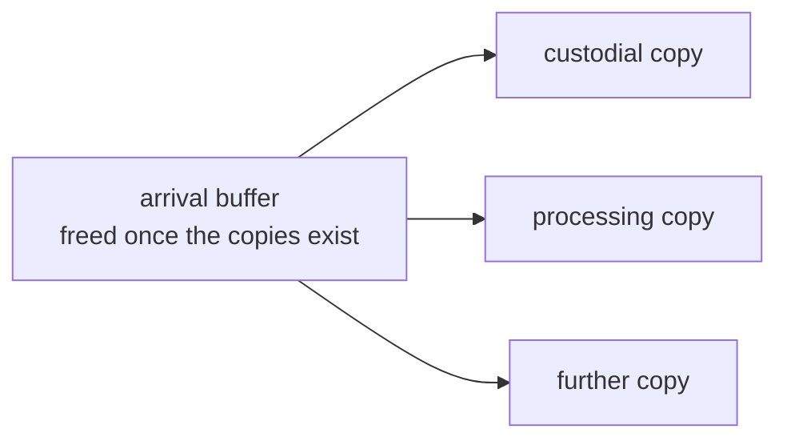
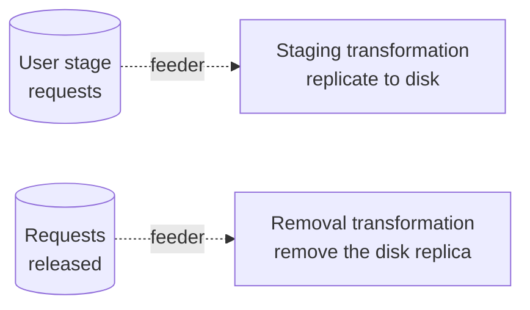

# DX-ADR-008: Data management transformations

## Metadata

- **Created By:** Chris Burr, Christophe Haen
- **Date:** 2026-09-22
- **Status:** Draft
- **Decision Maker(s):** TBD

## Abstract

A transformation whose `Kind` is `Data` ([DX-ADR-004](DX-ADR-004_schema.md)) moves and removes files instead of running jobs. This ADR specifies them: what their parcels carry, how they are executed, and what the core knows about a request it does not itself interpret.

Data management is one of the Transformation System's primary uses, and it is the only case where a transformation runs without a workgraph. A parcel is rarely one operation: a transformation distributing newly produced data writes a custodial copy, places further copies where the data is to be kept or processed, and frees the buffer the file arrived on, all under one request. Because one parcel mixes copies and removals, it has no single operation type to declare. What it declares to the core instead is its effect on each storage element: the files and bytes it adds there, and the files and bytes it frees. A transformation with no workgraph never scouts, and its feeder may yield the same file as often as it is asked for, each round a separate input distinguished by a key written into its `Descriptor` (DX-ADR-004).

The execution backend is the DIRAC Request Management System. The packer writes a request body onto each parcel and declares separately which storage elements the request acts on and what it does to each; that declaration is what the journalled counters of [DX-ADR-009](DX-ADR-009_counters.md) are keyed on. The counters give an exact count of the files and bytes a transformation has queued for a storage element at each stage of the parcel lifecycle, which is what a packer reads to keep a campaign inside the space the storage element has. Nothing equivalent is foreseen for the output of compute transformations.

Rucio is complementary and independent. An installation that uses Rucio can run data transformations for what it wants DiracX to drive and leave the rest to Rucio rules. Driving rules from a workgraph is an open issue for the communities that want it.

## Motivation

DIRAC's Transformation System already drives the RMS: `RequestTasks` renders a per-transformation body into one request per task, and LHCb's replication, archival and removal plugins are transformation plugins like any other. What changes in DiracX is what the core knows about the work it has queued, and what it stops assuming about a transformation.

- **One task, several storage elements, replication and removal.** LHCb's raw replication adds a copy at three storage elements and frees a fourth, in one task. `TransformationFiles` records one `UsedSE` string per file, a comma-joined list the plugin splits apart again wherever it has to reason about a single storage element, and there is no efficient way to obtain how much space the in-flight tasks are about to take or give back.
- **Work in flight is invisible.** Distributing by share means knowing how much has already gone to each candidate. The raw replication plugin recomputes that at the start of every cycle, through a `GROUP BY UsedSE` over the whole of the transformation's `TransformationFiles`, increments it in memory as it creates tasks, and throws it away when the cycle ends. What has already landed is measured separately again: `StorageUsage` for what is there, `_countRecentFiles` for files recently assigned to a storage element within a time window, and a `SpaceTokenOccupancyCache` refreshed every twelve hours for free space. A campaign therefore throttles on a watermark (`MinFreeSpace`) wide enough to absorb the error.
- **A file cannot come round twice.** `TransformationFiles` is keyed on `(TransformationID, FileID)` and `DataFiles.LFN` is `NOT NULL UNIQUE`, so a file a transformation has processed can never be processed by it again. A service that stages files on request and removes them afterwards needs exactly that, since the same file is staged and removed as often as users ask for it.
- **The workgraph machinery has to be optional.** The model of [DX-ADR-002](DX-ADR-002_overview.md) is written around workgraphs, and much data management has no workgraph at all. Scouting and approval mean nothing for a removal campaign, and a data transformation must not carry them.

## Specification

### What a data transformation is

A `Data` transformation has the common `Transformations` row and no subtype row (DX-ADR-004). It has no process, no requirements template and no output declarations, because what a parcel does is decided per parcel by the packer rather than fixed per transformation. Everything else is the ordinary machinery: a feeder fills the input pool, a packer claims `Unassigned` inputs, and the dispatcher hands each parcel to a backend ([DX-ADR-003](DX-ADR-003_compute_backends.md)).

A packer yields a `DataParcel` ([DX-ADR-006](DX-ADR-006_extensions.md)) carrying two things:

- `request`, the body the backend submits, stored in `DataParcels.Request`;
- `deltas`, a file count and byte count per storage element the request acts on, stored as `DataParcelDeltas` rows.

A delta is what the request costs that storage element, in files and in bytes: positive where it puts data there, negative where it frees data. The packer states both counts rather than the core deriving them from the parcel's inputs, because only the packer knows whether several of those inputs are masks of one file, which is one file and one file's bytes however many inputs carry it. That is the whole of what the core reads out of a data parcel, so the RMS's own operation types stay inside the body the backend submits.

The sign is the packer's way of saying which direction it means; the core stores the two directions as separate columns rather than one signed number (DX-ADR-004). A storage element that a transformation both writes to and frees therefore reports both quantities instead of their difference, which is what separates a space budget from a transfer load.

### One parcel, several storage elements

A data parcel commonly acts on several storage elements at once, and in both directions. Distributing newly produced data is the general case: for every file the transformation has to put a custodial copy on tape, place one or more further copies where the data is to be kept or processed, and free the buffer the file arrived on. One request does all of it, so the parcel carries a delta per storage element, several positive and one negative.



| What the storage element is to the parcel | `files`                  | `bytes`                  |
| ----------------------------------------- | ------------------------ | ------------------------ |
| the custodial copy it writes              | the parcel's files       | the parcel's bytes       |
| each further copy it places               | the parcel's files       | the parcel's bytes       |
| the buffer it frees                       | minus the parcel's files | minus the parcel's bytes |

Which storage element each copy goes to is the packer's decision, and where the processing copy lands is also what decides where the data will later be read, so the packing decision of a data transformation places the compute that follows it. Three properties of that case are what the rest of this ADR is shaped around.

**The order is in the body, the effect is in the deltas.** Two copies destined for the same site can be made in sequence, the second from the first, so that the second hop stays off the wide-area network; copies at different sites are made from the source in one operation. That choice changes the request the backend executes and changes none of the deltas, because what the core needs to know is that a storage element is about to gain those bytes rather than which hop delivers them.

**A destination is a decision with memory.** Files that must stay together are grouped, the group is given its destinations once, and it keeps them for the rest of the transformation; a transformation can also be told to wait for a destination another transformation has already chosen rather than pick its own. Both belong to the packer, and the assignment table belongs to its extension (DX-ADR-006 has a packer of this shape).

**Distributing by share is what the counters are for.** Choosing the next destination means knowing how much has already gone to each candidate, which is what `DataParcelsCounters` holds exactly, per storage element, for any packer invocation to read. Both measures come from the parcel's own deltas, so a share expressed in files and one expressed in bytes read equally straight off the counter; a share in any other unit stays the packer's own arithmetic over its inputs.

A file that is already where it needs to be still has to leave the pool. The packer yields a parcel with an empty request and no deltas, which moves the input to `Processed` without asking the backend for anything and counts nothing against any storage element.

### Standalone data transformations

A transformation created without a workgraph gets an `Ownership` row with a null `WorkgraphID` and takes on its own the transitions a workgraph would otherwise fan out (DX-ADR-005). It runs `New → Active`, drains when its feeder is disabled and its inputs and parcels are terminal, and finalises, archives or cleans through the same action lists.

**There is no scouting.** A scout runs a reduced sample to prove a payload works and to measure what it needs (DX-ADR-005), and a replication has no payload to prove and no per-parcel resource needs to estimate. A workgraph scouts only when it has both something to scout and an approving list to judge it ([DX-ADR-007](DX-ADR-007_cwl.md)), and a standalone transformation has neither, so `Scouting` and `Approving` never arise. A data transformation that is a member of a workgraph is held or started by where it sits in the graph, which is the rule DX-ADR-007 already states.

Staging on users' requests is the simpler example, and the one where a transformation has no workgraph to belong to:



The two are separate transformations with separate pools. The staging feeder yields a file each time it is asked for, carrying the identifier of the staging request under its own key in `Descriptor`; the removal feeder does the same when a request is released. Because `Inputs.InputHash` covers the descriptor and not the LFN alone (DX-ADR-004), each round is a row of its own with its own lifecycle, and the second round of a file is not dropped as a duplicate of the first. The core neither names nor reads that key.

### The RMS as the data backend

An RMS request is an ordered list of operations, each with a type (`ReplicateAndRegister`, `RemoveFile`, `RemoveReplica`, `PhysicalRemoval` and the rest), a catalogue list and a list of files. Most types name a target storage element; `RemoveFile`, which removes every replica, names none. A source is optional throughout, and a replication usually leaves it unset so that the transfer system chooses which replica to read. The operations run in order and the request is done when the last of them is.

The identifier table is the RMS's own request id:

```sql
CREATE TABLE RMSIDs (                             -- diracx-rms
    ParcelID  BINARY(16) NOT NULL,
    RequestID BIGINT     NOT NULL,                -- ReqDB RequestID
    PRIMARY KEY (ParcelID),
    FOREIGN KEY (ParcelID) REFERENCES Parcels (ParcelID),
    UNIQUE KEY (RequestID)
);
```

**The RMS owns retries.** It counts attempts per file against a maximum and re-queues a request behind a `NotBefore` that grows with the attempt count, and transfers scheduled through FTS3 are driven by FTS3 for as long as they take. A data parcel therefore stays `Assigned` for as long as the transfer system is still trying, and reaching `Failed` means the RMS gave up rather than that one attempt failed. The input failure hook (DX-ADR-006) sees an input whose failure the transfer system already considers final, so a hook that sends it back to `Unassigned` is asking for a fresh request rather than a further attempt at the same one. The consequence for the counters is stated below.

Cancellation and completion follow the ordinary parcel machine (DX-ADR-005): the backend is asked to cancel while the parcel is `Completing`, and the outcome is recorded there. A data parcel registers no outputs, because its files already exist in the catalogue.

### Data transformations are sinks in the dataflow

A data parcel produces no `ParcelOutputs` rows (DX-ADR-004), so nothing downstream can be edge-fed from a data transformation. A transformation that needs files another one has replicated shares the upstream input query rather than consuming its output, and its packer delays each input until the replica exists (DX-ADR-005). A processing transformation reading data that a replication puts on disk is the common case: both feed from the same catalogue query, and the consumer's packer waits on the replica.

### Accounting for work in flight

`DataParcelsCounters` is keyed on `(TransformationID, Status, StorageElement)` and measures `LFNCountAdded`, `LFNSizeAdded`, `LFNCountFreed` and `LFNSizeFreed` (DX-ADR-004, DX-ADR-009). The task that runs the packer journals the `Unassigned` deltas in the transaction that creates the parcel, one row per `DataParcelDeltas` row carrying that row's four columns, and every later parcel transition moves the same quantities from the old status to the new. A read is exact whatever the aggregation lag.

What that buys is a direct answer to the questions the plugins of the Motivation approximate today: how much this transformation is about to write to a named storage element, how much it is about to free there, and how far through the lifecycle each part of that is. A packer reads the counters for its destinations before deciding where to send the next group, and holds back or picks elsewhere when what it has already queued would take the destination past its budget. The core provides the numbers and applies nothing; the decision is the packer's, as every packing decision is (DX-ADR-006).

Three limits are part of the specification rather than deficiencies to be fixed later:

- **The counters cover what the Transformation System queued.** They say nothing about user jobs writing to the same storage element, about another installation, or about files a Rucio rule is moving. A packer combines them with a measurement of the storage element's free space; they do not replace it.
- **Bytes in flight include bytes that are stuck.** Because the RMS retries for as long as it does, a parcel counted under `Assigned` may be a transfer that has been failing for days. The count is a correct statement of what has been queued and not yet settled, which is the conservative answer for a budget.
- **No prediction is made for compute output.** A compute parcel's files are recorded with their sizes as it reaches `Done` (`ParcelOutputs.LFNSize`), and nothing in the schema records an intended size before that. Extending the counters to what a compute transformation is expected to produce is not foreseen.

### Rucio

Rucio is complementary to data transformations and independent of them. Where an installation uses Rucio, DiracX registers a compute parcel's outputs into it as into any other catalogue (DX-ADR-003), and Rucio's replication rules remain Rucio's own mechanism: nothing in a data transformation creates, reads or waits on one.

The two mix freely, and mixing them is expected rather than a transitional state. An installation can run a DiracX data transformation to remove files, because removal is work it wants driven file by file with a pool, a lifecycle and counters, and leave the replication of a workgraph's output to a Rucio rule, because a rule is a standing declaration that Rucio maintains without being asked again. Files a rule moves are outside the counters above.

Creating rules from a workgraph, so that declaring what should be replicated is part of the document that declares the work, is left to the communities that want it (see Open Issues).

## Rationale

- **The RMS because it exists.** Data transformations work on day one against a request system that is already deployed and already understands FTS3, staging and the catalogues. The cost is a schema tied to something DiracX intends to replace, which is the open issue below rather than a reason to build a second transfer system first.
- **Deltas declared, not parsed.** The core drives counters, answers "how much is queued for CERN-TAPE" and cleans up after a transformation, and each of those needs the storage elements, the direction and the files and bytes. Parsing them out of an RMS body would teach the core a vocabulary it otherwise never reads and would have to be relearned when that vocabulary is replaced, and it would still get both counts wrong wherever several inputs are masks of one file. The packer knows all of it, so it states it.
- **Retries left with the RMS.** The RMS and FTS3 hold the information a transfer retry needs: which endpoint failed, how, and how recently. Bounding their attempt budget so that failures come back sooner would put a second retry loop above one that already backs off, without giving the outer loop anything the inner one does not have. The price is a parcel that stays `Assigned` while the inner loop works, which the counters report honestly.
- **Repeat inputs as descriptor keys.** The alternative is a transformation-level notion of a round, which would put an experiment's staging conventions into the core schema. The hash over `(LFN, Descriptor)` gives each round its own row with no core change and no agreement on what a round is.

## Rejected Ideas

- **A `DataTransformations` subtype with a body template.** An earlier draft of DX-ADR-004 rendered each parcel's request from a per-transformation template at submission. The packer already decides per parcel what is copied where, so the template had nothing left to hold.
- **Rucio as a data backend.** A backend implements `submit`, `poll` and `cancel` over a discrete unit of work (DX-ADR-003), and a Rucio rule is a standing declaration Rucio maintains rather than a request that completes. Wrapping one as a parcel would mean synthesising a completion from rule state and would put DiracX in the way of a system designed to be left alone.
- **Reading the counts from the RMS.** Querying `ReqDB` for what is queued for a storage element would cross a database boundary, would miss parcels that exist but have not been submitted, and could not be read in the same transaction as the parcel transition it describes, which is the property DX-ADR-009 is built on.
- **Teaching the core the request vocabulary.** Parsing operation types and storage element lists out of the body would make the core depend on a format it is committed to replacing.
- **Predicting compute output for the quota.** Would require every compute transformation to declare an expected output size per parcel, which nothing measures before a scout and which the schema has nowhere to put.

## Open Issues

- **A native request vocabulary.** `DataParcels.Request` is a DIRAC RMS request body, which ties the schema to a system DiracX intends to replace, and which is heavy for what it says: an RMS request repeats its whole file list once per operation, and each file carries eleven fields of which most are the RMS's own runtime state. A compact form is wanted instead, and the direction under consideration is a list of groups, each naming the input ids it applies to and an ordered list of steps over them, with a group's inputs defaulting to the parcel's own; the dispatcher would resolve the ids and render whatever the backend needs, as it already materialises a compute parcel's payload, and per-file metadata such as a checksum would come from the input's `Descriptor` rather than from the body. Fixing that encoding, what it has to cover, and how it maps onto the RMS belongs to a dedicated ADR for the request system rather than to this one. `DataParcelDeltas` bounds what is at stake meanwhile, because everything the core itself needs is declared beside the body rather than inside it. (Shared with DX-ADR-003 and DX-ADR-004.)
- **Surfacing a stuck parcel.** A parcel counted under `Assigned` may be a transfer the RMS has been retrying for days. Whether the core needs to surface that, through the backend's raw status or an age threshold on the counters, is open and is part of DX-ADR-003's raw-backend-status question.
- **Where a budget comes from.** The packer reads the counters, but whether the space it is allowed to spend is a packer argument, a configuration-service value per storage element, or something the data management team maintains elsewhere is not specified.
- **Rucio rules for workgraph outputs.** Declaring in the workgraph document that an output should carry a Rucio rule, and having submission create it, is wanted by installations that use Rucio. Who creates the rule, who owns its lifetime, and what a workgraph's cleaning does to it are open, and the design is left to those communities.
