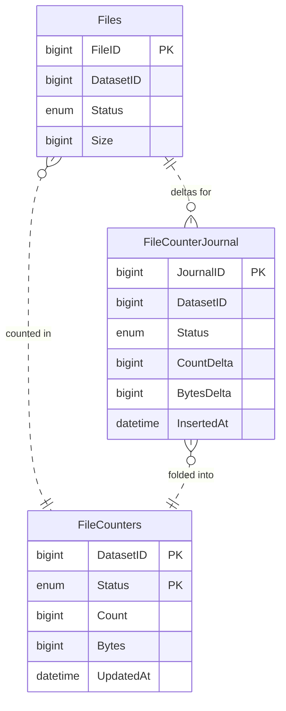

# DX-ADR-009: Journalled counters

## Metadata

- **Created By:** Chris Burr, Christophe Haen
- **Date:** 2026-09-21
- **Status:** Draft
- **Decision Maker(s):** TBD

## Abstract

Monitoring and control both need aggregate counts over tables too large to scan and too busy to lock: how many inputs of a transformation are in each status, how many bytes a transformation has queued for a storage element. This ADR defines a generic **journalled counter**. Writers append signed deltas to a journal table in the same transaction as the change those deltas describe; a periodic aggregator claims committed journal rows, folds them into a counter table and deletes them in one transaction; a read sums the folded counters and the journal in one statement. Reads are exact at any aggregation lag, and no two writers share a row to lock.

A counter is declared by a **key**, the tuple of columns the counts are grouped by, and one or more **measures**, the additive quantities it sums. `diracx-db` generates the tables and the transition, read, fold and rebuild statements from that declaration, together with the isolation level each runs at, so a schema that needs a counter declares one rather than reimplementing the mechanism. The counters of [DX-ADR-004](DX-ADR-004_schema.md) are the first two instances. The guarantee rests on a handful of operational rules as much as on the tables: who may write a delta, how it is derived, when it is written, and what an aggregator that stops costs.

## Motivation

"How many X are in state Y" is asked constantly, by operators, by the web interface, and by the core itself. DIRAC answers it in three ways, and each has a cost the Transformation System cannot pay at a hundred million rows:

- **`COUNT(*)` over the authoritative table.** Correct and unaffordable. The status summary of a large transformation scans a table that the system is writing to at full rate.
- **One counter row per group, updated in place.** `UPDATE counters SET n = n + 1` makes that row the lock hot spot of the whole system. The worst case is also the common one: a bulk transition moves thousands of rows between the same two statuses, so every writer wants the same two rows, and they serialise.
- **A separate agent that recounts periodically.** The counters drift from the data between recounts, and a number that disagrees with reality gives no way to tell whether the count is wrong or the state is. Each cycle is a full scan.

Caching is not a way out, because some of these counters are load-bearing rather than decorative. A caller that acts on a count, such as the check in [DX-ADR-005](DX-ADR-005_state_machines.md) that lets a workgraph finalise once nothing is live, acts wrongly on a stale one: a counter that reports zero while work is still live closes the workgraph early. The requirement is therefore exact reads, not fresh-enough reads.

The problem is not new to DIRAC. The FileCatalog keeps directory sizes with `FC_DirectoryUsageJournal`, which is the same construction: append deltas, fold them in the background, and combine both halves when reading. The same shape fits other large mutable tables in DiracX, which is why the mechanism is a construct in `diracx-db` rather than a pattern copied into each schema that needs it.

## Specification

### An example

A table of files, each belonging to a dataset and in some status, with a counter of how many files and how many bytes each dataset has in each status. The counter's key is `(DatasetID, Status)` and its measures are `Count` and `Bytes`. `diracx-db` generates the other two tables from that declaration; neither has a foreign key to `Files`, which is why the links are dashed.



Dataset 7 starts with three files in `New`, of 10, 20 and 30 bytes, all folded, so its only counter row is `(7, New, 3, 60)` and the journal is empty. A transaction moves files 1 and 2 to `Copied`. It locks them and sums their sizes, changes their status with `WHERE Status = 'New'`, and in the same transaction appends two journal rows:

| DatasetID | Status   | CountDelta | BytesDelta |
| --------- | -------- | ---------- | ---------- |
| 7         | `New`    | -2         | -30        |
| 7         | `Copied` | +2         | +30        |

A read now sums the counter row and the journal: `New` is 3 - 2 = 1 file of 60 - 30 = 30 bytes, and `Copied` is 2 files of 30 bytes, which is what `COUNT(*)` and `SUM(Size)` over `Files` would say. The next fold adds the two journal rows into the counter rows, leaving `(7, New, 1, 30)` and `(7, Copied, 2, 30)`, and deletes them from the journal in the same transaction. The read gives the same answer before and after the fold.

The rest of this section is that example in general form.

### Declaring a counter

A counter is declared over one or more counted tables by a **key** and a set of **measures**.

The key is the tuple of columns the counts are grouped by. Every read, every journal row and every counter row carries the whole key. The measures are the quantities summed over the group; each is a signed `BIGINT` on the counter and a signed delta, named `<measure>Delta`, on the journal. A plain count is the measure `Count`, journalled as `+1` and `-1`; a byte total is a measure like any other.

Two tables are generated per counter, and one lock table is shared by all of them:

```sql
CREATE TABLE `<Name>Counters` (
    <key columns>                 NOT NULL,
    <one BIGINT per measure>      NOT NULL,
    `UpdatedAt`   DATETIME(6)     NOT NULL,   -- newest InsertedAt folded in
    PRIMARY KEY (<key columns>)
);

CREATE TABLE `<Name>CounterJournal` (
    `JournalID`   BIGINT          NOT NULL AUTO_INCREMENT,
    <key columns>                 NOT NULL,
    <one BIGINT per measure>      NOT NULL,   -- `<measure>Delta`, signed
    `InsertedAt`  DATETIME(6)     NOT NULL DEFAULT CURRENT_TIMESTAMP(6),
    PRIMARY KEY (`JournalID`),
    INDEX (<key columns>)
);

CREATE TABLE `CounterLocks` (
    `CounterName` VARCHAR(64)     NOT NULL,
    `Operation`   ENUM('rebuild', 'fold') NOT NULL,
    PRIMARY KEY (`CounterName`, `Operation`)
);
```

Neither counter table has foreign keys, for the reasons in the Rationale. `diracx-db` quotes every identifier it generates, since `Count` is also the name of a SQL function. The database sets `InsertedAt`, so clock skew between writers cannot distort the maximum the lag metric and `UpdatedAt` are taken from.

The order of the key columns decides which reads are a single range scan: a read that fixes a prefix of the key is one, and a read that fixes only later columns scans the whole index. A counter may therefore declare extra read indexes, each generated on both tables. Every index on the journal is paid on every insert, so a read that is hot and shares no prefix with the key can instead be given its own counter.

The declaration a schema writes names the key columns, the measures, any read indexes, and the counted tables. For each counted table it gives an expression for every key column and every measure, which is how `rebuild()` recounts: a key column can be a literal, as `Entity` is in `TransformationCounters` (see Instances), and a measure other than `Count` is an aggregate over the table's columns. The declaration of the example counter is below; it fixes what is declared rather than the concrete Python API, which is settled at implementation time:

```python
file_counters = JournalledCounter(
    name="File",  # FileCounters, FileCounterJournal
    key=["DatasetID", "Status"],
    measures=["Count", "Bytes"],
    # only rebuild() reads these
    counted=[
        Counted(
            Files,
            key=[Files.DatasetID, Files.Status],
            measures={"Count": func.count(), "Bytes": func.sum(Files.Size)},
        ),
    ],
)
```

From the declaration `diracx-db` derives the tables and its operations: `journal()` for writers, `read()` for callers, `fold()` for the aggregator, `rebuild()` for recovery, `delete_scope()` for removing a scope. Only `rebuild()` needs the counted tables, which is why nothing else in the declaration refers to them.

### Writing

**Every transaction that changes a counted row appends its deltas in the same transaction, and nothing else ever writes a delta.** If the change commits, the delta commits with it; if the change rolls back, so does the delta.

- A transition journals two rows, `(-N, old key)` and `(+N, new key)`.
- A creation journals `(+N, key)`, a deletion `(-N, key)`.
- A bulk transition journals one row per key with `N` already aggregated, not one row per counted row. Moving ten thousand files from `New` to `Copied` writes two journal rows.

Committing the delta with the change makes the two atomic; it does not make the delta correct. A writer that computes `N` from what it believes the rows' statuses were, rather than from what they were when it changed them, commits a wrong delta atomically. **A delta is therefore derived from the rows as the transaction found them under its own locks:** from the row count of a conditional update that names the old key, from a `SELECT … FOR UPDATE` of the rows before they are changed, or from the row count of an insert. For example:

```sql
UPDATE Files SET Status = :to
 WHERE FileID IN (…) AND DatasetID = :dataset AND Status = :from;
```

journals `(-N, from)` and `(+N, to)` for the `N` rows it matched. A row another transaction has already moved is not matched, and a late write to a scope that has been deleted matches nothing and journals nothing. An insert journals the rows it added, which is not always the rows it was given: an insert that skips duplicates on a unique key adds fewer.

How `diracx-db` packages this for writers is left until the schemas that use counters show which shapes recur.

Journal rows are written with `INSERT … VALUES` only, with deltas aggregated in the application first. `INSERT … SELECT` into a journal is forbidden: its row count is unknown in advance, so under the consecutive lock mode MariaDB defaults to it holds the table-level AUTO-INC lock for the whole statement, and every writer waits behind it. The rebuild's correction follows the same rule. The fold's `INSERT … SELECT` into the counter table is unaffected, since that table has no `AUTO_INCREMENT` column.

Writers only insert into the journal, so two concurrent writers never contend for a journal row, whatever they are counting.

### Reading

A read sums the folded counters and every committed journal row:

```sql
SELECT <key>, SUM(`m`) AS `Count`, MAX(`t`) AS `UpdatedAt`
  FROM (
        SELECT <key>, `Count` AS `m`, `UpdatedAt` AS `t`
          FROM <counters>
         WHERE <key predicate>
        UNION ALL
        SELECT <key>, `CountDelta` AS `m`, `InsertedAt` AS `t`
          FROM <journal>
         WHERE <key predicate>
       ) t
 GROUP BY <key>
```

The invariant is that the true value of a key is its counter row plus every committed journal row for it. The answer is exact whatever the aggregation lag, because a fold moves deltas from the journal to the counter inside a single transaction, and the statement sees the database either before that transaction or after it.

`read()` stays a single statement for a reason that is easy to undo by accident: two statements at READ COMMITTED each take a fresh snapshot, and a fold that commits between them moves a delta from the journal half, already read, to the counter half, not yet read, so the delta is missed.

A key with no counter row and no journal rows sums to nothing. Callers read a missing row as zero, which they have to do anyway for a status the counted table has never reached. A fold that brings every measure of a key to zero leaves the zero row in place: only scope deletion removes counter rows, so the fold never deletes one and never has to check.

`UpdatedAt` is the newest `InsertedAt` of any delta in the answer. The fold carries it through, and the read takes the maximum over both halves. A rebuild's correction is a delta like any other, so it moves `UpdatedAt` although nothing in the counted table changed.

`read()` is exact against any one server that gives it a consistent view, so a dashboard can read a replica. A caller that acts on the count reads the primary.

A cache in front of `read()` is opt-in per caller. `diracx-db` does not provide a generic one, and nothing may sit between a caller that acts on a count and the counters.

### Considerations when using a count

If an exact read is necessary for a caller that acts on a count there are several considerations:

- Could another transaction be appending to the journal?
- Have any INSERT/UPDATE/DELETE statements been executed in the same transaction that could have changed the count?

Ensuring these considerations are met is the responsibility of the caller, e.g. by using a lock on a shared resource.

### Folding

The aggregator runs in one transaction at READ COMMITTED:

```sql
SELECT 1 FROM `CounterLocks`
 WHERE `CounterName` = :name AND `Operation` = 'fold' FOR UPDATE;

SELECT `JournalID` FROM <journal>
 ORDER BY `JournalID` LIMIT :batch
   FOR UPDATE SKIP LOCKED;
-- the returned ids go into `FoldClaim`, a session temporary table

INSERT INTO <counters> (<key>, <measures>, `UpdatedAt`)
     SELECT <key>, SUM(<delta>), MAX(`InsertedAt`)
       FROM <journal> JOIN `FoldClaim` USING (`JournalID`)
   GROUP BY <key>
ON DUPLICATE KEY UPDATE <measure> = <measure> + VALUES(<measure>),
                        `UpdatedAt` = GREATEST(`UpdatedAt`, VALUES(`UpdatedAt`));

DELETE <journal> FROM <journal> JOIN `FoldClaim` USING (`JournalID`);
```

The claim locks the committed journal rows it returns and skips every row that is locked, which includes every row whose writer has not yet committed. At READ COMMITTED it takes record locks only, so no writer's insert waits on it. The fold and the delete then name the claimed ids exactly. They never use the range between the smallest and largest claimed id, because a skipped row can lie inside that range, commit before the delete, and be deleted without being folded. A small batch can name its ids in an `IN` list; a large one loads them into `FoldClaim`, which the session creates once, outside any transaction, and empties after each fold. A skipped row is unclaimed for the next cycle, where it is counted exactly once, and a crash anywhere in the transaction rolls all of it back.

At REPEATABLE READ the same claim would be wrong for writers. A locking scan there waits on uncommitted inserts and takes next-key and supremum gap locks, and a writer's insert into a locked gap waits until the fold commits.

The fold requires `SKIP LOCKED`, which sets the version floor at MySQL 8.0 and MariaDB 10.6, and the binary log must use `ROW` format, since READ COMMITTED and `SKIP LOCKED` are both unsafe under statement-based logging.

`VALUES()` in `ON DUPLICATE KEY UPDATE` is deprecated from MySQL 8.0.20, and MariaDB has no row alias to replace it. The fold keeps `VALUES()` deliberately, as the one form both servers accept; it is generated in one place, so moving to per-dialect SQL later is a local change.

Folding by a `JournalID` watermark instead does not work. `AUTO_INCREMENT` values are allocated before commit, so rows do not commit in id order: a row with an id below the watermark can commit after the watermark was read, and would be folded twice or never.

### Rebuilding

A rebuild repairs counters that have been corrupted by a bug or an out-of-band write. It does not stop writers, and it does not claim the journal. This can be done either for the entire table or for a subset of the key space, henceforth called a **scope**. An example of a partial rebuild would be for a single `TransformationID`.

It takes a scope, a prefix of the key (for example one `DatasetID`), and the invariant holds per key, so a scoped rebuild is as correct as a full one.

It runs as one transaction at REPEATABLE READ:

1. Lock the `rebuild` row of `CounterLocks` for this counter. This is the transaction's first statement, so its snapshot is taken after any earlier rebuild's correction has committed.
2. Recount the counted tables, read the counter rows, and read the journal rows, all within the scope and grouped by the key.
3. Write the correction for each key as journal rows through `journal()`, with `INSERT … VALUES`, and commit. The next fold absorbs them.

The correction for each key is `recount - counters - journal`, computed over the union of the keys that appear in any of the three reads, since a key can be missing from any of them. MySQL has no `FULL OUTER JOIN`, so `diracx-db` issues the three reads as one statement that signs each half and groups the union:

```sql
SELECT <key>, SUM(`m`) AS `Correction`
  FROM (
        SELECT <key expr>, <measure expr> AS `m` FROM <counted>  WHERE <scope> GROUP BY <key expr>
        UNION ALL                             -- one branch per counted table
        SELECT <key>,      -`Count`       AS `m` FROM <counters> WHERE <scope>
        UNION ALL
        SELECT <key>,      -`CountDelta`  AS `m` FROM <journal>  WHERE <scope>
       ) t
 GROUP BY <key>
HAVING SUM(`m`) <> 0
```

Two properties make this safe while the system keeps running. A writer commits its change to the counted table and its delta together, so every change the recount observes has its delta inside the snapshot and every change it misses has its delta outside, with nothing falling between. And `counters + journal` does not change when a fold commits, so a fold racing the rebuild cannot disturb the correction. Scope deletion is the one exception to the first property: its batches delete counted rows without journalling, so a rebuild that overlaps them computes a correction for a scope that is on its way out. That correction is harmless, because the final step of the deletion removes it (see Deleting a scope).

The recount holds a read view open for as long as it scans. That does not affect correctness, but every journal row a fold deletes in the meantime stays in the key index as a delete-marked record until the view closes, so every read of every key slows down while a large rebuild runs. Scopes are therefore kept small, and a rebuild of a whole counter is a maintenance operation.

The rebuild lock is a row lock rather than a lease. A lease can expire during a long recount, and a second rebuild would then compute and apply the same correction. A row lock lasts exactly as long as the transaction.

### Deleting a scope

When a scope of counted rows is dropped wholesale, its counter and journal rows are deleted rather than journalling a compensating delta for every status it empties.

The scope must already be unwritable, so that every late write finds no rows; how a scope becomes unwritable is the owning schema's. The counted rows are then deleted in batches, with no counter lock, so no single transaction builds a large undo log. Last, `delete_scope()` deletes the scope's counter and journal rows in one short transaction under the locks described below. The counters overstate the scope while the batches run, which nothing acting on the scope can see since nothing writes to it any more, and any rebuild correction journalled in that window is swept up by the final step. A rebuild still running when `delete_scope()` starts holds the `rebuild` row, so the deletion waits for it to commit and then removes its correction with the rest of the scope's journal rows. A rebuild that starts after the deletion commits finds no counted, counter or journal rows for the scope, and writes nothing.

### Locks

Each counter has two lock rows, and the fold and the rebuild use one each. They do not share one, because a rebuild's recount is long and the fold has no reason to wait for it: the fold moves deltas without changing `counters + journal`, which is all the rebuild reads.

- **Folds serialise.** Two concurrent folds would claim disjoint rows, then queue on the counter rows they both upsert, so they gain nothing from running together. The periodic fold task also holds a `MutexLock` keyed on the counter name ([DX-ADR-001](DX-ADR-001_tasks.md)), so that only one is scheduled at a time; the `fold` row is what the correctness argument relies on.
- **Scope deletion serialises with both, briefly.** A fold racing a deletion could upsert a counter row the deletion has just removed, and a rebuild could journal a correction for a scope that no longer exists. `delete_scope()` therefore takes `rebuild` and then `fold`, in that order and before any other row its transaction locks, but only for its own short transaction; the bulk delete of the counted rows happens before it, without either lock (see Deleting a scope).

### Isolation

The correctness argument of each operation depends on the isolation level it runs at, so none takes the level from the connection pool's default. `fold()`, `rebuild()` and `delete_scope()` open their own transactions and set their level explicitly. `read()` and `journal()` run inside the caller's transaction, so each is written to be exact at either level, and `diracx-db` sets the level of every transaction it opens.

| Operation        | Isolation       | Requirement                                                                                           |
| ---------------- | --------------- | ----------------------------------------------------------------------------------------------------- |
| `fold()`         | READ COMMITTED  | Record locks only, so the claim never takes a gap lock a writer's insert would wait on.               |
| `read()`         | caller's        | Single SQL statement, so both the counts and journal entries come from one read view at either level. |
| `rebuild()`      | REPEATABLE READ | The lock is its first statement; its first plain read comes after it.                                 |
| `delete_scope()` | READ COMMITTED  | Record locks only, so deleting one scope's journal rows never blocks inserts for another.             |
| `journal()`      | caller's        | Inserts only; the deltas come from the caller's locking reads, which are exact at either level.       |

### The workflow that keeps counters current and cheap

The construction is only correct if these rules hold.

- **The delta rides the transaction.** Nothing re-derives a count from the counted table afterwards, which is where DIRAC's periodic recounts drift. There is no reconciliation step in normal operation, and no window in which a read of the counters disagrees with the counted table.
- **Only the code that changes counted rows writes deltas, and only from rows it has locked.** Nothing else, such as an extension or an operator's script, writes to the counted table or the journal directly. In the Transformation System this is the propose-and-write rule of DX-ADR-006.
- **Bulk work journals bulk deltas.** One row per key per transaction, with the count already aggregated. Journalling per counted row would make the journal as large as the work it describes and the fold as expensive as the transition.
- **The fold is a periodic task holding its lock.** One task per counter, serialised as described under Locks.
- **Aggregation lag costs read time and nothing else.** Because reads are exact at any lag, the cadence is chosen from read cost rather than from a staleness budget. Every read scans the journal rows for its key, so what the cadence controls is the depth of that scan: a counter that is read often needs folding often, and one that is read occasionally does not.
- **A cycle that fills its batch runs again.** The batch bounds how many rows one transaction claims, so a journal filling faster than one cycle drains it would otherwise grow until the next tick. A fold that claims a full batch re-queues itself instead of waiting.
- **Deleting counted rows deletes the counters.** A scope dropped wholesale loses its counter and journal rows with it, as described under Deleting a scope, rather than journalling a compensating delta for every status it empties.
- **Neither table has foreign keys.** If inserts on the journal's right edge ever limit the insert rate, the fallback is partitioning, and InnoDB does not allow foreign keys on a partitioned table. The lock argument is weaker than it looks: a foreign key makes an insert take a shared lock on the parent row, which conflicts only with transactions holding that row exclusively, not with other writers. It would still make the fold wait behind every transaction that holds a parent row exclusively, and scope deletion removes counter rows explicitly, so the counter table gains nothing from one either.
- **`JournalID` is a plain `AUTO_INCREMENT`.** The allocation mutex is held only while a value is assigned, never until commit, so writers do not serialise on it; the shared hot point is the right-most index page, which any time-ordered key would hit equally. This holds under MySQL 8.0's interleaved lock mode and under the consecutive mode MariaDB still defaults to, because the journal only receives `INSERT … VALUES`, whose row count is known in advance. Values interleave and leave gaps, and nothing reads meaning into their order beyond the fold claiming oldest first.

### Health

- **Every claim takes the oldest rows first.** The fold orders its claim by `JournalID`, so the age of the oldest journal row tracks the aggregator's lag rather than the luck of which rows a batch happened to take.
- **The metrics are journal depth, the age of the oldest journal row, and InnoDB's history list length.** An aggregator that stops slows reads down rather than making them wrong: the journal grows, each read scans more of it, and the answers stay exact. Purge lag is the case the first two miss. Deleted journal rows stay in the key index as delete-marked records until purge removes them, so a long-running transaction makes every read slower while the journal's depth stays flat. A large rebuild is one such transaction.
- **A negative value is proof of drift.** A count or a size cannot be negative, `read()` is exact, and every delta commits with its change, so any negative value it returns means a delta was wrong. The alert on it is the data-driven trigger for a scoped rebuild.

### Bootstrap and migration

A new counter is created with empty tables and brought up to date with `rebuild()`, one scope at a time. An empty counter and journal make the correction the full recount, and since the rebuild runs alongside writers, a counter can be added to a table that is already in use without stopping it. The `CounterLocks` rows are inserted when the counter's tables are created.

### Instances

The two counters of DX-ADR-004, which argues for their keys:

| Counter                  | Key                                            | Measures                                                         |
| ------------------------ | ---------------------------------------------- | ---------------------------------------------------------------- |
| `TransformationCounters` | `TransformationID`, `Entity`, `Status`         | `Count`                                                          |
| `DataParcelsCounters`    | `TransformationID`, `Status`, `StorageElement` | `LFNCountAdded`, `LFNSizeAdded`, `LFNCountFreed`, `LFNSizeFreed` |

They show the two shapes the mechanism has to cover beyond the example: a key column that discriminates two counted tables, and a counted table that is a join, since a data parcel's status is on the parcel and its sizes on its `DataParcelDeltas` rows.

## Rationale

- **Exact reads rather than eventual consistency.** A counter that only informs a dashboard could be stale, but some callers act on a count, and a stale zero is a wrong decision. Combining the folded and unfolded halves costs one extra index range scan per read and removes the question, so no caller has to know how far behind the aggregator is.
- **A journal rather than an in-place update.** The contention of `UPDATE counters SET n = n + 1` is not a tail case. Bulk transitions are the normal way work moves through the system, and every writer in one moves rows between the same pair of statuses, so they all want the same two rows. Insert-only writers have nothing to queue behind.
- **A `SKIP LOCKED` claim at READ COMMITTED.** At REPEATABLE READ the fold blocked writers in every design measured, with 6 to 42 s of writer row-lock wait per 20 s. At READ COMMITTED the `SKIP LOCKED` claim caused no writer lock waits on MySQL and left writer p99 unchanged during folds.
- **Isolation is set per operation.** Each operation's correctness argument names the level it holds at, and a pool default can change without anyone looking at the counters.
- **Folded rows are deleted.** The read path scans the journal, so journal size is a read cost rather than storage. The counter row is the archive of everything folded into it, and the log tables are where an audit trail belongs.
- **Measures are signed and additive.** A transition is two rows rather than an update, which keeps writers insert-only, and the fold is a `SUM` per key with no ordering requirement, so claimed rows may be folded in any order.
- **One implementation rather than one per schema.** The transition, the fold, the read and the rebuild are the parts that are easy to get subtly wrong, and none of them depends on what is being counted. Declaring a key and a set of measures leaves each schema with the part that is genuinely its own.
- **The counters live in the database.** A counter a transaction has to agree with cannot be written outside that transaction, which rules out the broker (whose state is ephemeral by design, DX-ADR-001) and the metrics system. Metrics scrape these tables; they do not hold the values.

## Rejected Ideas

- **In-place counter rows.** See the Motivation and Rationale; this is the current behaviour and a known pain point at scale.
- **`COUNT(*)` on demand.** Also current behaviour. A scan of the authoritative table for every status summary.
- **A periodic recount with no journal.** Several DIRAC agents work this way. It drifts between cycles and pays a full scan in each one, and a disagreement between the count and the data cannot be attributed to either.
- **Triggers.** Triggers maintaining the counter rows move the write into the database but keep the in-place update and its contention. Triggers writing the journal fare no better: MySQL triggers are row-level, so a bulk transition would journal one row per counted row. Either way the write is invisible to anyone reading the application code.
- **Materialised views.** Neither MySQL 8.0 nor MariaDB has an incremental materialised view, so the alternatives are a full recompute or triggers.
- **Counters in Redis.** The broker's state is ephemeral and recreated on restart (DX-ADR-001), and a value a database transaction must agree with cannot live outside the database.
- **One journal row per counted row in a bulk transition.** Makes the journal proportional to the work rather than to the number of keys it touches, and makes the fold as expensive as the transition it is summarising.
- **Blocking writers during a rebuild.** Simple to reason about, and unusable at this scale, since the recount is a full scan of a table the system writes to constantly. The correction delta gives the same result without a pause.

## Benchmark results

MariaDB 10.11 and MySQL 8.0, fold batch 5,000, 8 writers throttled to 2,000 txn/s in total except in the unthrottled MariaDB runs, where the baseline was about 6,000 txn/s. The machine had a single CPU. That limits the throughput figures more than the locking ones: whether a writer waits on the fold's locks does not depend on how many cores there are.

- `read()` was exact in all 36 runs, including runs with hundreds of deadlocks.
- At REPEATABLE READ the fold blocked writers in every design: 6 to 42 s of writer row-lock wait per 20 s.
- At READ COMMITTED the `SKIP LOCKED` claim produced no writer lock waits on MySQL, with writer p99 unchanged during folds.

## Open Issues

- **Fold cadence and batch size.**
- **Multi-core contention on the journal.** Whether the right-most index page and the hot pages of the key index limit the insert rate with writers on several cores. The single-CPU benchmark could not show it.
- **Partitioning.** Hash partitioning of the journal on `JournalID` is the fallback if inserts on the right edge ever limit the insert rate, but reads filter on the key, so every read then probes every partition's key index. The read cost has to be measured alongside the right-edge gain, and the partition count, and whether partitioning is on by default or per counter, is open.
- **Non-additive measures.** Only sums fold. A maximum, a distinct count or a percentile cannot be maintained this way, and whether any counter will want one is not yet known.
