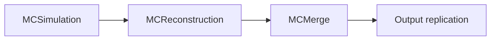
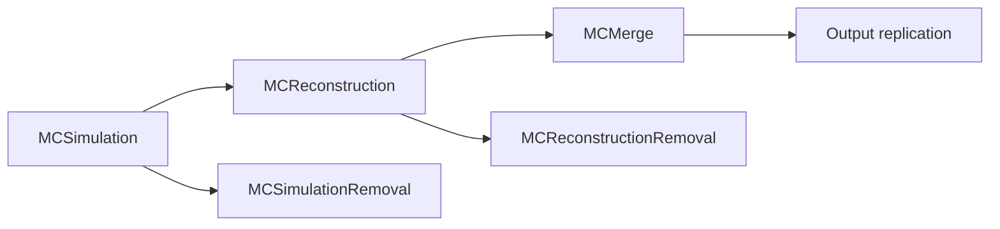
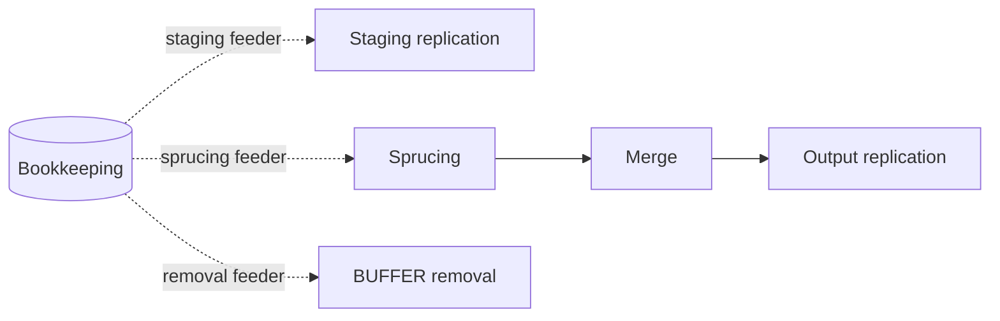
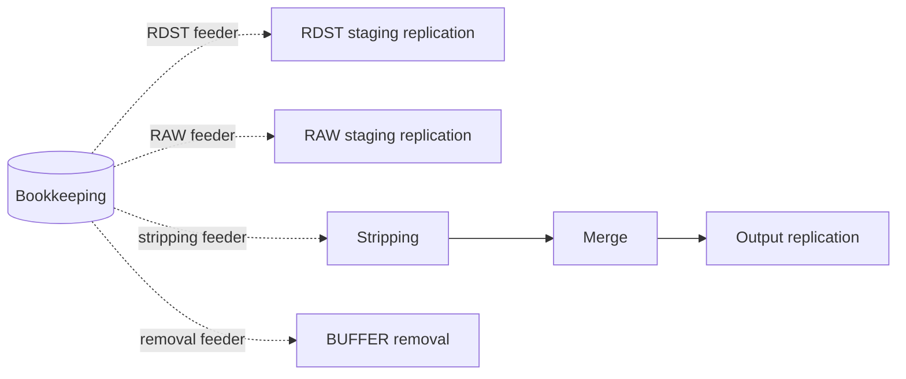

# Transformation System worked examples

These examples trace workgraphs the stakeholder communities run today through the model of [DX-ADR-002](DX-ADR-002_overview.md) and its companions, in their vocabulary and against their state machines. Each is written as the sequence of events an operator sees. The packing policies in them balance two efficiencies against each other: that of the system as a whole, and that of a single transformation which is nearly done. Steps that the ADRs do not yet provide for are collected at the end.

## LHCb simulation

The workgraph has three compute steps and one data transformation:

The replication is declared in the `dirac:Workgraph` hint against the MCMerge output (DX-ADR-007). The two internal edges are served by the edge feeder (DX-ADR-006). Each compute step's output is an intermediate: in this variant the downstream job removes the files it consumed once its own outputs are registered, and the variant with removal transformations below does it separately. The three compute steps run during scouting and the replication waits for approval, which follows from where each sits in the graph rather than from anything the document says about each of them (DX-ADR-007).

### Scouting

1. Submitting the workgraph creates it and all four transformations in `New`, in one transaction.
2. An operator starts it. The workgraph moves to `Scouting`, the compute transformations to `Active`, and the replication to `Paused`.
3. The MCSimulation feeder is the seed feeder of DX-ADR-006. In scouting mode it yields 100 seeds; its bookmark is the highest seed issued.
4. The MCSimulation packer makes one parcel per seed.
5. A parcel that reaches `Done` moves its seed to `Processed` and records the files it produced, which MCReconstruction's edge feeder picks up. A parcel that fails moves its seed to `Failed`, and the LHCb input failure hook returns the seed to `Unassigned` when the failure is a known grid problem and quarantines it in `Problematic` otherwise.
6. MCReconstruction's edge feeder picks up the recorded files as they appear. Its packer groups about 3 GB of input per parcel, keeping files at the same storage together.
7. MCReconstruction parcels are handled the same way. The reconstruction job removes the simulation outputs it consumed once its own outputs are registered.
8. MCMerge's edge feeder picks up the reconstruction outputs. Its packer groups about 10 GB per parcel, again per storage, and the merge job removes the reconstruction outputs it consumed.
9. Once 90% of the seeds are `Processed`, MCReconstruction's packer stops waiting for full 3 GB groups.
10. Once 90% of the events have been reconstructed, MCMerge is flushed once and the `ScoutingToApproving` hook accepts. The workgraph moves to `Approving`; the compute transformations stay `Active` and finish what is in flight.

### Approving

The workgraph's approving actions run in order (DX-ADR-006). A failed action moves the workgraph to `ApprovingBlocked`, and a sign-off nobody has given is a failure like any other: giving it is forcing the action to passed. `Pending` is for an action still at work, which leaves the workgraph where it is.

| Position | Action                  | Checks                                                                                                                                      |
| -------- | ----------------------- | ------------------------------------------------------------------------------------------------------------------------------------------- |
| 1        | `CheckSuccessRate`      | The failure rate is acceptable.                                                                                                             |
| 2        | `EstimateResourceUsage` | Measures CPU, memory and disk usage. Fails if it is too high; otherwise writes the measured needs into the members' requirements templates. |
| 3        | PPG approval            | If the usage scaled to the full production exceeds what the PPG approved, the request is flagged for a second PPG approval.                 |
| 4        | `ManualApproval`        | `Failed` until the MC production manager signs off, which moves the workgraph to `ApprovingBlocked`; the sign-off forces it to passed.      |

When the last action has passed the workgraph moves to `Active`, which starts the replication transformation.

### Active

- The workgraph's `Active` hook extends MCSimulation's feeder arguments in steps rather than requesting the whole workgraph at once. For a request of a billion events it keeps at most 10 million events in flight and extends by another step whenever fewer than a million remain in flight. What counts as in flight may be defined differently per transformation, and in-flight CPU may turn out to be a better measure than events.
- MCMerge is flushed at least once a week if a notable amount of its input is `Unassigned`.
- A transformation whose failure rate becomes excessive is moved to `Paused`, with the reason recorded in its `Metadata`.
- The resource estimates are updated periodically, with `Metadata` recording when they were last updated.
- An operator looks at why inputs ended up `Problematic`, resets the recoverable ones to `Unassigned` and writes the rest off as `NotProcessed`.

### Finishing

When the events produced, counted from the merged output, reach the requested number, the workgraph's `Active` hook disables MCSimulation's feeder. If `Problematic` inputs had left the count short, the hook would have raised the feeder again instead; whatever is in flight at the moment it disables the feeder still completes, so the workgraph ends a little over the target rather than under it. The chain then drains from the top: the MCSimulation packer packs its remaining seeds; when its parcels are terminal and every recorded output has been fed, MCReconstruction's edge feeder reports exhaustion (DX-ADR-006); MCReconstruction's packer, told that its feeder is off, drops the 3 GB threshold and packs what is left; MCMerge and the replication follow in turn. What is in flight is mostly processed rather than fully: a remainder below a packer's group size is written off as `NotProcessed` (DX-ADR-005).

The core moves the workgraph and all its members to `Finalizing` in one transaction once every member is drained: its feeder is disabled, and it has no non-terminal inputs or parcels.

### Finalizing

The members are finalised upstream first, in a linearised order of the DAG, each running its finalizing actions in order:

| Transformation     | Position | Action                                                                              |
| ------------------ | -------- | ----------------------------------------------------------------------------------- |
| MCSimulation       | 1        | No seed was used twice                                                              |
| MCSimulation       | 2        | Merge the GAUSSHIST histograms                                                      |
| MCReconstruction   | 1        | No input was used twice                                                             |
| MCReconstruction   | 2        | Merge the BOOLEHIST histograms                                                      |
| MCReconstruction   | 3        | Merge the MOOREHIST histograms                                                      |
| MCMerge            | 1        | No input was used twice                                                             |
| Output replication | 1        | Every input is `Processed`, or is `NotProcessed` and absent from the file catalogue |

A failed action moves its transformation to `FinalizingBlocked`. The operator forces the action to `Passed` or resets it to run again, returns the workgraph to `Active`, or cancels it (DX-ADR-005). When the last member is `Finalized` the workgraph moves to `Completed`.

### Archiving and cancelling

After a configurable delay the completed workgraph moves to `Archiving`, and each member runs its archiving actions: remove the intermediate files, such as the outputs of inputs that ended `NotProcessed`, then `CleanDatabaseEntries`. The workgraph is `Archived` when the last member is.

Cancelling the workgraph at any point before `Completed` moves it and its members to `Cancelling`. Each member runs `CancelInFlightParcels`, which stays `Pending` until every parcel is terminal, then removes its output files, removes its intermediate files, and cleans its database entries. The workgraph is `Cleaned` when the last member is.

### Variant: removal transformations

Instead of removing intermediates in-job, two data transformations are declared in the `dirac:Workgraph` hint: MCSimulationRemoval against the MCSimulation output and MCReconstructionRemoval against the MCReconstruction output. Both sit downstream of the step whose output they remove, so both wait for approval; when the workgraph moves to `Active` they are started.

Each removal is fed by the edge feeder from the same declared output as its sibling consumer (DX-ADR-004). Its packer keeps a file `Unassigned`, through `DelayInput`, until the sibling has processed it, which a lookup of the LFN in the sibling's inputs answers. Nothing is removed in-job.

Their finalizing actions:

| Transformation          | Position | Action                                                                                                     |
| ----------------------- | -------- | ---------------------------------------------------------------------------------------------------------- |
| MCSimulationRemoval     | 1        | The MCSimulation output directory in the DFC contains only files that MCReconstruction left `NotProcessed` |
| MCSimulationRemoval     | 2        | Every removed MCSimulation output has `GotReplica=N` in the bookkeeping                                    |
| MCReconstructionRemoval | 1        | The MCReconstruction output directory in the DFC contains only files that MCMerge left `NotProcessed`      |
| MCReconstructionRemoval | 2        | Every removed MCReconstruction output has `GotReplica=N` in the bookkeeping                                |

### Variant: filtered simulation

When the reconstruction keeps only a fraction of the events, the scout may not retain enough of them. At the 90% point, if MCReconstruction has retained fewer than the target number of scouting events, the `ScoutingToApproving` hook extends the scout with more seeds instead of accepting. The extension has an upper limit, beyond which the hook accepts anyway. The approving list gains a first action, that the target number of scouting events was produced, and MCReconstruction's finalizing list gains a check after each histogram merge:

| Position | Action                              |
| -------- | ----------------------------------- |
| 1        | No input was used twice             |
| 2        | Merge the BOOLEHIST histograms      |
| 3        | Check the mean is compatible with 0 |
| 4        | Merge the MOOREHIST histograms      |
| 5        | Check the mean is compatible with 0 |

## Closing a workgraph by hand

There is no forced transition to `Finalizing`. An operator closes a workgraph by changing what its members do, at the workgraph level, and the core takes the transition once the guard is met (DX-ADR-005). Either:

- **drain**: disable the external feeders and let the chain drain as in the simulation example; or
- **halt**: disable every feeder, stop the packers and the hooks, cancel the in-flight parcels, write off every input still waiting, `Unassigned`, `Failed` and `Problematic` alike, as `NotProcessed`, and wait for the remaining parcels to reach a terminal state.

## LHCb sprucing

Sprucing selects and slims the raw data stream, which lives on tape. The workgraph has two compute steps and three data transformations:

The staging replication copies the raw files to BUFFER storage. The sprucing transformation shares its bookkeeping input query rather than being fed from it, since a data transformation records no edge outputs (DX-ADR-004); its packer delays each file until the BUFFER replica exists (DX-ADR-005). The merge is edge-fed from sprucing, and the output replication is declared against the merge output. The BUFFER removal is declared against the workgraph's input files, shares the same query, and its packer delays each file until sprucing has processed it. The scouting run range and the full run range are both feeder arguments. The compute steps and the staging run during scouting, the output replication waits for approval, and the removal's initial state is overridden by a hint so that it stays `Paused` when the workgraph becomes `Active`.

### Scouting

1. Submitting the workgraph creates it and its five transformations in `New`.
2. An operator starts it. The workgraph moves to `Scouting`; the staging, sprucing and merge move to `Active`, and the output replication and the removal to `Paused`.
3. In scouting mode the staging and sprucing feeders yield only the LFNs in the scouting run range.
4. The staging packer makes replication parcels to BUFFER. The sprucing packer delays each file until its BUFFER replica exists, then packs it.
5. Sprucing parcels are handled as in the simulation example: `Done` moves the inputs to `Processed` and records the outputs for the merge's edge feeder; a failure goes through the LHCb input failure hook.
6. The merge's edge feeder picks up the sprucing outputs, and the merge job removes the sprucing outputs it consumed once its own outputs are registered.
7. When the scouting range has been processed, the `ScoutingToApproving` hook accepts and the workgraph moves to `Approving`.

### Approving and Active

The approving actions are those of the simulation example without the PPG step. When the last has passed the workgraph moves to `Active` and the output replication starts; the removal stays `Paused`.

While `Active`, the hook moves `EndRun` forward over time on both the staging and sprucing feeders, towards the requested end of the range. The removal is started by an operator, and removes the BUFFER copy of each file once sprucing has processed it.

### Finishing and finalizing

Once `EndRun` has reached the requested end and the closed range is fully registered, the feeders exhaust themselves. The chain drains as in the simulation example: sprucing packs what is left, the merge's edge feeder reports exhaustion, and the output replication and the removal follow. The core moves the workgraph and its members to `Finalizing` once every member is drained.

| Transformation     | Position | Action                                                                              |
| ------------------ | -------- | ----------------------------------------------------------------------------------- |
| Sprucing           | 1        | No input was used twice                                                             |
| Merge              | 1        | No input was used twice                                                             |
| Output replication | 1        | Every input is `Processed`, or is `NotProcessed` and absent from the file catalogue |

Archiving and cancelling are as in the simulation example.

## LHCb RDST stripping

An RDST is the output of the reconstruction software. It is missing parts of the raw detector data, so to reconstruct the events it must be processed together with the corresponding RAW files. The workgraph is the sprucing one with "stripping" in place of "sprucing" and these differences:

- There are two staging replications, one for the RDST files and one for the RAW files. The RAW replication's feeder either has its own bookkeeping query or derives its inputs from the ancestors of the RDST files; which is a matter for the VO's feeder extension.
- The stripping feeder has the same input query as the RDST replication, so the input pool holds only RDST files. The stripping packer looks up the RAW ancestor or ancestors of each RDST and adds them to the parcel's parameters, and it delays each RDST until both it and its ancestors are at BUFFER.

Scouting, approving, the active phase and finalizing run as for sprucing, with the workgraph's `Active` hook moving `EndRun` forward on the staging and stripping feeders.

## A standalone replication transformation

A single data transformation with no workgraph. It takes the workgraph's transitions on its own (DX-ADR-005); where its definition document lives is open (DX-ADR-004).

1. It is created in `New` and an operator moves it to `Active`.
2. The feeder adds inputs.
3. The packer creates data parcels whose request already names the destinations. The task running the packer inserts the `DataParcelsCounterJournal` rows in the transaction that creates the parcel (DX-ADR-009).
4. When a parcel finishes, its inputs move to `Processed` or `Failed` and the counters follow. The input failure hook sends every failed input to `Problematic`; nothing is retried automatically.
5. When the feeder reports that no more inputs are coming, and an operator has reset or written off every quarantined input so that every input is terminal, the transformation moves to `Finalizing`. Its finalizing list is probably empty, so it moves on to `Finalized` and `Completed`.
6. After the cooldown it moves to `Archiving`, runs `CleanDatabaseEntries`, and is `Archived`.
7. If it is cancelled instead, it runs `CancelInFlightParcels` and `CleanDatabaseEntries` and is `Cleaned`.

## Raw data distribution

A data transformation whose packer assigns each run to a destination the first time it sees the run and keeps that assignment for the rest of the transformation; the packer is the example in DX-ADR-006. DIRAC's per-run flush has no counterpart in the core: a packer that needs one implements it in the extension.

## What the examples need that the ADRs do not yet provide

- **Flushes from hooks.** The end of scouting flushes MCMerge once and the active phase flushes it weekly. DX-ADR-005 names flushes by hand, periodic flushes and flushes at closing, but not which component triggers the first two here, nor how a periodic flush knows when it last ran (the transformation log is one option). DX-ADR-006 lists whether the workgraph's `Active` or `ScoutingToApproving` hooks may request a flush as open.
- **Upstream progress in the packer.** MCReconstruction's packer relaxes its group size when 90% of the seeds are `Processed`, but the packer contract passes only its own transformation's input overview and feeder status.
- **Skipping finalisation.** An operator may want to skip a whole finalizing list. DX-ADR-005 offers forcing each action, returning the workgraph to `Active`, or cancelling.
