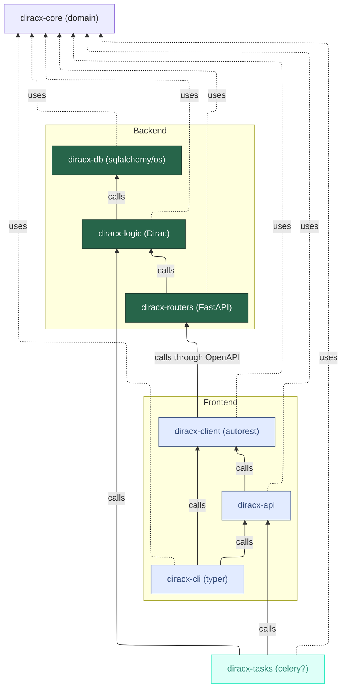

# Packaging and versioning

DiracX is a Python package composed of several interconnected submodules.
It's designed to provide robust and versatile functionalities, primarily through these key components:

1. **User-Facing Components**:

    - **`diracx`**: This is the primary interface for users, integrating both the Command Line Interface (CLI) and Python API.
    - **`diracx-routers`**: Serves as the server component, offering HTTPS endpoints.
    - **`diracx-tasks`**: Handles operations executed by DiracX servers, either periodically or upon request.

2. **Containerization**:

    - Each component is available as a container image, packaging DiracX along with all necessary dependencies.

## Python Modules

DiracX is structured into various modules, each serving a distinct purpose:

- **`diracx-core`**: The foundational code base, utilized by all other DiracX modules.
- **`diracx-db`**: Data Access Layer, focuses on database functionalities.
- **`diracx-logic`**: Business Logic Layer, comprises Dirac logic.
- **`diracx-routers`**: Presentation Layer, handles user interactions through HTTP using a FastAPI application.
- **`diracx-client`**: A client auto-generated from the OpenAPI specification in `diracx-routers`.
- **`diracx-api`**: Provides higher-level operations building on `diracx-client`.
- **`diracx-cli`**: The command line interface (`dirac`).
- **`diracx`**: A metapackage offering `diracx-client`, `diracx-api`, and `diracx-cli`.

These modules are each implemented as a [native Python namespace package](https://packaging.python.org/en/latest/guides/packaging-namespace-packages/).

The direct dependencies between the submodules are as follows:



### Versioning Strategy

- Currently, and as long as `DIRAC` and `diracx` coexist, we employ a versioning format of v0.<major>.<patch>.
- We only support using the same version across all `diracx-*` packages.
- The client and server versions can vary, but the client version is always communicated to the server. Incompatibly old client versions may lead to request rejections, prompting a client update.

## Container Images

DiracX container images are built using [pixi](https://pixi.sh/) environments defined in `pixi.toml`. All dependencies — both conda and PyPI packages — are resolved via the committed `pixi.lock` file, ensuring reproducible builds with exact version parity between development and production.

### Architecture

Each container image is built using a multi-stage Dockerfile:

1. **Build stage**: Uses `ghcr.io/prefix-dev/pixi` to install a pixi environment from the lock file with `pixi install --locked`.
2. **Runtime stage**: Uses a minimal `ubuntu:24.04` base image. The installed pixi environment is copied from the build stage. [Tini](https://github.com/krallin/tini) is used as the init process for proper signal handling.

The container environments are defined in `pixi.toml` alongside the development environments, sharing the same solve group to guarantee identical dependency versions:

- **`container-services`**: Includes `diracx-routers`, `diracx-logic`, `diracx-db`, and `diracx-core` plus runtime dependencies (tini, CA certificates, git).
- **`container-client`**: Includes `diracx-cli`, `diracx-api`, `diracx-client`, and `diracx-core` plus runtime dependencies.

### Building

Container images are self-contained — the Dockerfile copies source code and uses `pixi install --locked` to resolve everything from the lock file. No separate base images or wheel-building steps are needed:

```
┌──────────────────────────────────────────┐
│           pixi build stage               │
│  pixi.toml + pixi.lock + source → env    │
└────────────────┬─────────────────────────┘
                 │
     ┌───────────▼────────────┐
     │  ubuntu:24.04 runtime  │
     │  + pixi env copied in  │
     └────────────────────────┘
```

### Versioning

- Release builds are tagged with the version (e.g., `ghcr.io/diracgrid/diracx/services:v0.X.Y`).
- Development builds from `main` are tagged as `dev`.

### Server Entry Points

- `diracx-routers`:
    - `diracx.diracx_min_client_version` entry-point defines the diracx minimum client version required by the server to prevent issues. This also searches for extension names instead of `diracx`. The minimum version number has to be updated in `diracx-routers/src/__init.py__`

## Extensions

Extensions (e.g., Gubbins, LHCbDIRACX) provide their own `pixi.toml` and `pixi.lock` with container environments that pull in both the extension and upstream DiracX packages transitively.

The extension container Dockerfile follows the same multi-stage pixi pattern, built from the extension's own source directory.
