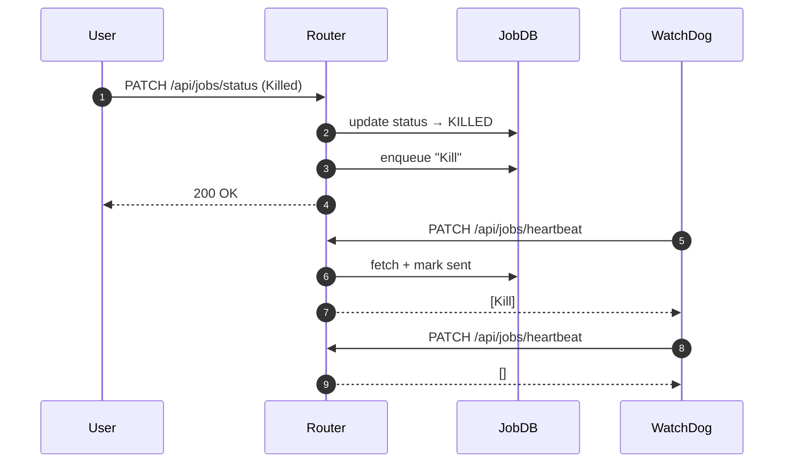
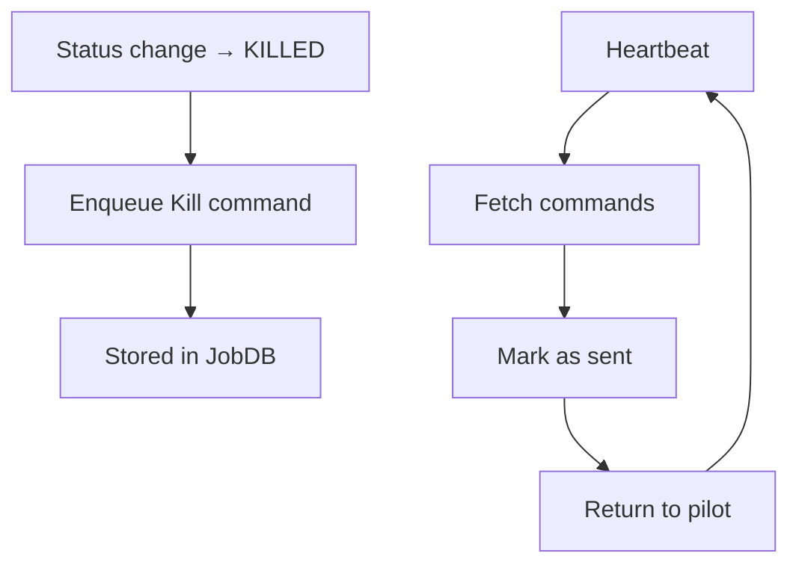

## What Are Job Commands?

Job commands implement a **per-job control queue** between the WMS and the pilot (JobAgent).

They allow the WMS to send control instructions to running jobs via the heartbeat mechanism.

Currently used for:

- Remote job termination (`Kill` command)

The mechanism is generic and could support additional commands in the future (e.g. debug actions, core dump requests, etc.).

______________________________________________________________________

## Behaviour Summary

### Command Creation

When a job transitions to a terminal state (`KILLED` or `DELETED`),
`set_job_statuses()` enqueues a `Kill` command in the JobDB.

### Command Delivery

Commands are delivered during:

```text
PATCH /api/jobs/heartbeat
```

Flow:

1. Heartbeat updates job state.
2. `get_job_commands()` retrieves pending commands.
3. Commands are marked as sent.
4. Commands are returned to the pilot.

This guarantees **one-shot delivery semantics**:

- A command is delivered exactly once.
- It is not re-delivered on subsequent heartbeats.

______________________________________________________________________

## Sequence Diagram (Kill Command Lifecycle)



______________________________________________________________________

## Activity View



______________________________________________________________________
