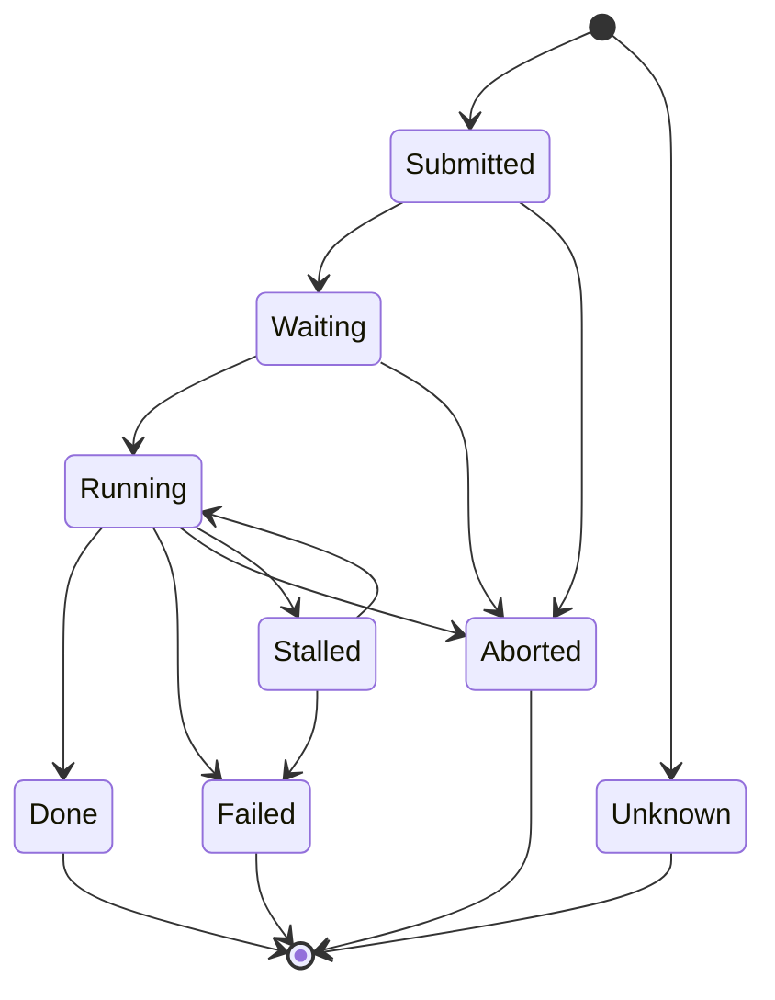

# Pilots

## What is a pilot

A pilot is a small piece of software that runs on a *worker node* and pulls user payloads (jobs). The same pilot binary is equipped to talk to both DIRAC and DiracX during the migration, and it supports two authentication modes:

- **X.509 proxy** (legacy): the pilot presents a proxy and, in DiracX, exchanges it for a DiracX token. Callers authenticated this way carry the `GENERIC_PILOT` property and are handled by the "legacy pilot" code paths in the access policy.
- **Pre-issued secret**: the pilot is provisioned with a secret that it exchanges for a DiracX token. Pilots authenticated this way are identified by their unique *stamp* rather than by a set of security properties.

## Identity model

Three identifiers appear throughout the code and are easy to confuse:

- `PilotStamp`: immutable string chosen by the pilot factory. Primary user-facing key; never changes for the lifetime of a pilot.
- `PilotID`: auto-incrementing database primary key. Not meaningful outside the DB layer; never exposed on the HTTP surface as an identity.
- `PilotJobReference`: the CE job reference (batch-system identifier)
    that submitted the pilot process. Defaults to the stamp when not known.

## Lifecycle

## Relationship to jobs

A pilot can execute zero or more jobs over its lifetime. The association is tracked in the `JobToPilotMapping` table and is append-only: once a job has run on a pilot, the link is preserved until the pilot row is deleted.

Both directions of the lookup are exposed as *pseudo-parameters* on the respective search endpoints. This keeps every pilot and job attribute addressable through a single `POST /search` per resource type, matching the UI's one-search-bar-per-resource mental model. The pattern mirrors the existing `LoggingInfo` pseudo-parameter on `POST /api/jobs/search`: the filter is intercepted in the logic layer, resolved against `JobToPilotMapping`, and rewritten into a normal vector filter before hitting the DB.

- `POST /api/jobs/search` accepts a `PilotStamp` filter, resolved to a `JobID` filter via `JobToPilotMapping`.
- `POST /api/pilots/search` accepts a `JobID` filter, resolved to a `PilotID` filter.

Concrete request bodies for both are provided as OpenAPI examples on the respective search routes; open the Swagger UI at `/api/docs` to see them.

Only `eq` and `in` operators are supported on the pseudo-parameter; other operators (`neq`, `not in`, `lt`, ...) are refused with `InvalidQueryError` because their semantics across the join are ambiguous. Combining a `PilotStamp` filter with a `JobID` filter in the same request body is likewise refused; clients that want the intersection should compute it themselves.

## VO scoping and authorization

Pilots are partitioned by VO. By default a normal user sees and acts on pilots belonging to their own VO only. `SERVICE_ADMINISTRATOR` can read pilots across VOs via `/search` and `/summary`.

Management actions (register, delete, patch metadata) require `SERVICE_ADMINISTRATOR`. Legacy X.509 pilot identities may be permitted to self-register or self-modify; those paths opt in via `allow_legacy_pilots=True` in the access policy and limit each call to a single pilot stamp as a containment measure against stolen credentials.
