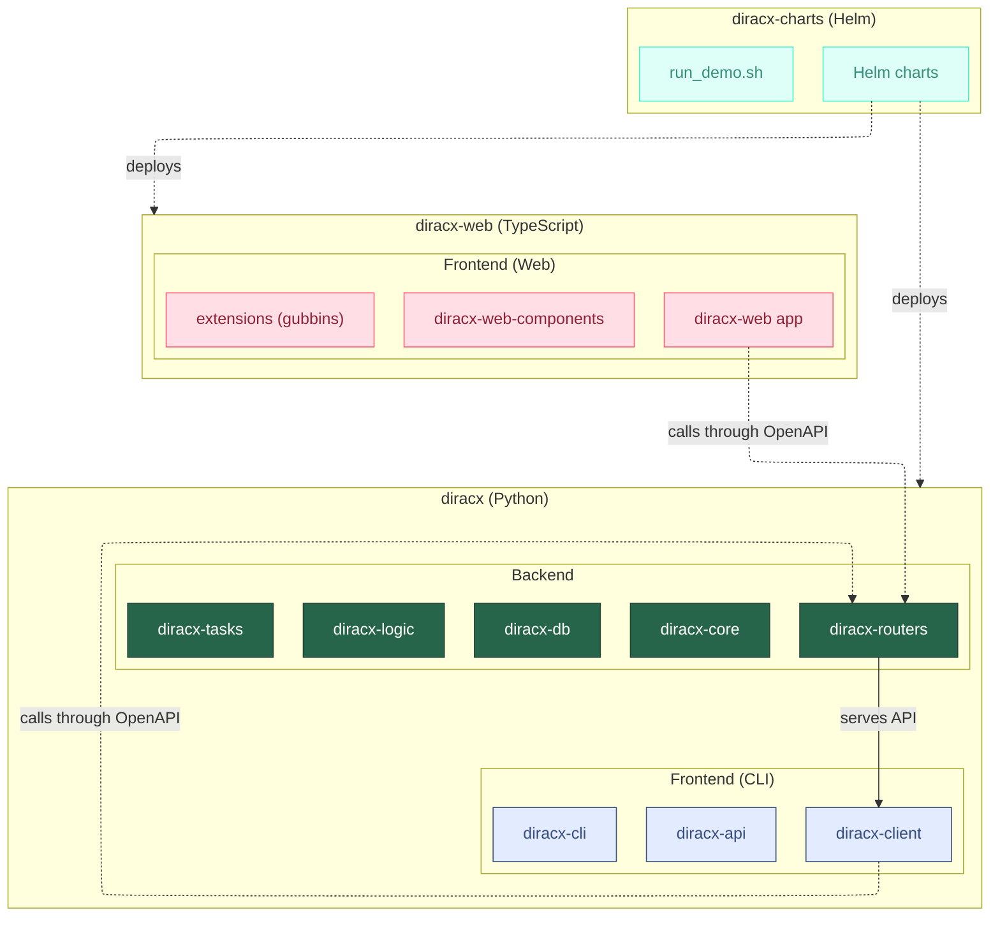

# Repository Structure

DiracX is developed across three repositories, each with a distinct responsibility. They are combined into a single documentation site and a single deployment, but developed independently.

## Repositories

### [`diracx`](https://github.com/DIRACGrid/diracx)

The main repository containing all Python packages. It holds both **backend** (server-side) and **frontend CLI** (client-side) code:

- **Backend** — `diracx-core`, `diracx-db`, `diracx-logic`, `diracx-routers`, `diracx-tasks`: the server that exposes an OpenAPI-based REST API.
- **Frontend (CLI)** — `diracx-client`, `diracx-api`, `diracx-cli`: the Python client, higher-level API, and command-line interface that consume the REST API.

This repository also owns the `mkdocs.yml` that defines the navigation for the entire documentation site.

### [`diracx-web`](https://github.com/DIRACGrid/diracx-web)

The web interface, built with TypeScript / React / Next.js. It is a separate frontend that also consumes the REST API served by `diracx-routers`. See [Web architecture](web-architecture.md) for the internal package structure.

Documentation files in this repo are merged into the main site by the [mkdocs-diracx-plugin](https://github.com/DIRACGrid/mkdocs-diracx-plugin). See [Documentation system](documentation-system.md) for details on how the merge works.

### [`diracx-charts`](https://github.com/DIRACGrid/diracx-charts)

Helm charts for deploying DiracX (backend + web) on Kubernetes. Also provides `run_demo.sh` for running a local development instance. Documentation files are similarly merged into the main site.

## What "Backend" and "Frontend" mean in this project

The terms follow standard software architecture usage:

- **Backend** = server-side code that processes requests, accesses databases, and enforces business logic.
- **Frontend** = client-side code that users interact with to consume backend services.

DiracX has two frontends:

| Frontend | Language   | Repository   | Interface                              |
| -------- | ---------- | ------------ | -------------------------------------- |
| **CLI**  | Python     | `diracx`     | Command-line + programmatic Python API |
| **Web**  | TypeScript | `diracx-web` | Browser-based graphical interface      |

Both communicate with the backend through the same OpenAPI-based REST API.

## Where to make changes

| I want to...                    | Repository      | Relevant docs                                                  |
| ------------------------------- | --------------- | -------------------------------------------------------------- |
| Add or modify a REST endpoint   | `diracx`        | [Add a route](../how-to/add-a-route.md)                        |
| Add or modify business logic    | `diracx`        | [Designing functionality](designing-functionality.md)          |
| Add or modify a database        | `diracx`        | [Add a DB](../how-to/add-a-db.md)                              |
| Add or modify a CLI command     | `diracx`        | [Add a CLI command](../how-to/add-a-cli-command.md)            |
| Add or modify the web interface | `diracx-web`    | [Getting started (web)](../tutorials/web-getting-started.md)   |
| Create a web extension          | `diracx-web`    | [Creating a web extension](../tutorials/web-extensions.md)     |
| Change deployment / Helm values | `diracx-charts` | [Chart structure](../../admin/explanations/chart-structure.md) |
| Run the demo locally            | `diracx-charts` | [Run demo](run_demo.md)                                        |
