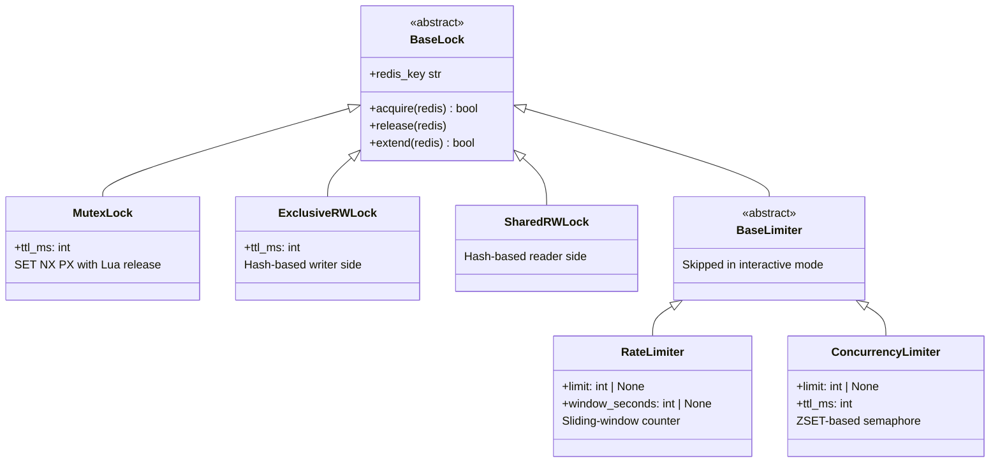
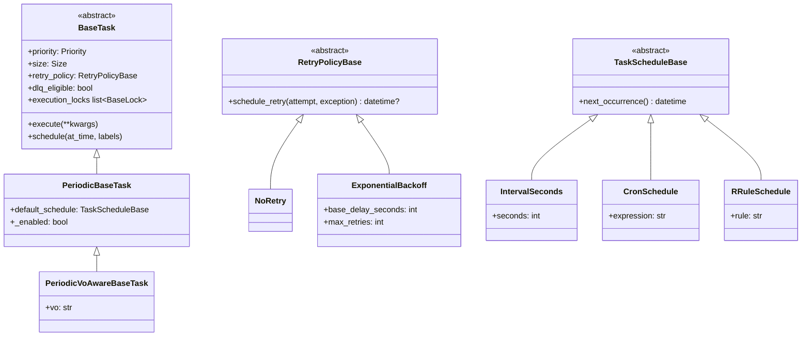
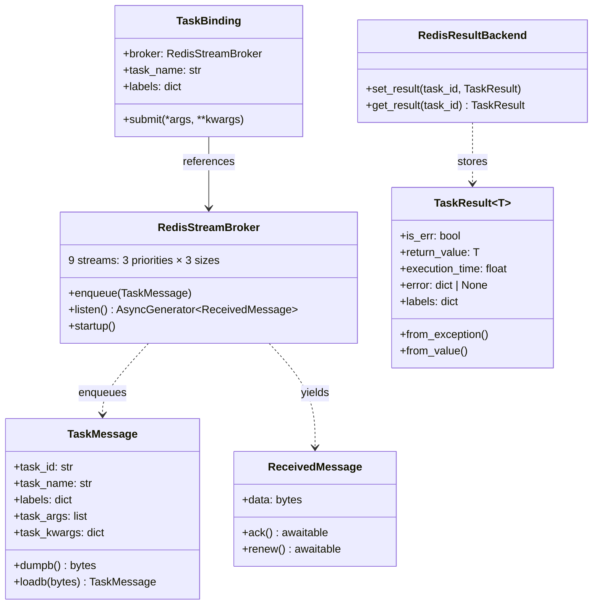
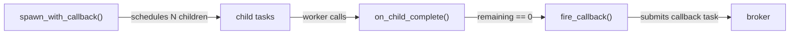

# Class details

This page describes the key classes and type definitions that make up the task system's plumbing layer in `diracx.tasks.plumbing`. Read the [architecture overview](index.md) first for the high-level design.

## Redis type aliases

The module `plumbing/_redis_types.py` defines four `TypeAlias` values. All resolve to `redis.asyncio.Redis` at runtime — they exist purely for readability and grep-ability, so that each function signature documents *why* it needs a Redis connection.

| Alias              | Semantics                                      |
| ------------------ | ---------------------------------------------- |
| `LockCoordinator`  | Acquiring, releasing, and extending locks      |
| `MessageTransport` | Enqueuing, reading, or promoting task messages |
| `ResultCache`      | Storing and retrieving task results            |
| `CallbackRegistry` | Tracking callback groups and firing callbacks  |

## Lock subsystem

All lock primitives live in `plumbing/locks.py`. Every lock is scoped to a `(LockedObjectType, key, *extra_keys)` tuple which is joined into a Redis key. A random owner ID is generated per instance so that release operations can verify ownership.

**Reader-writer locks** (`ExclusiveRWLock` and `SharedRWLock`) share the same Redis hash key (`lock:rw:{obj}:{key}`) — multiple readers can hold the lock concurrently, but a writer requires exclusive access.

**Limiters** inherit from `BaseLock` but are skipped when a task is executed interactively via `diracx-task-run call`. Their `limit` defaults to `None` (disabled); configuration can enable them without code changes.

## Task subsystem

Task base classes live in `plumbing/base_task.py`, with supporting types in `plumbing/retry_policies.py` and `plumbing/schedules.py`.

Each task tier uses different locks:

| Class                     | Default `execution_locks`                            |
| ------------------------- | ---------------------------------------------------- |
| `BaseTask`                | `RateLimiter` + `ConcurrencyLimiter` (both disabled) |
| `PeriodicBaseTask`        | `MutexLock(TASK, class_name)`                        |
| `PeriodicVoAwareBaseTask` | `MutexLock(TASK, class_name, vo)`                    |

`PeriodicBaseTask` intentionally does **not** call `super().execution_locks` — it replaces the limiter pair with a single mutex. `PeriodicVoAwareBaseTask` adds the VO name to the mutex key so each VO gets its own lock.

## Broker and result backend

The broker models live in `plumbing/broker/models.py`, the stream broker in `plumbing/broker/redis_streams.py`, and the result backend in `plumbing/broker/result_backend.py`.

`TaskMessage` is the wire-protocol message serialized to msgpack. `ReceivedMessage` wraps the raw bytes with `ack()` and `renew()` callbacks: `ack()` acknowledges completion, while `renew()` refreshes ownership of in-flight messages during long executions. `TaskBinding` maps a task class to its broker, providing the `submit()` method used by `BaseTask.schedule()`.

## Callback subsystem

The callback module (`plumbing/callbacks.py`) implements fan-out/fan-in: a parent spawns N child tasks and a callback fires automatically when all children complete.

`spawn_with_callback` stores the callback and an atomic counter in Redis, then schedules each child with a `group_id` label. After each child completes, the worker calls `on_child_complete` which decrements the counter. When the counter reaches zero, `fire_callback` deserializes and submits the callback task to the broker.

Redis keys used per callback group:

| Key pattern                                        | Type   | Contents                         |
| -------------------------------------------------- | ------ | -------------------------------- |
| `diracx:groups:{group_id}:callback`                | string | msgpack-serialized callback task |
| `diracx:groups:{group_id}:remaining`               | string | atomic counter (int)             |
| `diracx:groups:{group_id}:results:{child_task_id}` | string | msgpack-serialized child result  |

All keys are created with a TTL (default 86400s) for automatic cleanup.
