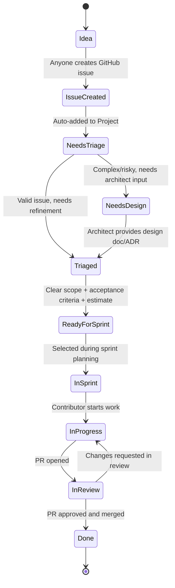

# Issue Triage and Project Management

This page describes how issues are tracked and triaged across DIRACGrid repositories using GitHub Projects.

## Issue workflow

Issues follow a structured process from idea to completion:

## Workflow states

Issues are tracked through **Project Status** fields, not labels.

### Needs Triage

New issues are automatically added to the Project with Status = "Needs triage". Maintainers review the issue to:

- Confirm it's valid and not a duplicate
- Set appropriate fields (see [Project fields](#project-fields) below)
- Determine if it needs design work or can go to the backlog

### Needs Design

Applied to complex or risky issues that require architectural input. An architect or senior developer will:

- Create a design document or Architecture Decision Record (ADR)
- Outline the technical approach
- Identify potential risks or trade-offs

Once design is complete, status moves to "Triaged".

### Triaged

The issue is valid and understood but needs refinement. During refinement/grooming:

- Add clear acceptance criteria
- Add a story point estimate using the **Story Points** field
- Clarify any open questions

Once refined, status moves to "Ready for sprint".

### Ready for Sprint

The issue has clear scope, acceptance criteria, and a story point estimate. It is ready to be selected during sprint planning. Only maintainers can move issues to this status.

### In Sprint

The issue is assigned to a specific sprint using the **Sprint** field. It was selected during the sprint planning meeting and a developer may be assigned at this stage.

### In Progress

A developer has started work. Typically indicated by an open PR or assignment. The issue should be linked to the PR.

### In Review

A pull request has been opened and is awaiting code review. May loop back to "In Progress" if changes are requested.

### Done

The PR has been approved and merged. The issue is automatically closed if properly linked in the PR (e.g. `Closes #123`).

## Project fields

Each issue in the GitHub Project has the following fields:

| Field                | Values                                                                        |
| -------------------- | ----------------------------------------------------------------------------- |
| **Area** (epic)      | pilot, core, wf-mgmt, data-mgmt, resource-mgmt, deployment, obs-analytics, ui |
| **Priority** (label) | priority:critical, priority:high, priority:medium, priority:low               |
| **Type** (label)     | bug, enhancement, documentation, question                                     |
| **Story Points**     | Estimated effort                                                              |
| **Sprint**           | Sprint assignment                                                             |

## Creating issues

### Bug reports

When creating a bug report, include:

- A clear description of the bug
- Confirmation that you've searched for duplicates
- Steps to reproduce the issue
- Expected vs. actual behaviour
- Environment details (OS, version, etc.)
- Log output if available

### Feature requests

When requesting a feature, provide:

- A user story (As a [user], I want [goal], so that [benefit])
- Description of the proposed feature
- Definition of Done -- what criteria must be met?
- Related or blocking issues
