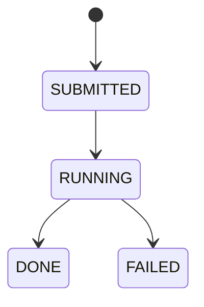
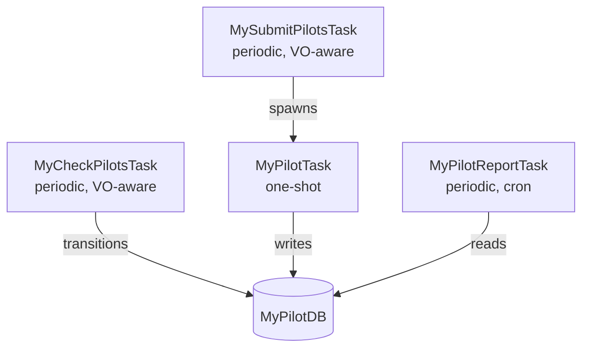

# Part 1: Design

Before writing any code, it's worth spending time thinking through the domain model and key design decisions. This upfront investment saves rework later — the data model and task graph you sketch here will guide the database schema, task classes, and API endpoints you build in the following parts.

!!! tip "For real contributions"

    If you were adding a new system to DiracX (rather than following a tutorial), you'd typically start by opening an issue to discuss the design with maintainers, or writing an ADR for more significant changes. See [Designing functionality](../../explanations/designing-functionality.md) for guidance.

## Identify entities

Our system has two main entities:

| Entity                   | Description                                                             |
| ------------------------ | ----------------------------------------------------------------------- |
| **Compute Element (CE)** | A site where pilots can be submitted. Has a capacity and reliability.   |
| **Pilot Submission**     | A record of a pilot sent to a CE. Transitions through lifecycle states. |

## State machine

Pilots follow this lifecycle:

## Task graph

We need four tasks:

| Task                 | Type                    | Schedule      | Purpose                                            |
| -------------------- | ----------------------- | ------------- | -------------------------------------------------- |
| `MySubmitPilotsTask` | PeriodicVoAwareBaseTask | Every 60s     | Finds available CEs, spawns `MyPilotTask` per slot |
| `MyPilotTask`        | BaseTask (one-shot)     | On demand     | Submits a single pilot to a CE                     |
| `MyCheckPilotsTask`  | PeriodicVoAwareBaseTask | Every 30s     | Transitions pilot states                           |
| `MyPilotReportTask`  | PeriodicBaseTask        | Hourly (cron) | Logs aggregate statistics                          |

!!! note "What does 'VO-aware' mean?"

    A **Virtual Organisation (VO)** is a group of users and resources organised around a common goal. VO-aware tasks run once per VO — so if you have three VOs configured, `MySubmitPilotsTask` spawns three independent instances, each submitting pilots for its own VO. Non-VO-aware tasks like `MyPilotReportTask` run once globally.

## Locking strategy

- **`MyPilotTask`**: `MutexLock(MY_PILOT, ce_name)` — serialise submissions to the same CE
- **`MySubmitPilotsTask`**: default VO-scoped mutex — each VO submits independently
- **`MyCheckPilotsTask`**: default VO-scoped mutex — each VO checks independently
- **`MyPilotReportTask`**: default class-level mutex — only one report at a time

## Retry policy

`MyPilotTask` uses `NoRetry()`. Why? Because the periodic parent
(`MySubmitPilotsTask`) will naturally re-evaluate available CEs on the
next cycle and resubmit. Explicit retries would add complexity without
benefit here.

Failed tasks are *not* dead-letter-queue eligible (`dlq_eligible = False`).
Pilots are ephemeral — there will always be more on the next cycle, so
there's no value in preserving failed submissions for manual recovery.
The DLQ is reserved for tasks that correspond to external state which
must always be recovered (e.g. failing to optimise a job, or submitting
a transformation task).

## What's next

With the design in hand, we'll start implementing. The order is:
database → tasks → router → tests.
